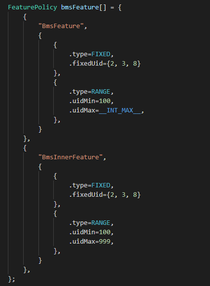
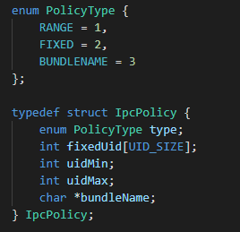
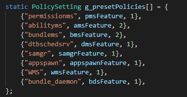

# 项目介绍

-   [应用权限管理](#section20822104317111)
-   [IPC通信鉴权](#section156859591110)

## 应用权限管理

应用权限是软件用来访问系统资源和使用系统能力的一种通行方式，存在涉及个人隐私相关功能和数据的场景，例如：访问个人设备的硬件特性，如摄像头、麦克风，以及读写媒体文件等。操作系统通过应用权限管理来保护这些数据以及能力。

权限定义字段说明：

<table><thead align="left"><tr id="row11107193541417"><th class="cellrowborder" valign="top" width="22.220000000000002%" id="mcps1.1.4.1.1">
字段

</th>
<th class="cellrowborder" valign="top" width="35.099999999999994%" id="mcps1.1.4.1.2">
取值

</th>
<th class="cellrowborder" valign="top" width="42.68%" id="mcps1.1.4.1.3">
意义

</th>
</tr>
</thead>
<tbody><tr id="row151081735111418"><td class="cellrowborder" valign="top" width="22.220000000000002%" headers="mcps1.1.4.1.1 ">
name

</td>
<td class="cellrowborder" valign="top" width="35.099999999999994%" headers="mcps1.1.4.1.2 ">
字符串

</td>
<td class="cellrowborder" valign="top" width="42.68%" headers="mcps1.1.4.1.3 ">
权限名。

</td>
</tr>
<tr id="row19108143516148"><td class="cellrowborder" valign="top" width="22.220000000000002%" headers="mcps1.1.4.1.1 ">
reason

</td>
<td class="cellrowborder" valign="top" width="35.099999999999994%" headers="mcps1.1.4.1.2 ">
多语言字符串id

</td>
<td class="cellrowborder" valign="top" width="42.68%" headers="mcps1.1.4.1.3 ">
应用申请此权限的目的。

</td>
</tr>
<tr id="row13108123516145"><td class="cellrowborder" valign="top" width="22.220000000000002%" headers="mcps1.1.4.1.1 ">
used-scene{

ability，

when

}

</td>
<td class="cellrowborder" valign="top" width="35.099999999999994%" headers="mcps1.1.4.1.2 ">
ability:组件类名字符串

when:inuse, always

</td>
<td class="cellrowborder" valign="top" width="42.68%" headers="mcps1.1.4.1.3 ">
调用受此权限管控的接口的场景。

声明在哪些组件和场景（前台/后台）下调用受管控的接口。

</td>
</tr>
</tbody>
</table>

## IPC通信鉴权

-   在Samgr中注册的系统服务如果通过进程间通信的方式暴露接口给其他进程访问，需要配置相应的访问控制策略。若不进行相关配置，访问会被拒绝。
-   配置方式：在头文件base/security/permission/services/permission\_lite/ipc\_auth/include/policy\_preset.h中配置访问策略。

    1. 定义各个Feature的策略

    2. 将Feature的策略加到全局策略中

Eg.  比如当前需要为BMS服务配置访问策略，BMS在Samgr中注册的service为bundlems，注册的Feature为BmsFeature。

一、首先定义Feature的策略，可配置多个Feature，每个Feature可以配置多个访问策略，策略的声明方式参考图1

**图 1**  Feature策略示例  

访问策略有三种类型：

**图 2**  访问策略结构体  

1.   type为RANGE类型：允许某个特定范围UID的进程访问，需要指定uidMin和uidMax

2.   type为FIXED类型：允许指定的几个UID的进程访问，需要指定fixedUid，最多配置8个

3.   type为BUNDLENAME类型：只允许特定的应用访问，需要指定bundleName（包名）

二、将定义的Feature的策略加配到全局策略中，需要配置feature数量，注册参考图3

**图 3**  feature策略注册  

UID分配规则

1. Init进程：0

2. appspawn进程：1

3. Shell进程：2

4. 其他内置系统服务UID <= 99

5. 系统应用（如设置、桌面、相机）：100 \~ 999

6. 预置厂商应用：1000 \~ 9999

7. 普通三方应用：10000 \~ INT\_MAX

