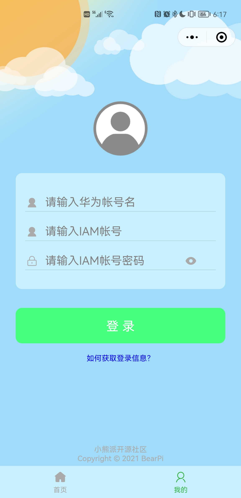
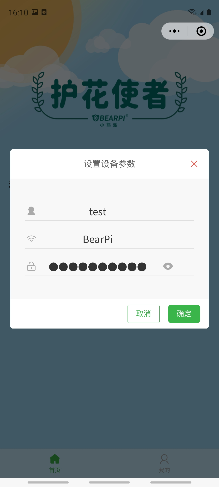

## 小程序使用
### &emsp;1. 打开小程序

&emsp;&emsp;扫描二维码关注公众号，在下方菜单栏中打开小程序。
    
&emsp;&emsp;

&emsp;&emsp;

### &emsp;2. 登录小程序

1. 华为账号名获取
    
    （1）在电脑上使用华为账号登录华为云[https://www.huaweicloud.com/](https://www.huaweicloud.com/)，若无华为账号请自行注册华为账号。

    

    （2）在右上角用户的账号中心中**完成实名认证**，并点击进入账号中心。
    
    

    （3）在账号中心的基本信息中获取华为账号名。

    

2. IAM账号名及密码获取

    
    （1）在电脑上点击[https://console.huaweicloud.com/iam](https://console.huaweicloud.com/iam)，进入华为云统一身份认证服务。
    
    （2）点击右上角“创建用户“。
    
     

    （3）填写新用户信息，此处填写的用户名及密码即为登录小程序所需的IAM账号名及密码，并点击下一步。

    

    （4）选择加入的用户组，此处选择“拥有所有操作权限的用户组“，并点击右下角“创建用户”。

    
3. 开通IoTDA服务

    在电脑上点击[开通IoTDA服务](https://console.huaweicloud.com/iotdm/?region=cn-north-4#/dm-portal/home)，本实验需要使用的华为云IoTDA设备接入服务，设备的数据会先上传至IoTDA平台，再转至小程序。该服务针对开发者不收费，请知悉。

4. 登录小程序
    
    &emsp;在小程序”我的“界面输入以上步骤中获取的华为账号名、IAM账号名及密码。
    
    &emsp;

### 3、添加设备

&emsp;添加设备前请**打开手机的NFC及定位服务**功能，然后点击小程序右上角加号，添加设备。
    
&emsp;&emsp;**`注：`**

- **`需要使用带NFC功能的手机，并打开NFC功能，许多旧款的手机及iPhone手机不带有此功能`**
- **`v0.1版本护花使者只能添加一个设备，添加一个设备后该“+”控件会失效`**

&emsp;&emsp;&emsp;        
 
### 4、配置设备

&emsp;填写自定义设备名称，以及设备连接目标WiFi的账号和密码，当提示“请将NFC模块靠近设备”时，**将手机靠近开发板的NFC天线处，等待完成设备配置。**

&emsp;**`注：`**
- **`此处指定接入的WiFi需要为2.4G的WiFi（一般为WiFi名字后缀不带5G字样的），且不能是开放的WiFi，也就是连接时需要输入密码的WiFi。`**

- **`也可在添加设备前将手机接入2.4G的WiFi，添加设备时会自动选择手机当前连接的WiFi`**

    
&emsp;&emsp;  

&emsp;
 
### 5、调试设备

&emsp;添加完设备后，**按一下开发板的复位按键，等待30S后，下拉“我的设备”界面**，刷新界面，此时设备变为在线状态。点击设备，打开设备详情界面，即可查看当前绿植的土壤湿度以及空气的温湿度，点击浇水按钮即可远程控制设备浇水。(设备上线后，手机使用移动数据也能远程监控设备数据及控制浇水)

&emsp;&emsp;   
