# 护花使者套件使用手册

## 一、护花使者套件安装说明

### 1. 准备工作

&emsp;在开发之前，需要准备以下材料([点击购买](https://item.taobao.com/item.htm?ft=t&id=645216486457))

- BearPi-HM Nano主板及“护花使者”底板

- 配套水泵（额外土壤湿度传感器选配）

- 排线两对

- Type-C 电源线一根

- PC 预装Windows系统

### 2. 硬件环境搭建

 &emsp;如下图所示，5V水泵和额外的土壤湿度传感器连接到底板上。同时，底板的IO口（5V、3.3V、GND、IO5、IO13、IO14、IO7、IO1、IO0）分别和BearPi-HM Nano主板的（5V、3.3V、GND、ADC2、ADC6、GPIO1、INT、IIC1_SCL、IIC1_SDA）相连

&emsp;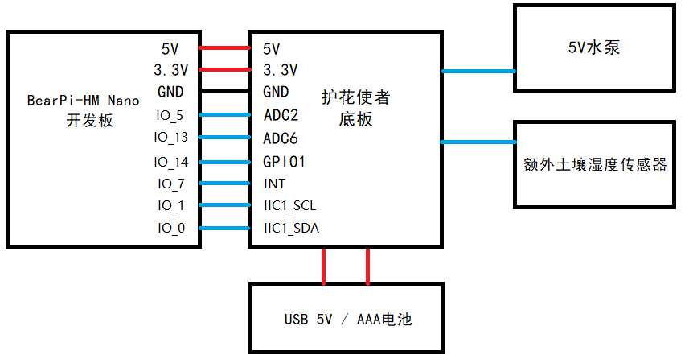

&emsp;主板对准四个限位螺母，拧上螺丝即可固定主板，再用排线连接主板和底板的两组排针。

&emsp;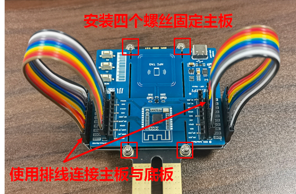

&emsp;本套件背板搭载标准的USB Type-A接口，用于接入5V水泵，水管接到水泵的出水口

&emsp;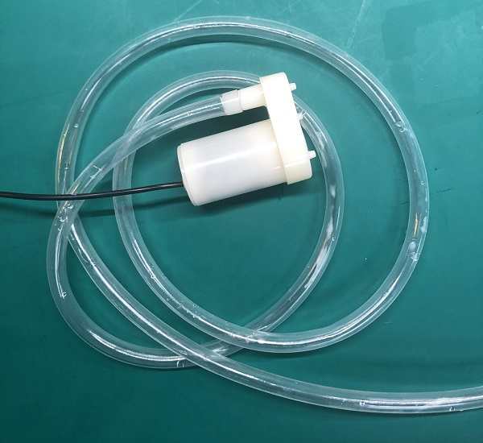

&emsp;再根据USB接口方向，直接接入水泵的USB插头即可

&emsp;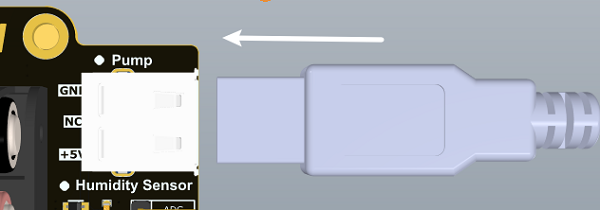

&emsp;本套件背板搭载3P 2.54mm的弯针排针，用于接入额外的土壤湿度传感器，根据接口方向，按ADC、VCC、GND的顺序直接通过杜邦线接入土壤传感器即可

&emsp;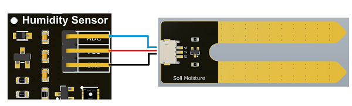

&emsp;装入4节AAA电池，注意电池的正负极

  
&emsp;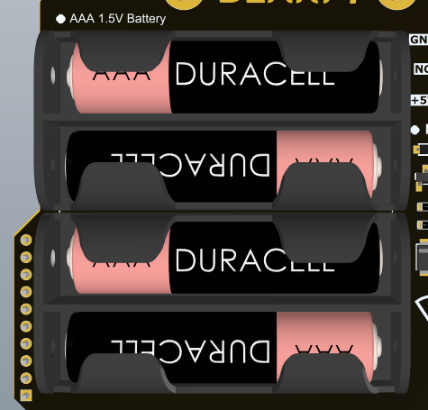

&emsp;准备一个蓄水的容器，用作浇花的水源，把水泵放入容器中，再将底板的探头部分插入土壤，通过四节AAA电池或是Type-C 5V对套件进行供电，整套系统就可以开始工作了。

## 二、小程序使用
### &emsp;1. 打开小程序

&emsp;&emsp;扫描二维码关注公众号，在下方菜单栏中打开小程序。
    
&emsp;&emsp;

&emsp;&emsp;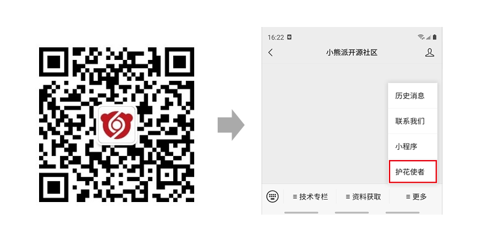

### &emsp;2. 登录小程序

1. 华为账号名获取
    
    使用华为账号登录华为云[https://www.huaweicloud.com/](https://www.huaweicloud.com/)，若无华为账号请自行注册华为账号。
    
    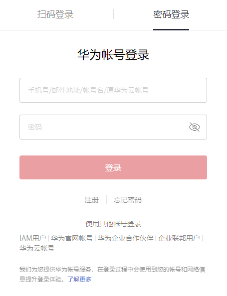

    在右上角用户的账号中心中完成实名认证，并点击进入账号中心。
    
    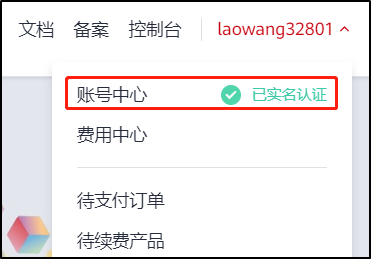

    在账号中心的基本信息中获取华为账号名。

    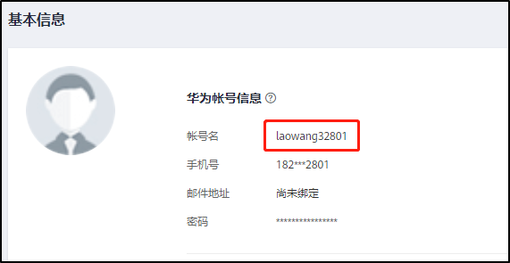

2. IAM账号名及密码获取

    
    点击[https://console.huaweicloud.com/iam](https://console.huaweicloud.com/iam)，进入华为云统一身份认证服务。
    
    点击右上角“创建用户“。
    
    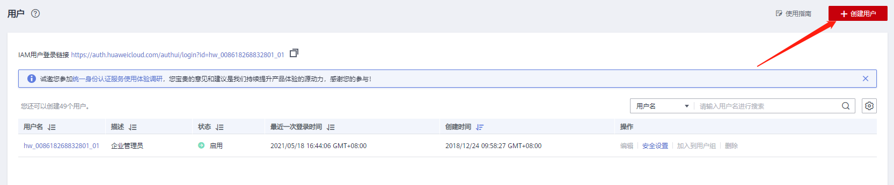 

    填写新用户信息，此处填写的用户名及密码即为登录小程序所需的IAM账号名及密码，并点击下一步。

    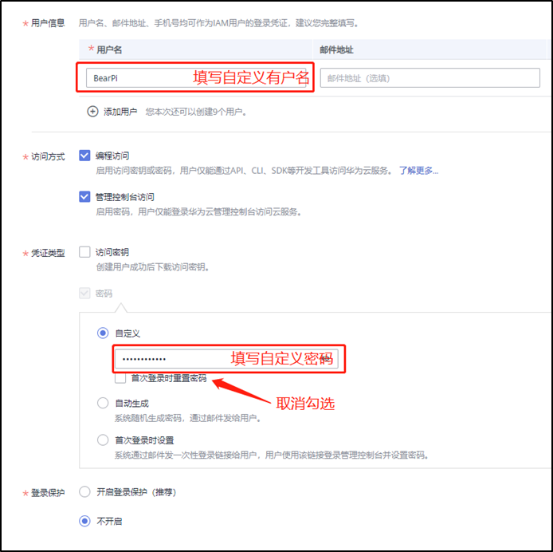

    选择加入的用户组，此处选择“拥有所有操作权限的用户组“，并点击右下角“创建用户”。

    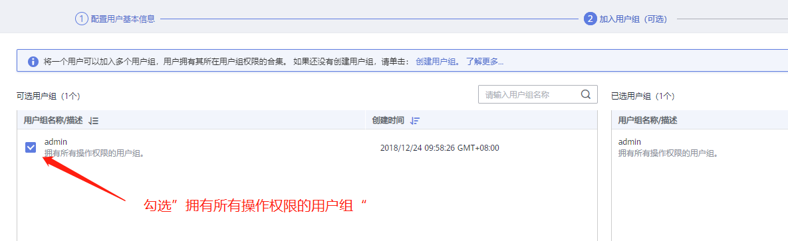
3. 登录小程序
    
    在小程序”我的“界面输入以上步骤中获取的华为账号名、IAM账号名及密码。
    
    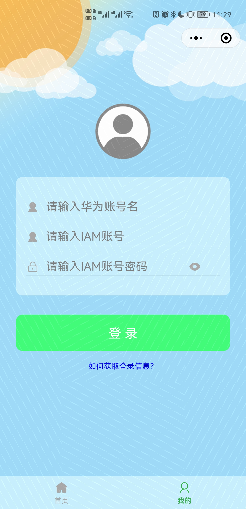

### 3、添加设备

&emsp;添加设备前请将手机`接入2.4G的WiFi`中，并`打开手机的NFC`功能，然后点击右上角加号，添加设备。

&emsp;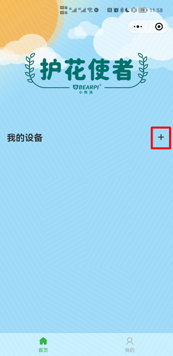        
 
### 4、配置设备

&emsp;填写自定义设备名称，以及设备连接目标WiFi的账号和密码，当提示“请将NFC模块靠近设备”时，将手机靠近开发板的NFC天线处，完成设备配置。
    
&emsp;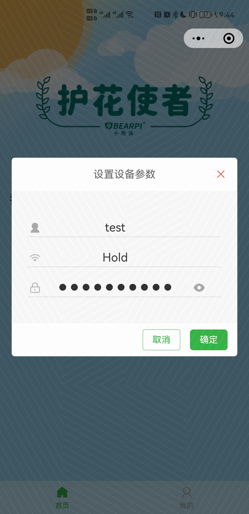&emsp;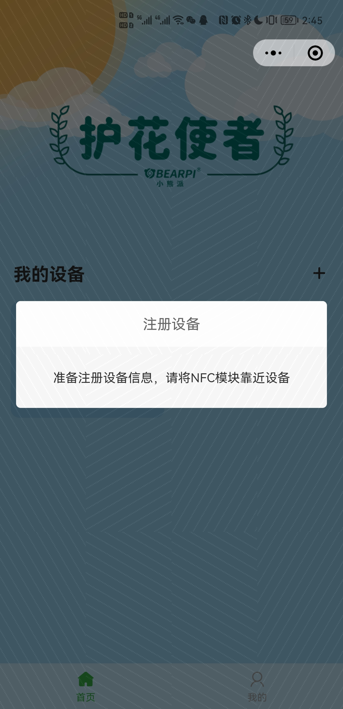  
 
### 6、调试设备

&emsp;添加完设备后，按一下开发板的复位按键，等待设备上线。点击设备，打开设备详情界面，即可查看当前绿植的土壤湿度以及空气的温湿度，点击浇水按钮即可远程控制设备浇水。

&emsp;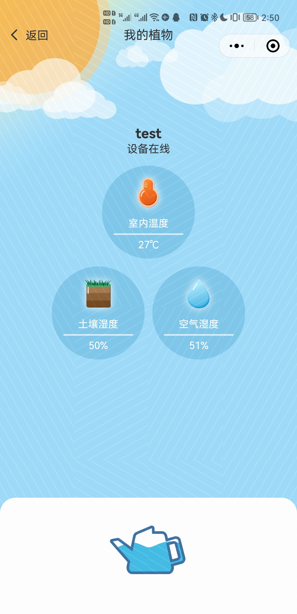   
