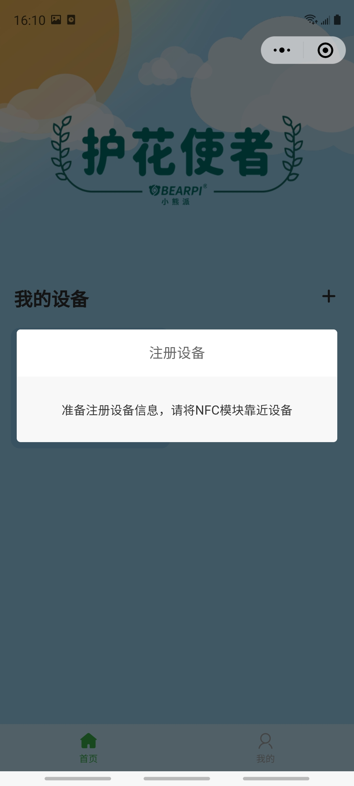

# 一、 准备工作
## 1.&emsp; 硬件准备（[点击购买](https://item.taobao.com/item.htm?ft=t&id=645216486457)）

- BearPi-HM Nano主板及“护花使者”底板

- “护花使者”底板，即传感器底板，下述统一称“护花使者”底板

- 配套水泵（额外土壤湿度传感器选配）

- 排线两对

- 水管

- 螺丝刀 

&emsp;&emsp;&emsp;

- Type-C 电源线一根（套装不包含，需自备）

- 安装HarmonyOS或安卓系统的手机，且要具备NFC功能，当前不支持IOS系统（需自备）

- 4节7号电池，用于开发板供电，也可用Type-C供电。（需自备）

## 2.&emsp;软件准备

- HiBurn烧录工具路径：”vendor_oh_fun\bearpi-hm_nano-oh_flower/04_烧录工具/HiBurn.exe “

- PC 预装Windows系统

# 二、 快速上手

该“护花使者”项目具备成本低、耗时少、操作简单等特点，时时刻刻呵护您的植物，伴其茁壮成长。那么如何使用BearPi-HM_Nano开发板来制作“护花使者“，让我们来DIY吧

## 1.&emsp;注册
&emsp;1.1.&emsp;打开网址：https://gitee.com/ 点击注册，如图

&emsp;&emsp; 

&emsp;1.2.&emsp;发送验证码：

&emsp;&emsp; 
 
&emsp;1.3&emsp;填写验证码和密码后，点击“立即注册”，如图：

&emsp;&emsp; 
 
&emsp;1.4.&emsp;注册成功，如图：

&emsp;&emsp; 
 
## 2.&emsp;点赞

打开以下链接，给该项目点赞，效果如下图所示：
https://gitee.com/openharmony-sig/vendor_oh_fun/tree/master/bearpi-hm_nano-oh_flower

## 3.&emsp;护花使者套件安装

### 3.1. 准备工作

&emsp;如下所列硬件准备完成后，请按照下述教程完成相关硬件连接。

- BearPi-HM Nano主板及“护花使者”底板

- “护花使者”底板，即传感器底板，下述统一称“护花使者”底板

- 配套水泵（额外土壤湿度传感器选配）

- 排线两对

- 水管

- 螺丝刀 

&emsp;&emsp;&emsp;

- Type-C 电源线一根（套装不包含，需自备）

- 安装HarmonyOS或安卓系统的手机，且要具备NFC功能，当前不支持IOS系统（需自备）

- 4节7号电池，用于开发板供电，也可用Type-C供电。（需自备）

### 3.2. 将开发板和底板固定

&emsp;主板对准四个限位螺母，拧上螺丝即可固定主板，再用排线连接主板和传感器底板的两组排针。

&emsp;

### 3.3. 连接水泵和开发板
&emsp;本套件背板搭载标准的USB Type-A接口，用于接入5V水泵，水管接到水泵的出水口，再根据USB接口方向，直接接入水泵的USB插头即可。

&emsp;

### 3.4.	为开发板供电
- 在“护花使者”底板背部，装入4节7号电池。安装电池的时候，注意电池的正负极。
- 也可通过BearPi-HM Nano主板中标准的USB Type-C接口为开发板供电。

&emsp;

### 3.5.	安装设备
&emsp;准备一个蓄水的容器，用作浇花的水源，把水泵放入容器中，水管伸到花盆中，再将底板的探头部分插入土壤。

&emsp;

## 4.&emsp;小程序使用
### &emsp;4.1. 打开小程序

&emsp;&emsp;扫描二维码关注公众号，在下方菜单栏中打开小程序。
    
&emsp;&emsp;

&emsp;&emsp;

### &emsp;4.2. 登录小程序

&emsp;&emsp;在小程序“我的”界面输入华为账号名、IAM账号名及密码。若没有华为账号名、IAM账号名及密码，请按照下述步骤进行。

&emsp;&emsp;

&emsp;&emsp;4.2.1. **获取华为账号名**
    
&emsp;&emsp;（1）在电脑上使用华为账号登录华为云[https://www.huaweicloud.com/](https://www.huaweicloud.com/)，若无华为账号请自行注册华为账号。

&emsp;&emsp;

&emsp;&emsp;（2）在右上角用户的账号中心中**完成实名认证**，并点击进入账号中心。
    
&emsp;&emsp;

&emsp;&emsp;（3）在账号中心的基本信息中获取华为账号名。

&emsp;&emsp;

&emsp;&emsp;4.2.2 **获取IAM账号名及密码**

    
&emsp;&emsp;（1）在电脑上点击[https://console.huaweicloud.com/iam](https://console.huaweicloud.com/iam)，进入华为云统一身份认证服务。
    
&emsp;&emsp;（2）点击右上角“创建用户“。
    
&emsp;&emsp; 

&emsp;&emsp;（3）填写新用户信息，此处填写的用户名及密码即为登录小程序所需的IAM账号名及密码，并点击下一步。

&emsp;&emsp;

&emsp;&emsp;（4）选择加入的用户组，此处选择“拥有所有操作权限的用户组“，并点击右下角“创建用户”。

&emsp;&emsp;

&emsp;&emsp;**4.2.3 开通IoTDA服务**

&emsp;&emsp;点击[开通IoTDA服务](https://console.huaweicloud.com/iotdm/?region=cn-north-4#/dm-portal/home)，本实验需要使用的华为云IoTDA设备接入服务，设备的数据会先上传至IoTDA平台，再转至小程序。该服务针对开发者不收费，请知悉。

### 4.3. 添加设备

&emsp;添加设备前请**打开手机的NFC及定位服务**功能，然后点击小程序右上角加号，添加设备。
    
&emsp;&emsp;**`注：`**

- **`需要使用带NFC功能的手机，并打开NFC功能，许多旧款的手机及iPhone手机不带有此功能`**
- **`v0.1版本护花使者只能添加一个设备，添加一个设备后该“+”控件会失效`**

&emsp;&emsp;&emsp;        
 
### 4.4. 配置设备

&emsp;填写自定义设备名称，以及设备连接目标WiFi的账号和密码，当提示“请将NFC模块靠近设备”时，**将手机NFC感应区（不同手机的NFC感应部位不同）靠近开发板的NFC天线处，等待完成设备配置。**

&emsp;**`注：`**
- **`此处指定接入的WiFi需要为2.4G的WiFi（一般为WiFi名字后缀不带5G字样的），且不能是开放的WiFi，也就是连接时需要输入密码的WiFi。`**

- **`也可在添加设备前将手机接入2.4G的WiFi，添加设备时会自动选择手机当前连接的WiFi`**

    
&emsp;&emsp;  

&emsp;
 
### 4.5. 调试设备

&emsp;添加完设备后，**按一下开发板的复位按键，开发板上蓝色灯开始闪烁，等待大约20S后，开发板上蓝色灯长亮，然后下拉小程序“我的设备”界面**，刷新界面，此时设备变为在线状态。点击设备，打开设备详情界面，即可查看当前绿植的土壤湿度以及空气的温湿度，点击浇水按钮即可远程控制设备浇水。(设备上线后，手机使用移动数据也能远程监控设备数据及控制浇水)

&emsp;&emsp;   

## 5.&emsp;固件升级指导

&emsp;快速上手之后，如果需要升级固件，请按照本章流程操作。下面为大家简单介绍一下OpenHarmony+小熊派HM Nano开发板升级烧录步骤：

### 5.1.&emsp;下载开发板程序

&emsp;（1）打开如下链接，可进入Gitee源码仓：
链接：
https://gitee.com/openharmony-sig/vendor_oh_fun/tree/master/bearpi-hm_nano-oh_flower

&emsp;（2） 克隆/下载处，点击下载ZIP，如图：

&emsp;&emsp;

&emsp;（3） 解压“openharmony-sig-vendor_oh_fun-master.zip”文件，进入“bearpi-hm_nano-oh_flower”文件夹，获得以下文件

&emsp;&emsp;

### 5.2.&emsp;安装驱动

&emsp;BearPi-HM_Nano开发板可以使用USB烧录代码及打印调试日志，但使用前需要在电脑上安装相应的驱动，所以下面我们就来看看怎么安装驱动。

&emsp;（1） 通过TypeC数据线，把电脑与BearPi-HM Nano连接。
    
&emsp;（2） 双击打开“02_USB驱动“文件夹下的”CH341SER.EXE“文件，并点击安装，驱动安装成功将如下图所示。

&emsp;&emsp;

&emsp;注：若提示“安装失败”，请点击“卸载”，再点击“安装”

&emsp;（3）	打开电脑设备管理器，查看开发板的连接的端口，该端口用于后续烧录代码及打印调试日志使用。
 
&emsp;&emsp;

### 5.3.&emsp;烧录程序
    
&emsp;烧写工具用于为可编程的集成电路写上数据，要实现开发板程序烧写。本次给BearPi-HM Nano开发板烧写二进制镜像文件工具是 HiBurn，接下来让我们来看一下怎么使用HiBurn工具给开发板烧录程序。

&emsp;（1）	打开“04_烧录工具”文件下的“HiBurn.exe”工具，并点击Refresh，在COM中选择上一步看到的COM号。然后点击Setting，并选择 Com settings。
    
&emsp;&emsp;

&emsp;（2） 在Com settings中设置Baud为：921600（代表该串口的烧录速率），点击确定。

&emsp;&emsp;

&emsp;（3）	点击 Hiburn工具中的Select file按钮，在弹出的文件框中，选择“03_固件”文件下的OpenHarmony_flower_V0.1 文件。

&emsp;&emsp;

&emsp;（4）	点击Auto burn复选框，然后点击Connect，此时Connect按钮变成Disconnect，等待下载。
 
&emsp;&emsp;

&emsp;（5）	复位开发板RESET按键，开始下载程序。

&emsp;&emsp;

&emsp;&emsp;
    
&emsp;（6）	直到出现Execution Successful字样，程序下载完成。
    
&emsp;&emsp;

&emsp;（7）	下载完后，点击Disconnect按钮，否则再次按下复位键后会重新开始烧录代码。

&emsp;&emsp;
