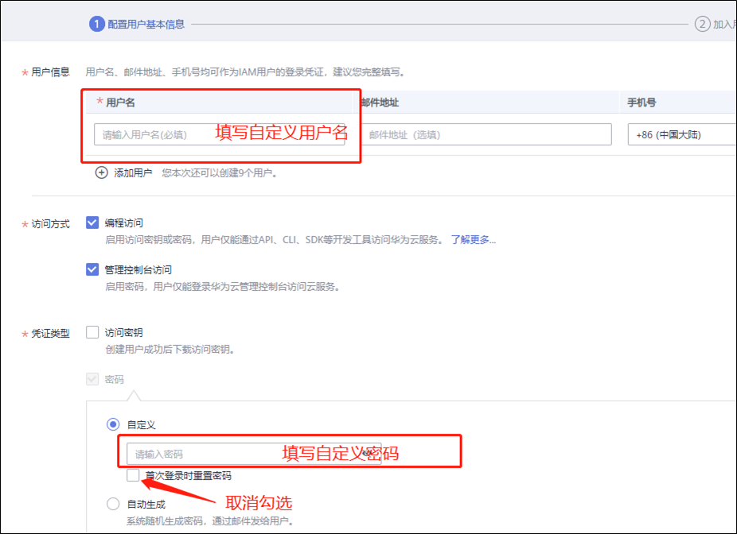
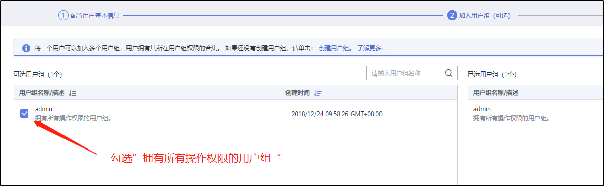
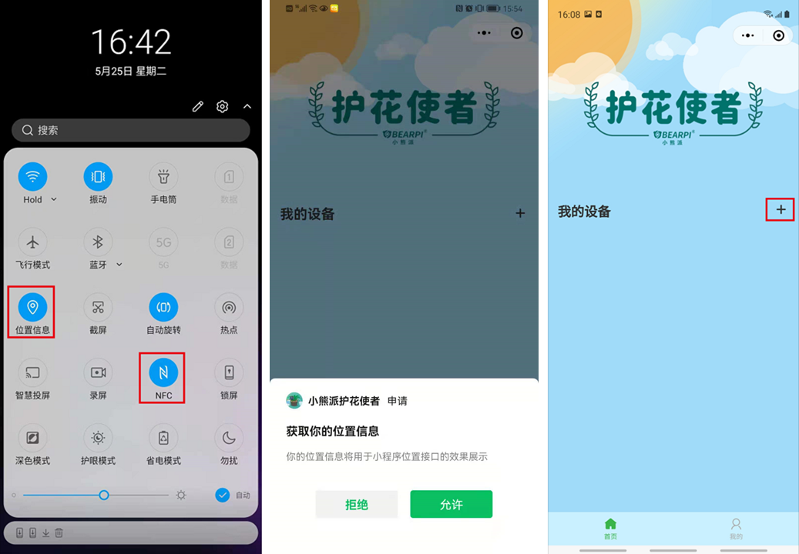

# 护花使者套件使用手册

## 一、护花使者套件安装说明

### 1. 准备工作

&emsp;在开发之前，需要准备以下材料([点击购买](https://item.taobao.com/item.htm?ft=t&id=645216486457))

- BearPi-HM Nano主板及“护花使者”底板

- 配套水泵（额外土壤湿度传感器选配）

- 排线两对

- Type-C 电源线一根

- PC 预装Windows系统

### 2. 硬件环境搭建

&emsp;（1）主板对准四个限位螺母，拧上螺丝即可固定主板，再用排线连接主板和底板的两组排针。

&emsp;

&emsp;（2）本套件背板搭载标准的USB Type-A接口，用于接入5V水泵，水管接到水泵的出水口

&emsp;

&emsp;（3）再根据USB接口方向，直接接入水泵的USB插头即可

&emsp;

&emsp;（4）装入4节AAA电池，注意电池的正负极

  
&emsp;

&emsp;（5）准备一个蓄水的容器，用作浇花的水源，把水泵放入容器中，再将底板的探头部分插入土壤，整套系统就可以开始工作了。

## 二、小程序使用
### &emsp;1. 打开小程序

&emsp;&emsp;扫描二维码关注公众号，在下方菜单栏中打开小程序。
    
&emsp;&emsp;

&emsp;&emsp;

### &emsp;2. 登录小程序

1. 华为账号名获取
    
    （1）使用华为账号登录华为云[https://www.huaweicloud.com/](https://www.huaweicloud.com/)，若无华为账号请自行注册华为账号。

    

    （2）在右上角用户的账号中心中**完成实名认证**，并点击进入账号中心。
    
    

    （3）在账号中心的基本信息中获取华为账号名。

    

2. IAM账号名及密码获取

    
    （1）点击[https://console.huaweicloud.com/iam](https://console.huaweicloud.com/iam)，进入华为云统一身份认证服务。
    
    （2）点击右上角“创建用户“。
    
     

    （3）填写新用户信息，此处填写的用户名及密码即为登录小程序所需的IAM账号名及密码，并点击下一步。

    

    （4）选择加入的用户组，此处选择“拥有所有操作权限的用户组“，并点击右下角“创建用户”。

    
3. 登录小程序
    
    &emsp;在小程序”我的“界面输入以上步骤中获取的华为账号名、IAM账号名及密码。
    
    &emsp;

### 3、添加设备

&emsp;添加设备前请**打开手机的NFC及定位服务**功能，然后点击小程序右上角加号，添加设备。
    
&emsp;&emsp;**`注：`**

- **`需要使用带NFC功能的手机，并打开NFC功能，许多旧款的手机及iPhone手机不带有此功能`**
- **`v0.1版本护花使者只能添加一个设备，添加一个设备后该“+”控件会失效`**

&emsp;&emsp;          
 
### 4、配置设备

&emsp;填写自定义设备名称，以及设备连接目标WiFi的账号和密码，当提示“请将NFC模块靠近设备”时，**将手机靠近开发板的NFC天线处**，完成设备配置。

&emsp;**`注：`**
- **`此处指定接入的WiFi需要为2.4G的WiFi（一般为WiFi名字后缀不带5G字样的），且不能是开放的WiFi，也就是连接时需要输入密码的WiFi。`**

- **`也可在添加设备前将手机接入2.4G的WiFi，添加设备时会自动选择手机当前连接的WiFi`**

    
&emsp;&emsp;  
 
### 5、调试设备

&emsp;添加完设备后，**按一下开发板的复位按键，等待30S后，下拉“我的设备”界面**，刷新界面，此时设备变为在线状态。点击设备，打开设备详情界面，即可查看当前绿植的土壤湿度以及空气的温湿度，点击浇水按钮即可远程控制设备浇水。(设备上线后，手机使用移动数据也能远程监控设备数据及控制浇水)

&emsp;&emsp;   

## 三、固件升级指导
1.	下载开发板程序

    （1）打开如下链接，可进入Gitee源码仓：
链接：
https://gitee.com/openharmony-sig/vendor_oh_fun/tree/master/bearpi-hm_nano-oh_flower
    
    （2） 克隆/下载处，点击下载ZIP，如图：

    

    （3） 解压“openharmony-sig-vendor_oh_fun-master.zip”文件，进入“bearpi-hm_nano-oh_flower”文件夹，获得以下文件

    

2.	安装驱动

    BearPi-HM_Nano开发板可以使用USB烧录代码及打印调试日志，但使用前需要在电脑上安装相应的驱动，所以下面我们就来看看怎么安装驱动。

    （1） 通过TypeC数据线，把电脑与BearPi-HM Nano连接。
    
    （2） 双击打开“02_USB驱动“文件夹下的”CH341SER.EXE“文件，并点击安装，驱动安装成功将如下图所示。

    

    注：若提示“安装失败”，请点击“卸载”，再点击“安装”

    （3）	打开电脑设备管理器，查看开发板的连接的端口，该端口用于后续烧录代码及打印调试日志使用。
 
    

3.	烧录程序

    （1）	打开“04_烧录工具”文件下的“HiBurn.exe”工具，并点击Refresh，在COM中选择上一步看到的COM号。然后点击Setting，并选择 Com settings。
    
    

    （2） 在Com settings中设置Baud为：921600，点击确定。

    

    （3）	点击 Hiburn工具中的Select file按钮，在弹出的文件框中，选择“03_固件”文件下的OpenHarmony_flower_V0.1 文件。

    

    （4）	点击Auto burn复选框，然后点击Connect，此时Connect按钮变成Disconnect，等待下载。
 
    

    （5）	复位开发板RESET按键，开始下载程序。

    
    
    
    （6）	直到出现Execution Successful字样，程序下载完成。

    （7）	下载完后，点击Disconnect按钮，便于后面调测使用。
