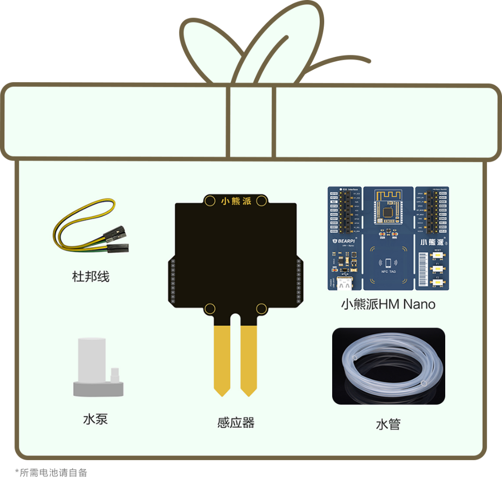
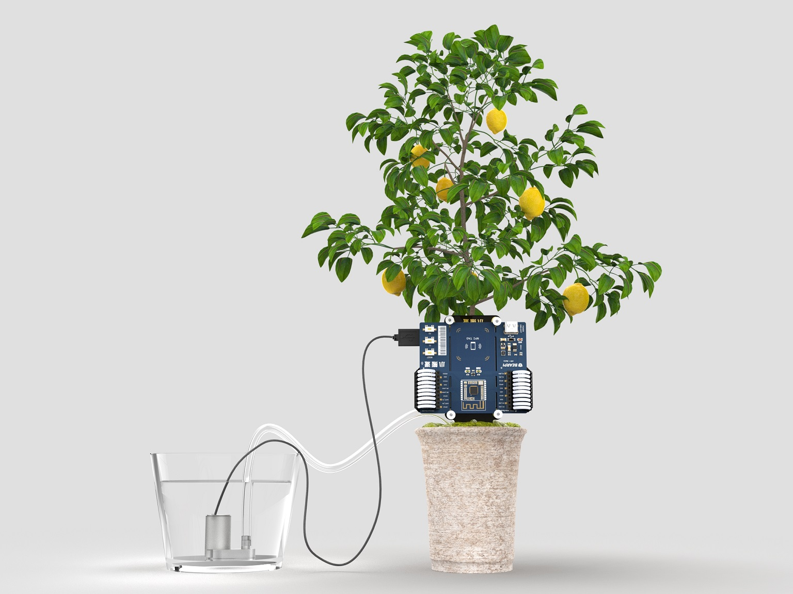
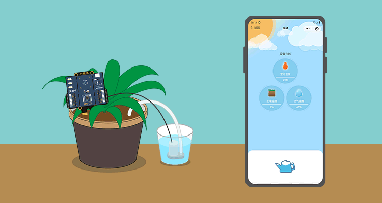

# OpenHarmony和小熊派BearPi-HM Nano陪宝宝们过六一

&emsp;&emsp;小时候，我们相信魔法，充满好奇；长大后，我们研发“魔法”，探索未知。又到了我们光明正大当宝宝的日子！这个六一，我们专宠每一位开发者。为每一位宝宝安排了一份神秘又充满乐趣的六一礼物——”护花使者”。OpenHarmony&小熊派HM Nano为六一献礼，推出 “护花使者”的超级礼盒，99元、30分钟便可让各位宝宝们重拾童趣。

&emsp;&emsp;

 
&emsp;&emsp;自从养了花花草草，主子们真是为它们操碎了心。阳台党的N多烦恼，你是不是也会经常遇到？
- 好不容易有个假期，想去旅行，却担心家里的花花草草无人照顾。
- 最近总是下雨，还要不要给养的花花浇水了？
- 今天又要加班了，又不能给我的肉肉及时浇水了。 

&emsp;&emsp;别焦虑！OpenHarmony+小熊派BearPi-HM Nano开发板放大招啦！动动手指，一键解决浇水问题！

&emsp;&emsp;

&emsp;&emsp;搭载OpenHarmony的小熊派BearPi-HM Nano主板，加上一块传感器扩展板，利用湿度监测探头和水泵，解决你的一切烦恼。将开发板上的传感器插入土壤，传感器实时监测土壤中的湿度信息并在手机界面中显示。所以，我们可以通过观察手机界面中显示的湿度信息，决定要不要给花花草草浇水。当我们发现土壤中的湿度较低时，可通过手机远程控制水泵工作，轻松实现远程浇花！手机远程控制，在外也可控制家里的浇灌系统，别有一番“指点江山，掌控全场”的体验感。
 
 &emsp;&emsp;

&emsp;&emsp;后续版本畅想：后续版本可以实现按需定时浇水功能；也可以自动给花花草草浇水；还可以进行宠物喂食，实现智能养护……关于护花使者的N多种可能，由我们来定义！开发者宝宝们快为自己定制一个专属“护花使者”吧。最后，祝每一位探索世界而又童心未泯的开发者，六一儿童节快乐！ 

# 资料获取

开源社区链接:
https://gitee.com/openharmony-sig/vendor_oh_fun/tree/master/bearpi-hm_nano-oh_flower

相关设备获取链接：
https://item.taobao.com/item.htm?ft=t&id=645216486457

BearPi-HM_Nano开发板学习仓库：
https://gitee.com/bearpi/bearpi-hm_nano

# 互动有礼
&emsp;&emsp;欢迎小伙伴尝试OpenHarmony+小熊派HM Nano开发板_护花使者_v0.1项目！我们征集以下OpenHarmony+小熊派HM Nano开发板落地实践：

1.  基于本项目的植物浇水、宠物喂食等落地实践，请具体描述出设备品牌、型号、改造过程，并提供相关的改造文字、图片、视频等；

2. 基于本项目的开发板美化实践，如3D打印、手工制作外壳等美化方案；
3. 分享您的绿植浇水配置文件，如针对绿萝、多肉、仙人掌的浇水配置文件；
4. 基于OpenHarmony项目好玩的创意。

&emsp;&emsp;在2021年05月28日00:00:00 -2021年06月28日23:59:59期间，将你的“护花使者”项目的体验或者有关OpenHarmony的创意实践或idea提PR到Gitee仓库：
https://gitee.com/openharmony-sig/vendor_oh_fun/tree/master/bearpi-hm_nano-oh_flower

&emsp;&emsp;我们将根据实践或idea的创新性，抽取30位幸运用户分别赠送印制有HarmonyOS的精美文化衫一件，文化衫如下图所示。我们将在活动结束后7个工作日之内联系幸运用户进行兑奖。请幸运用户在接收到我们的消息之后7个工作日之内提供用于领取奖品的相关个人信息，逾期作废。

 &emsp;&emsp;

# 活动规则
1、本次活动一个用户ID只能中奖一次，如出现重复中奖则顺延至下一位有效用户；

2、 活动结束后15个工作日内公布获奖名单及发放奖品；

3、 所有回复禁止带有色情、政治等敏感或违法内容，推广、外链等商业内容，一经发现，封禁处理；

4、 所有用户均可参与，为杜绝恶意灌水刷奖，每个ID最多每天只能提交一次PR；

5、 禁止抄袭、复制他人发布内容，一经发现取消其获奖资格。

# 用户内容素材许可声明

 &emsp;&emsp;本活动中涉及的有奖征集用户的“护花使者”项目改造相关资源，将无偿用于活动的宣传和奖品公布环节。涉及的资源类型包括但不限于：评论内容、图片、肖像、视频等。用户发布的渠道包括但不限于：在技术交流群、在码云提交issue或PR、或者在“护花使者”改造项目发布渠道评论区等平台。如在上述渠道发布评论内容、图片、视频、肖像等资源，将视为用户将相关资源版权授予活动发起方。如您参与上述活动内容即表示您同意以上声明，请您悉知！

# 活动隐私声明
 &emsp;&emsp;如您参与活动并中奖，为了完成奖品发放，我们需要收集您的姓名、Gitee昵称、邮件地址、联系地址、联系电话等信息。实物奖品的寄送服务由第三方物流公司提供，为此我们会将您的上述信息向其进行共享。如您参与活动即表示您同意以上声明。

# 技术交流
 &emsp;&emsp;已开设交流群，请扫描下方二维码或搜索小助手微信号：BearPi_Helper，让小助手拉您进群与开发者们进行技术讨论，还可以与工程师在线交流哦！

 &emsp;&emsp;
 
