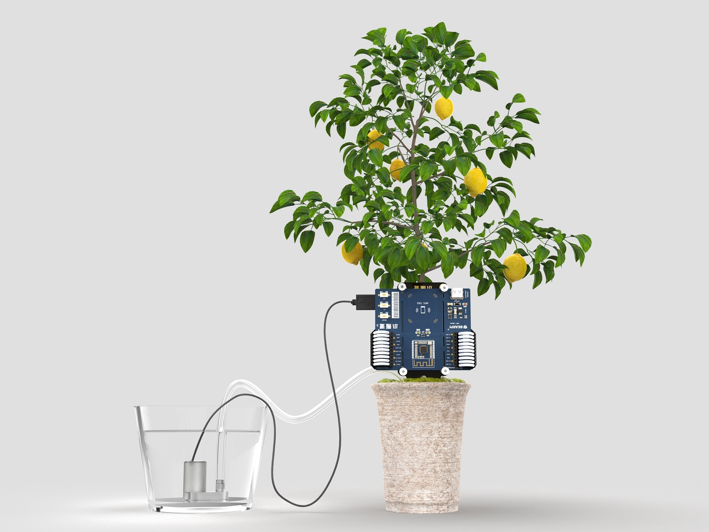

# 项目介绍
本项目是用BearPi-HM_Nano开发板加上一块“护花使者“底板及抽水电机等配件，快速DIY出一款具备远程监测土壤湿度并实现远程浇水的护花使者“。

该项目具备成本低、耗时少、操作简单等特点，时时刻刻呵护您的植物，伴其茁壮成长。

&emsp;

# 教程指导

该项目支持：

- 可通过小程序给设备配网
- 远程查看土壤湿度、环境温度及环境湿度
- 可实现远程控制水泵浇水 

那么如何使用BearPi-HM_Nano开发板来制作“护花使者“，点击[查看教程](01_操作文档/护花使者使用手册.md)一起来DIY吧

# 相关资源
## BearPi-HM Nano开发板介绍[（点击购买）](https://item.taobao.com/item.htm?id=633296694816)

BearPi-HM Nano开发板是一块专门为鸿蒙OS设计HarmonyOS的开发板，板载高度集成的2.4GHz WLAN SoC芯片Hi3861，并板载NFC电路及标准的E53接口，标准的E53接口可扩展智能家居、智能台灯、智能安防、智能烟感等案例。

## BearPi-HM Nano开发板深度学习教程

### 一、BearPi-HM Nano开发板快速上手（十分钟上手）

如果您想快速的体验一下HarmonyOS的源码`[获取]`、`[编译]`、`[烧录]`过程，强烈建议您学习以下教程，这能让您在环境安装环节省下不少时间。

1、视频教程（B站）

* [开发环境搭建(简单)—十分钟快速上手](https://www.bilibili.com/video/BV1tv411b7SA?p=2)

2、文档（Gitee）
* [VMware 镜像版本：十分钟上手体验](https://gitee.com/bearpi/bearpi-hm_nano/blob/master/applications/BearPi/BearPi-HM_Nano/docs/quick-start/BearPi-HM_Nano%E5%8D%81%E5%88%86%E9%92%9F%E4%B8%8A%E6%89%8B.md)

### 二、BearPi-HM Nano开发板手把手教程系列

如果您想学习鸿蒙系统的环境搭建，并想了解整个从0到1的过程，建议您跟着我们一步一步的学习。
需要告诉您的是，鸿蒙系统的环境搭建所涉及的领域及组件会比较多，您需要严格按照我们的教程执行每一步，否则可能会出现不能预知的错误。

1、视频系列（B站）[ 对应PPT地址 ](https://gitee.com/bearpi/bearpi-hm_nano/tree/master/applications/BearPi/BearPi-HM_Nano/docs/board/%E8%AF%BE%E7%A8%8B%E9%85%8D%E5%A5%97PPT)
* [P1. BearPi-HM Nano开发板介绍](https://www.bilibili.com/video/BV1tv411b7SA?p=1)
* [P2. 开发环境搭建(复杂)—编译环境搭建](https://www.bilibili.com/video/BV1tv411b7SA?p=3)
* [P3. 开发环境搭建(复杂)—源码获取](https://www.bilibili.com/video/BV1tv411b7SA?p=4)
* [P4. 开发环境搭建(复杂)—在Windows上打开源码](https://www.bilibili.com/video/BV1tv411b7SA?p=5)
* [P5. HarmonyOS快速入门：Hello_World](https://www.bilibili.com/video/BV1tv411b7SA?p=6)
* [P6. HarmonyOS快速入门：点亮LED](https://www.bilibili.com/video/BV1tv411b7SA?p=7)
* [P7. Harmony编译构建介绍](https://www.bilibili.com/video/BV1tv411b7SA?p=8)
* [P8. HarmonyOS CMSIS接口简介](https://www.bilibili.com/video/BV1tv411b7SA?p=9)
* [P9. HarmonyOS内核开发—任务管理（上）](https://www.bilibili.com/video/BV1tv411b7SA?p=10)
* [P10. HarmonyOS内核开发—任务管理（下）](https://www.bilibili.com/video/BV1tv411b7SA?p=11)
* [P11. HarmonyOS内核开发—软件定时器](https://www.bilibili.com/video/BV1tv411b7SA?p=12)
* [P12. HarmonyOS内核开发—信号量](https://www.bilibili.com/video/BV1tv411b7SA?p=13)
* [P13. HarmonyOS内核开发—事件管理](https://www.bilibili.com/video/BV1tv411b7SA?p=14)
* [P14. HarmonyOS内核开发—互斥锁](https://www.bilibili.com/video/BV1tv411b7SA?p=15)
* [P15. HarmonyOS内核开发—消息队列](https://www.bilibili.com/video/BV1tv411b7SA?p=16)
* [P16. HarmonyOS驱动子系统开发—GPIO](https://www.bilibili.com/video/BV1tv411b7SA?p=17)
* [P17. HarmonyOS驱动子系统开发—GPIO中断](https://www.bilibili.com/video/BV1tv411b7SA?p=19)
* [P18. HarmonyOS驱动子系统开发—PWM](https://www.bilibili.com/video/BV1tv411b7SA?p=19)
* [P19. HarmonyOS驱动子系统开发—ADC](https://www.bilibili.com/video/BV1tv411b7SA?p=20)
* [P20. HarmonyOS驱动子系统开发—I2C](https://www.bilibili.com/video/BV1tv411b7SA?p=21)
* [P21. HarmomyOS驱动子系统开发—UART](https://www.bilibili.com/video/BV1tv411b7SA?p=22)
* [P22. HarmonyOS无线联网开发—WiFi AP热点](https://www.bilibili.com/video/BV1tv411b7SA?p=23)
* [P23. HarmonyOS无线联网开发—WiFi STA联网](https://www.bilibili.com/video/BV1tv411b7SA?p=24)
* [P24. HarmonyOS网络应用开发—UDP客户端](https://www.bilibili.com/video/BV1tv411b7SA?p=25)
* [P25. HarmonyOS网络应用开发—TCP服务端](https://www.bilibili.com/video/BV1tv411b7SA?p=26)
* [P26. HarmonyOS网络应用开发—TCP客户端](https://www.bilibili.com/video/BV1tv411b7SA?p=27)
* [P27. HarmonyOS网络应用开发—UDP服务端](https://www.bilibili.com/video/BV1tv411b7SA?p=28)
* [P28. HarmonyOS网络应用开发—MQTT客户端](https://www.bilibili.com/video/BV1tv411b7SA?p=29)
* [P29. HarmonyOS网络应用开发—对接华为IoT平台](https://www.bilibili.com/video/BV1tv411b7SA?p=30)
* [P30. HarmonyOS网络应用开发—对接OneNET平台](https://www.bilibili.com/video/BV1tv411b7SA?p=31)
* [更多: 陆续上传中...](https://www.bilibili.com/video/BV1tv411b7SA)

2、文档系列（Gitee）
-   [BearPi-HM_Nano 开发板介绍](https://gitee.com/bearpi/bearpi-hm_nano/blob/master/applications/BearPi/BearPi-HM_Nano/docs/quick-start/BearPi-HM_Nano%E5%BC%80%E5%8F%91%E6%9D%BF%E4%BB%8B%E7%BB%8D.md)
-   [BearPi-HM_Nano 开发搭建环境](https://gitee.com/bearpi/bearpi-hm_nano/blob/master/applications/BearPi/BearPi-HM_Nano/docs/quick-start/BearPi-HM_Nano%E5%BC%80%E5%8F%91%E6%90%AD%E5%BB%BA%E7%8E%AF%E5%A2%83.md)
-   [BearPi-HM_Nano 开发板源码获取](https://gitee.com/bearpi/bearpi-hm_nano/blob/master/applications/BearPi/BearPi-HM_Nano/docs/quick-start/%E6%BA%90%E7%A0%81%E8%8E%B7%E5%8F%96.md)
-   [BearPi-HM_Nano 开发板如何烧录程序](https://gitee.com/bearpi/bearpi-hm_nano/blob/master/applications/BearPi/BearPi-HM_Nano/docs/quick-start/BearPi-HM_Nano%E5%BC%80%E5%8F%91%E6%9D%BF%E5%A6%82%E4%BD%95%E7%83%A7%E5%BD%95%E7%A8%8B%E5%BA%8F.md)
-   [BearPi-HM_Nano 开发第一个示例程序](https://gitee.com/bearpi/bearpi-hm_nano/blob/master/applications/BearPi/BearPi-HM_Nano/docs/quick-start/BearPi-HM_Nano%E5%BC%80%E5%8F%91%E6%9D%BF%E7%AC%AC%E4%B8%80%E4%B8%AA%E7%A4%BA%E4%BE%8B%E7%A8%8B%E5%BA%8F.md)
-   [BearPi-HM_Nano 案例开发](https://gitee.com/bearpi/bearpi-hm_nano/blob/master/applications/BearPi/BearPi-HM_Nano/sample/README.md)

