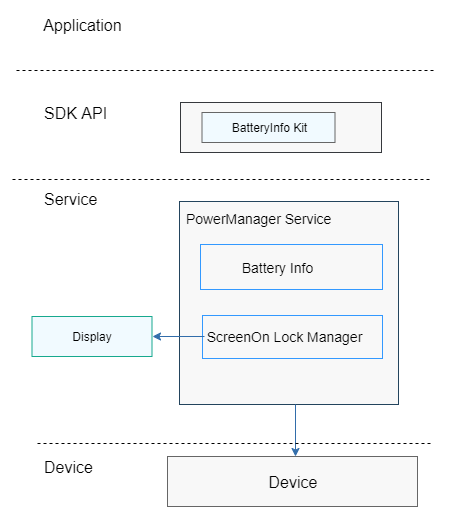

# Lite Power Manager<a name="EN-US_TOPIC_0000001126247025"></a>

-   [Introduction](#section11660541593)
-   [Directory Structure](#section19472752217)
-   [Usage](#section146636391856)
    -   [Available APIs](#section481251394)
    -   [Usage Guidelines](#section12620311012)

-   [Repositories Involved](#section63151229062)

## Introduction<a name="section11660541593"></a>

The lite power manager provides the following capabilities:

1.  Querying the battery level
2.  Keeping the device screen always on using a lock

**Figure  1**  Lite power manager architecture<a name="fig106301571239"></a>




## Directory Structure<a name="section19472752217"></a>

```
base/powermgr/powermgr_lite
├── interfaces		# APIs
│   └── kits
│       └── battery		# API for querying the battery level
└── services		        # Services
    ├── include
    └── source
```

## Usage<a name="section146636391856"></a>

### Available APIs<a name="section481251394"></a>

The following table lists the JavaScript APIs provided by the lite power manager.

<a name="table45171237103112"></a>
<table><thead align="left"><tr id="row12572123793117"><th class="cellrowborder" valign="top" width="38.71%" id="mcps1.1.3.1.1"><p id="p19572937163116"><a name="p19572937163116"></a><a name="p19572937163116"></a><strong id="b98969616388"><a name="b98969616388"></a><a name="b98969616388"></a>API</strong></p>
</th>
<th class="cellrowborder" valign="top" width="61.29%" id="mcps1.1.3.1.2"><p id="p157213711313"><a name="p157213711313"></a><a name="p157213711313"></a><strong id="b17930187133810"><a name="b17930187133810"></a><a name="b17930187133810"></a>Description</strong></p>
</th>
</tr>
</thead>
<tbody><tr id="row14574143723119"><td class="cellrowborder" valign="top" width="38.71%" headers="mcps1.1.3.1.1 "><p id="p67351028124111"><a name="p67351028124111"></a><a name="p67351028124111"></a>battery.getStatus(OBJECT)</p>
</td>
<td class="cellrowborder" valign="top" width="61.29%" headers="mcps1.1.3.1.2 "><p id="p105741337153115"><a name="p105741337153115"></a><a name="p105741337153115"></a>Obtains the battery level.</p>
</td>
</tr>
</tbody>
</table>

### Usage Guidelines<a name="section12620311012"></a>

**Obtaining the battery level**

Use the JavaScript API to obtain the battery level.

The sample code is as follows:

```
battery.getStatus({
  success: function(data) {
    console.log('success get battery level:' + data.level);
  },
  fail: function(data, code) {
    console.log('fail to get battery level code:' + code + ', data: ' + data);
  },
});
```

## Repositories Involved<a name="section63151229062"></a>

Power management subsystem

**hmf/powermgr/powermgr\_lite**

