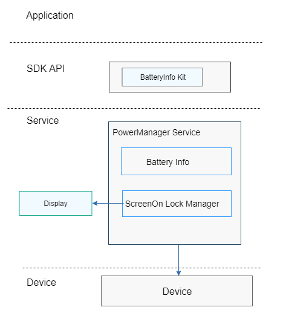

# 轻量级电源管理组件<a name="ZH-CN_TOPIC_0000001126247025"></a>

-   [简介](#section11660541593)
-   [目录](#section19472752217)
-   [说明](#section146636391856)
    -   [接口说明](#section481251394)
    -   [使用说明](#section12620311012)

-   [相关仓](#section63151229062)

## 简介<a name="section11660541593"></a>

轻量级电源组件提供如下功能：

1.  电池电量查询。
2.  亮灭屏控制锁。

**图 1**  轻量级电源管理组件架构图<a name="fig106301571239"></a>




## 目录<a name="section19472752217"></a>

```
base/powermgr/powermgr_lite
├── interfaces		# 轻量级电源管理组件接口层
│   └── kits
│       └── battery		# 电池查询接口
└── services		        # 电源管理组件服务
    ├── include
    └── source
```

## 说明<a name="section146636391856"></a>

### 接口说明<a name="section481251394"></a>

轻量电源管理服务对外提供的JS接口，如下表：

<a name="table45171237103112"></a>
<table><thead align="left"><tr id="row12572123793117"><th class="cellrowborder" valign="top" width="38.71%" id="mcps1.1.3.1.1"><p id="p19572937163116"><a name="p19572937163116"></a><a name="p19572937163116"></a><strong id="b18552135014316"><a name="b18552135014316"></a><a name="b18552135014316"></a>接口名</strong></p>
</th>
<th class="cellrowborder" valign="top" width="61.29%" id="mcps1.1.3.1.2"><p id="p157213711313"><a name="p157213711313"></a><a name="p157213711313"></a><strong id="b193891558123118"><a name="b193891558123118"></a><a name="b193891558123118"></a>描述</strong></p>
</th>
</tr>
</thead>
<tbody><tr id="row14574143723119"><td class="cellrowborder" valign="top" width="38.71%" headers="mcps1.1.3.1.1 "><p id="p67351028124111"><a name="p67351028124111"></a><a name="p67351028124111"></a>battery.getStatus(OBJECT)</p>
</td>
<td class="cellrowborder" valign="top" width="61.29%" headers="mcps1.1.3.1.2 "><p id="p105741337153115"><a name="p105741337153115"></a><a name="p105741337153115"></a>获取电池电量</p>
</td>
</tr>
</tbody>
</table>

### 使用说明<a name="section12620311012"></a>

**获取电池电量信息**

提供了获取电池电量的接口。

JS代码示例如下：

```
battery.getStatus({
  success: function(data) {
    console.log('success get battery level:' + data.level);
  },
  fail: function(data, code) {
    console.log('fail to get battery level code:' + code + ', data: ' + data);
  },
});

```

## 相关仓<a name="section63151229062"></a>

电源管理子系统

**hmf/powermgr/powermgr\_lite**

