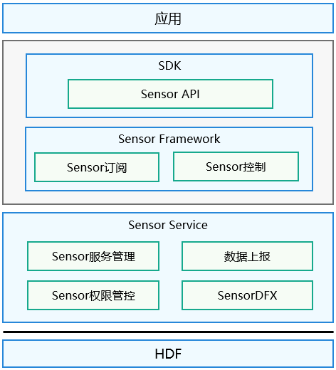

# Sensor\_lite组件<a name="ZH-CN_TOPIC_0000001078194836"></a>

-   [简介](#section11660541593)
-   [目录](#section161941989596)
-   [说明](#section1312121216216)
    -   [接口说明](#section827111510217)
    -   [使用说明](#section129654513264)

-   [相关仓](#section1371113476307)

## 简介<a name="section11660541593"></a>

泛Sensor服务子系统提供了轻量级sensor服务基础框架，提供了如下功能：

-   Sensor列表查询
-   Sensor启停
-   Sensor订阅/去订阅
-   设置数据上报模式
-   设置采样间隔等

泛Sensor服务框架如下图所示：

**图 1**  泛Sensor服务框架图<a name="fig15658513184019"></a>  


## 目录<a name="section161941989596"></a>

```
/base/sensors/sensor_lite
├── frameworks      # 框架代码
│   ├── include     # 头文件目录
│   └── src         # 源代码目录
├── interfaces      # 接口目录
│   └── kits        # Native接口目录
├── services        # 服务代码目录
│   ├── include     # 头文件目录
│   └── src         # 源代码目录
```

## 说明<a name="section1312121216216"></a>

### 接口说明<a name="section827111510217"></a>

**表 1**  SensorAgent的主要接口

<a name="table411220157213"></a>
<table><thead align="left"><tr id="row131101415123"><th class="cellrowborder" valign="top" width="62.339999999999996%" id="mcps1.2.3.1.1"><p id="p181106151923"><a name="p181106151923"></a><a name="p181106151923"></a>接口名</p>
</th>
<th class="cellrowborder" valign="top" width="37.66%" id="mcps1.2.3.1.2"><p id="p1511021515212"><a name="p1511021515212"></a><a name="p1511021515212"></a>描述</p>
</th>
</tr>
</thead>
<tbody><tr id="row711081513219"><td class="cellrowborder" valign="top" width="62.339999999999996%" headers="mcps1.2.3.1.1 "><p id="p111020153217"><a name="p111020153217"></a><a name="p111020153217"></a><strong id="b1411081511214"><a name="b1411081511214"></a><a name="b1411081511214"></a>GetAllSensors</strong>(SensorInfo **sensorInfo, int32_t *count)</p>
</td>
<td class="cellrowborder" valign="top" width="37.66%" headers="mcps1.2.3.1.2 "><p id="p71104156214"><a name="p71104156214"></a><a name="p71104156214"></a>获取系统中所有传感器的信息</p>
</td>
</tr>
<tr id="row7111111511212"><td class="cellrowborder" valign="top" width="62.339999999999996%" headers="mcps1.2.3.1.1 "><p id="p1111091510212"><a name="p1111091510212"></a><a name="p1111091510212"></a><strong id="b1011011514211"><a name="b1011011514211"></a><a name="b1011011514211"></a>SubscribeSensor</strong>(int32_t sensorTypeId, SensorUser *user)</p>
</td>
<td class="cellrowborder" valign="top" width="37.66%" headers="mcps1.2.3.1.2 "><p id="p011014153214"><a name="p011014153214"></a><a name="p011014153214"></a>订阅传感器数据，系统会将获取到的传感器数据上报给订阅者</p>
</td>
</tr>
<tr id="row8111121512211"><td class="cellrowborder" valign="top" width="62.339999999999996%" headers="mcps1.2.3.1.1 "><p id="p1211117151227"><a name="p1211117151227"></a><a name="p1211117151227"></a><strong id="b141111715023"><a name="b141111715023"></a><a name="b141111715023"></a>UnsubscribeSensor</strong>(int32_t sensorTypeId, SensorUser *user)</p>
</td>
<td class="cellrowborder" valign="top" width="37.66%" headers="mcps1.2.3.1.2 "><p id="p311115159211"><a name="p311115159211"></a><a name="p311115159211"></a>去订阅传感器数据，系统将取消传感器数据上报给订阅者</p>
</td>
</tr>
<tr id="row21111151822"><td class="cellrowborder" valign="top" width="62.339999999999996%" headers="mcps1.2.3.1.1 "><p id="p311110151824"><a name="p311110151824"></a><a name="p311110151824"></a><strong id="b8111201519219"><a name="b8111201519219"></a><a name="b8111201519219"></a>SetBatch</strong>(int32_t sensorTypeId, SensorUser *user, int64_t samplingInterval, int64_t reportInterval)</p>
</td>
<td class="cellrowborder" valign="top" width="37.66%" headers="mcps1.2.3.1.2 "><p id="p91111151727"><a name="p91111151727"></a><a name="p91111151727"></a>设置传感器的数据采样间隔和数据上报间隔</p>
</td>
</tr>
<tr id="row8111115520"><td class="cellrowborder" valign="top" width="62.339999999999996%" headers="mcps1.2.3.1.1 "><p id="p411113155213"><a name="p411113155213"></a><a name="p411113155213"></a><strong id="b1111181512210"><a name="b1111181512210"></a><a name="b1111181512210"></a>ActivateSensor</strong>(int32_t sensorTypeId, SensorUser *user)</p>
</td>
<td class="cellrowborder" valign="top" width="37.66%" headers="mcps1.2.3.1.2 "><p id="p13111111520217"><a name="p13111111520217"></a><a name="p13111111520217"></a>使能一个传感器订阅用户，只有在传感器使能之后，订阅该传感器的用户才能获取到数据</p>
</td>
</tr>
<tr id="row15111151518213"><td class="cellrowborder" valign="top" width="62.339999999999996%" headers="mcps1.2.3.1.1 "><p id="p11112158215"><a name="p11112158215"></a><a name="p11112158215"></a><strong id="b2011118151228"><a name="b2011118151228"></a><a name="b2011118151228"></a>DeactivateSensor</strong>(int32_t sensorTypeId, SensorUser *user)</p>
</td>
<td class="cellrowborder" valign="top" width="37.66%" headers="mcps1.2.3.1.2 "><p id="p51111215729"><a name="p51111215729"></a><a name="p51111215729"></a>去使能一个传感器订阅用户</p>
</td>
</tr>
<tr id="row10111171514213"><td class="cellrowborder" valign="top" width="62.339999999999996%" headers="mcps1.2.3.1.1 "><p id="p21114151528"><a name="p21114151528"></a><a name="p21114151528"></a><strong id="b1911119151727"><a name="b1911119151727"></a><a name="b1911119151727"></a>SetMode</strong>(int32_t sensorTypeId, SensorUser *user, int32_t mode)</p>
</td>
<td class="cellrowborder" valign="top" width="37.66%" headers="mcps1.2.3.1.2 "><p id="p51110150210"><a name="p51110150210"></a><a name="p51110150210"></a>设置传感器的数据上报模式</p>
</td>
</tr>
</tbody>
</table>

### 使用说明<a name="section129654513264"></a>

本节以订阅加速度传感器数据为例进行介绍。

1.  导入需要的包

```
#include "sensor_agent.h"
#include "sensor_agent_type.h"
```

1.  创建回调函数

```
void SensorDataCallbackImpl(SensorEvent *event)
{
    if(event == NULL){
        return;
    }
    float *sensorData=(float *)event->data;
}
```

1.  获取设备支持的Sensor列表

```
SensorInfo *sensorInfo = (SensorInfo *)NULL;
int32_t count = 0;
int32_t ret = GetAllSensors(&sensorInfo, &count);
```

1.  创建传感器用户

```
SensorUser sensorUser;
sensorUser.callback = SensorDataCallbackImpl; //成员变量callback指向创建的回调方法
```

1.  使能传感器

```
int32_t ret = ActivateSensor(SENSOR_TYPE_ID_ACCELEROMETER, &sensorUser);
```

1.  订阅传感器数据

```
int32_t ret = SubscribeSensor(SENSOR_TYPE_ID_ACCELEROMETER, &sensorUser);
```

1.  取消传感器数据订阅

```
int32_t ret = UnsubscribeSensor(SENSOR_TYPE_ID_ACCELEROMETER, &sensorUser);
```

1.  去使能一个传感器

```
int32_t ret = DeactivateSensor(SENSOR_TYPE_ID_ACCELEROMETER, &sensorUser);
```

## 相关仓<a name="section1371113476307"></a>

[泛Sensor子系统](https://gitee.com/openharmony/docs/blob/master/zh-cn/readme/%E6%B3%9BSensor%E5%AD%90%E7%B3%BB%E7%BB%9F.md)

**sensors_sensor_lite**

[sensors_miscdevice_lite](https://gitee.com/openharmony/sensors_miscdevice_lite/blob/master/README_zh.md)

