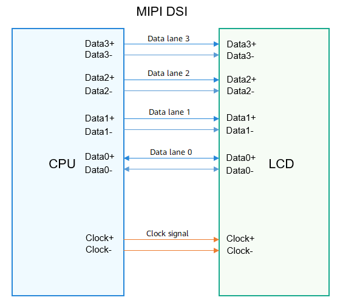
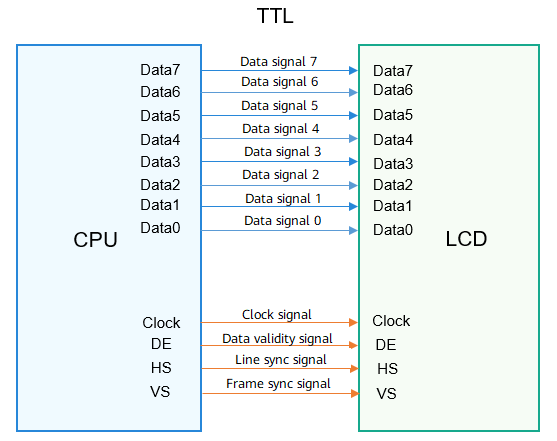

# LCD Overview

-   [Introduction](#section3781515122118)
-   [API Description](#section20280192712120)

## Introduction

The Liquid Crystal Display \(LCD\) driver powers on the LCD and initializes internal LCD registers APIs to enable the LCD to work properly. The display driver is developed based on the hardware driver foundation \([HDF](hdfoverview.md)\). It provides power-on, power-off, and sending of the initialization sequence for LCD hardware across OSs and platforms. The display driver model is shown in  [Figure 1](#fig69138814229).

**Figure  1**  Architecture of the display driver model  

-   **Display driver model**

    The display driver model consists of the display common driver layer, SoC adapter layer, and third-party chip driver layer. It is developed based on the HDF and hides the differences between kernel forms through platform and OSAL APIs so the LCD driver can be migrated to different OSs and chip platforms. The display driver connects to the display common HAL, supports the implementation of Hardware Driver Interfaces \(HDIs\), and provides various driver interfaces for the graphics service through the display HDI.

    -   Display common driver layer: connects to the display common HAL through the IOService data channel provided by the HDF to receive and process various upper-layer calls in a centralized manner.

    -   SoC adapter layer: decouples the display driver from the SoC driver, configures parameters related to the chip platform, and passes the calls at the platform driver layer to the LCD driver layer.

    -   Third-party chip driver layer: provides LCD-related APIs for sending the LCD initialization sequence, powering on or off the LCD device, and setting the backlight.

    Based on the display driver model, various capabilities, and APIs, you can greatly simplify the display driver development and improve the efficiency.

## API Description

The LCD interfaces are classified into the Mobile Industry Processor Interface \(MIPI\) Display Serial Interface \(DSI\), Transistor Transistor Logic \(TTL\) interfaces, and Low Voltage Differential Signaling \(LVDS\) interfaces. The MIPI DSI and TTL interfaces are commonly used. Here is a brief introduction to them.

-   MIPI DSI

    **Figure  2**  MIPI DSI  
    

    The MIPI DSI is defined by MIPI Alliance. It is mainly used for mobile terminal display. The MIPI DSI is used to transmit image data, in compliance with the MIPI protocol. Generally, control information of the MIPI DSI is sent to the peer IC in the form of MIPI packets through the MIPI DSI. No additional interface is required.

-   TTL interface

    **Figure  3**  TTL interface  
    

    TTL level signals are generated by TTL devices, which are a major type of digital integrated circuits. They are manufactured using the bipolar process and feature high speed, low power consumption, and multiple types.

    The TTL interface is used to transmit data in parallel mode. It transmits data signals, clock signals, and control signals \(such as line synchronization signals, frame synchronization signals, and data validity signals\) under the control of control signals. Generally, the LCD of the TTL interface and the read/write of internal registers require additional peripheral interfaces, such as the Serial Peripheral Interface \(SPI\) and Inter-Integrated Circuit \(I2C\).

