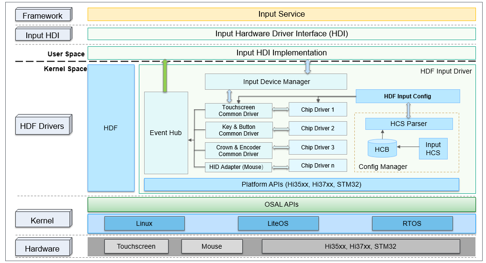

# Touchscreen Overview

-   [Introduction](#section124332411260)
-   [Available APIs](#section10542625172618)

## Introduction

-   **Functions of the Touchscreen driver**

    The Touchscreen driver is used to power on its integrated circuit \(IC\), configure and initialize hardware pins, register interrupts, configure Inter-Integrated Circuit \(I2C\) or SPI APIs, set input-related configurations, and download and update firmware.

-   **Layers of the Touchscreen driver**

    This section describes how to develop the touchscreen driver based on the input driver model.  [Figure 1](#fig6251184817261)  shows an overall architecture of the touchscreen driver.

    The input driver is developed based on the hardware driver foundation \(HDF\), platform APIs, and operating system abstraction layer \(OSAL\) APIs. It provides hardware driver capabilities through the input Hardware Driver Interfaces \(HDIs\) for upper-layer input services to control the touchscreen.

**Figure  1**  Architecture of the input driver model  

-   **Input driver model**

    The input driver model mainly consists of the device manager, common drivers, and chip drivers. The platform data channel provides capabilities for sending data generated by the touchscreen from the kernel to the user space. The driver model adapts to different touchscreen devices and hardware platforms via the configuration file, improving the efficiency of the touchscreen development. The description for each part of the input driver model is as follows:

    -   Input device manager: provides various input device drivers with the APIs for registering or unregistering input devices and manages the input device list.

    -   Input common driver: provides common abstract drivers \(such as the touchscreen common driver\) of various input devices for initializing the board-level hardware, processing hardware interrupts, and registering input devices with the input device manager.

    -   Input chip driver: provides different chip drivers of each vendor. You can minimize the workload for the input chip driver development by calling differentiated APIs reserved by the input platform driver.

    -   Event hub: provides a unified data reporting channel, which enables various input devices to report input events.

    -   HDF input config: parses and manages the board-level configuration as well as the private configuration of input devices.

-   **Advantages of developing drivers based on the HDF**

    The touchscreen driver is developed based on the HDF and is implemented via calls to the OSAL and platform APIs, including bus APIs and OS native APIs \(such as memory, lock, thread, and timer\). The OSAL and platform APIs hide the differences of underlying hardware, so that the touchscreen driver can be migrated across platforms and OSs. In this regard, you can develop the touchscreen driver only once but deploy it on multiple devices.

## Available APIs

Based on the attributes of the pins, interfaces on the touchscreens can be classified into the following types:

-   Power interfaces
-   I/O control interfaces
-   Communications interfaces

**Figure  2**  Common pins of the touchscreen  

The interfaces shown in the figure are described as follows:

1.  **Power interfaces**
    -   LDO\_1P8: 1.8 V digital circuits
    -   LDO\_3P3: 3.3 V analog circuits

        Generally, the touchscreen driver IC is separated from the LCD driver IC. In this case, the touchscreen driver IC requires both 1.8 V and 3.3 V power supplies. Nowadays, the touchscreen driver IC and LCD driver IC can be integrated. Therefore, the touchscreen, requires only the 1.8 V power supply, and the 3.3 V power required internally is supplied by the LCD VSP power \(typical value: 5.5 V\) in the driver IC.

2.  **I/O control interfaces**
    -   RESET: reset pin, which is used to reset the driver IC on the host when suspending or resuming the system.
    -   INT: interrupt pin, which needs to be set to the input direction and pull-up status during driver initialization. After detecting an external touch signal, the driver triggers the interrupt by operating the interrupt pin. The driver reads the touch reporting data in the ISR function.

3.  **Communications interfaces**
    -   I2C: Since only a small amount of touch data is reported by the touchscreen, I2C is used to transmit the reported data. For details about the I2C protocol and interfaces, see  [I2C Usage Guidelines](i2c-usage-guidelines.md).
    -   SPI: In addition to touch reporting data coordinates, some vendors need to obtain basic capacitance data. Therefore, Serial Peripheral Interface \(SPI\) is used to transmit such huge amount of data. For details about the SPI protocol and interfaces, see  [SPI Usage Guidelines](spiusage-guidelines.md).

