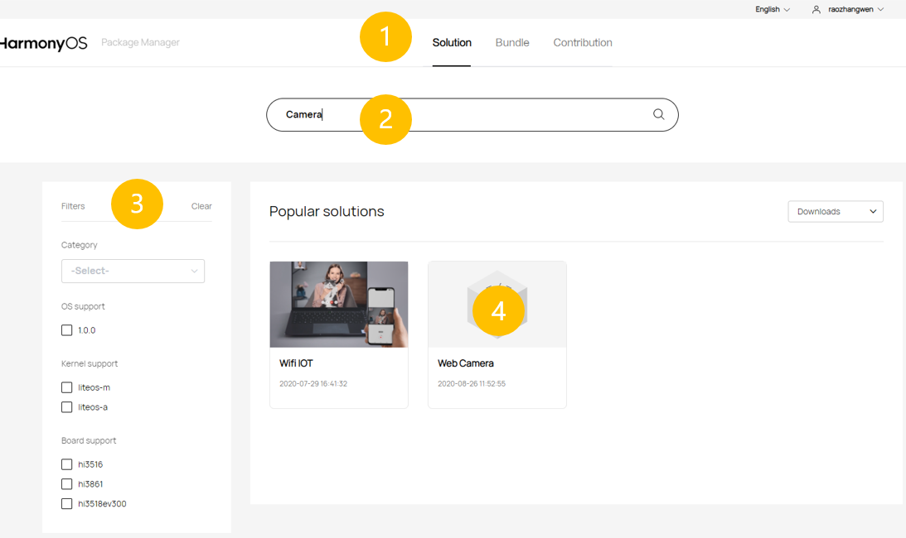
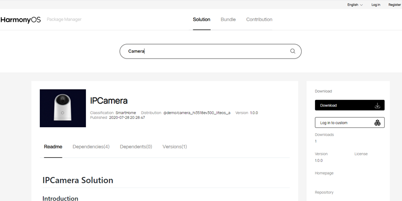

# Source Code Acquisition<a name="EN-US_TOPIC_0000001050769927"></a>

-   [About OpenHarmony](#section6370143622110)
-   [Overview of Source Code Acquisition](#section12763342204)
-   [Method 1: Acquiring Source Code from Image Sites](#section1186691118430)
-   [Method 2: Acquiring Source Code from the Bundle-specific HPM](#section463013147412)
-   [When to Use](#section123926431441)
-   [How to Use](#section1781916234118)
-   [Method 3: Acquiring Source Code with a hpm-cli Tool](#section9459261856)
-   [When to Use](#section1854923620139)
-   [Preparations](#section4451113551114)
-   [Operations](#section1445143510117)
-   [Method 4: Acquiring Source Code from a Code Repository](#section537312010229)
-   [When to Use](#section1492115412228)
-   [Preparations](#section1076962313239)
-   [Operations](#section17162735266)
-   [Source Code Directories](#section1072115612811)

## About OpenHarmony<a name="section6370143622110"></a>

OpenHarmony is an open-source version of HarmonyOS. It is donated by Huawei to OpenAtom Foundation. The first open-source version can run on 128 KB to 128 MB devices. You are welcomed to join the open-source community for continuous improvement.

Access code repositories at  [https://openharmony.gitee.com](https://openharmony.gitee.com).

> **NOTE:** 
>Currently, OpenHarmony source code can be compiled only in a Linux environment. You may encounter exceptions in a Windows environment.
>For example, while downloading and installing some bundles, you need to run Linux commands to set environment variables. However, if you do so in a Windows environment, an error may occur. To address this issue, change the shell of HPM to a third-party shell. For example, you can run the following command to change the shell to  **sh.exe**  of git:
>hpm config set shellPath 'C:\\Program Files\\Git\\bin\\sh.exe'

## Overview of Source Code Acquisition<a name="section12763342204"></a>

This document describes how to acquire OpenHarmony source code and provides its directory structure. The OpenHarmony code is open to you as  [bundles](../bundles/overview.md), which can be obtained in any of the following ways:

-   **Method 1 \(recommended\)**: Download compressed files from an image site.
-   **Method 2**: Visit the HarmonyOS Package Manager \([HPM](https://hpm.harmonyos.com/#/en/home)\) platform, search for your desired solution, select or exclude bundles from the solution, and download it.
-   **Method 3**: Use an hpm-cli tool available on the  [HPM](https://hpm.harmonyos.com/#/en/home)  platform, and run related HPM commands to download your desired code.
-   **Method 4**: Use the  **repo**  or  **git**  tool to download your desired code from the code repository.

## Method 1: Acquiring Source Code from Image Sites<a name="section1186691118430"></a>

You can download the source code or the corresponding solutions from the image library at the sites listed below.

**Table  1**  Acquiring source code from image sites

<a name="table91984129177"></a>
<table><thead align="left"><tr id="row51981312101713"><th class="cellrowborder" valign="top" width="25%" id="mcps1.2.5.1.1"><p id="p16618172471719"><a name="p16618172471719"></a><a name="p16618172471719"></a>Content</p>
</th>
<th class="cellrowborder" valign="top" width="25%" id="mcps1.2.5.1.2"><p id="p46181224161718"><a name="p46181224161718"></a><a name="p46181224161718"></a>Version Information</p>
</th>
<th class="cellrowborder" valign="top" width="25%" id="mcps1.2.5.1.3"><p id="p1461814241177"><a name="p1461814241177"></a><a name="p1461814241177"></a>Site</p>
</th>
<th class="cellrowborder" valign="top" width="25%" id="mcps1.2.5.1.4"><p id="p12618192481716"><a name="p12618192481716"></a><a name="p12618192481716"></a>SHA-256 Verification Code</p>
</th>
</tr>
</thead>
<tbody><tr id="row11198111281715"><td class="cellrowborder" valign="top" width="25%" headers="mcps1.2.5.1.1 "><p id="p161822419172"><a name="p161822419172"></a><a name="p161822419172"></a><span id="text958012347463"><a name="text958012347463"></a><a name="text958012347463"></a>XX</span> full code base</p>
</td>
<td class="cellrowborder" valign="top" width="25%" headers="mcps1.2.5.1.2 "><p id="p361810245170"><a name="p361810245170"></a><a name="p361810245170"></a>1.0</p>
</td>
<td class="cellrowborder" valign="top" width="25%" headers="mcps1.2.5.1.3 "><p id="p11618112416174"><a name="p11618112416174"></a><a name="p11618112416174"></a><a href="https://repo.huaweicloud.com/harmonyos/os/1.0/code-1.0.tar.gz" target="_blank" rel="noopener noreferrer">Site</a></p>
</td>
<td class="cellrowborder" valign="top" width="25%" headers="mcps1.2.5.1.4 "><p id="p2619182441717"><a name="p2619182441717"></a><a name="p2619182441717"></a><a href="https://repo.huaweicloud.com/harmonyos/os/1.0/code-1.0.tar.gz.sha256" target="_blank" rel="noopener noreferrer">SHA-256 Verification Code</a></p>
</td>
</tr>
<tr id="row1019861220171"><td class="cellrowborder" valign="top" width="25%" headers="mcps1.2.5.1.1 "><p id="p1619102471714"><a name="p1619102471714"></a><a name="p1619102471714"></a>Hi3861 solutions (binary)</p>
</td>
<td class="cellrowborder" valign="top" width="25%" headers="mcps1.2.5.1.2 "><p id="p1361982418176"><a name="p1361982418176"></a><a name="p1361982418176"></a>1.0</p>
</td>
<td class="cellrowborder" valign="top" width="25%" headers="mcps1.2.5.1.3 "><p id="p6619122411710"><a name="p6619122411710"></a><a name="p6619122411710"></a><a href="https://repo.huaweicloud.com/harmonyos/os/1.0/wifiiot-1.0.tar.gz" target="_blank" rel="noopener noreferrer">Site</a></p>
</td>
<td class="cellrowborder" valign="top" width="25%" headers="mcps1.2.5.1.4 "><p id="p86198245173"><a name="p86198245173"></a><a name="p86198245173"></a><a href="https://repo.huaweicloud.com/harmonyos/os/1.0/wifiiot-1.0.tar.gz.sha256" target="_blank" rel="noopener noreferrer">SHA-256 Verification Code</a></p>
</td>
</tr>
<tr id="row419901210176"><td class="cellrowborder" valign="top" width="25%" headers="mcps1.2.5.1.1 "><p id="p1461992491711"><a name="p1461992491711"></a><a name="p1461992491711"></a>Hi3518 solutions (binary)</p>
</td>
<td class="cellrowborder" valign="top" width="25%" headers="mcps1.2.5.1.2 "><p id="p0619122471719"><a name="p0619122471719"></a><a name="p0619122471719"></a>1.0</p>
</td>
<td class="cellrowborder" valign="top" width="25%" headers="mcps1.2.5.1.3 "><p id="p13619112431714"><a name="p13619112431714"></a><a name="p13619112431714"></a><a href="https://repo.huaweicloud.com/harmonyos/os/1.0/ipcamera_hi3518ev300-1.0.tar.gz" target="_blank" rel="noopener noreferrer">Site</a></p>
</td>
<td class="cellrowborder" valign="top" width="25%" headers="mcps1.2.5.1.4 "><p id="p6619224191719"><a name="p6619224191719"></a><a name="p6619224191719"></a><a href="https://repo.huaweicloud.com/harmonyos/os/1.0/ipcamera_hi3518ev300-1.0.tar.gz.sha256" target="_blank" rel="noopener noreferrer">SHA-256 Verification Code</a></p>
</td>
</tr>
<tr id="row1019901219170"><td class="cellrowborder" valign="top" width="25%" headers="mcps1.2.5.1.1 "><p id="p2619142411713"><a name="p2619142411713"></a><a name="p2619142411713"></a>Hi3516 solutions (binary)</p>
</td>
<td class="cellrowborder" valign="top" width="25%" headers="mcps1.2.5.1.2 "><p id="p10619182441718"><a name="p10619182441718"></a><a name="p10619182441718"></a>1.0</p>
</td>
<td class="cellrowborder" valign="top" width="25%" headers="mcps1.2.5.1.3 "><p id="p176194245176"><a name="p176194245176"></a><a name="p176194245176"></a><a href="https://repo.huaweicloud.com/harmonyos/os/1.0/ipcamera_hi3516dv300-1.0.tar.gz" target="_blank" rel="noopener noreferrer">Site</a></p>
</td>
<td class="cellrowborder" valign="top" width="25%" headers="mcps1.2.5.1.4 "><p id="p196193246171"><a name="p196193246171"></a><a name="p196193246171"></a><a href="https://repo.huaweicloud.com/harmonyos/os/1.0/ipcamera_hi3516dv300-1.0.tar.gz.sha256" target="_blank" rel="noopener noreferrer">SHA-256 Verification Code</a></p>
</td>
</tr>
<tr id="row151991912161714"><td class="cellrowborder" valign="top" width="25%" headers="mcps1.2.5.1.1 "><p id="p116191324121716"><a name="p116191324121716"></a><a name="p116191324121716"></a>RELEASE-NOTES</p>
</td>
<td class="cellrowborder" valign="top" width="25%" headers="mcps1.2.5.1.2 "><p id="p176191824181712"><a name="p176191824181712"></a><a name="p176191824181712"></a>1.0</p>
</td>
<td class="cellrowborder" valign="top" width="25%" headers="mcps1.2.5.1.3 "><p id="p66190245178"><a name="p66190245178"></a><a name="p66190245178"></a><a href="https://repo.huaweicloud.com/harmonyos/os/1.0/RELEASE-NOTES.txt" target="_blank" rel="noopener noreferrer">Site</a></p>
</td>
<td class="cellrowborder" valign="top" width="25%" headers="mcps1.2.5.1.4 "><p id="p1161982411713"><a name="p1161982411713"></a><a name="p1161982411713"></a>-</p>
</td>
</tr>
</tbody>
</table>

## Method 2: Acquiring Source Code from the Bundle-specific HPM<a name="section463013147412"></a>

## When to Use<a name="section123926431441"></a>

If OpenHarmony is new to you, sample solutions are helpful to your development. The  [HPM](https://hpm.harmonyos.com/#/en/home)  platform provides a recommended solution. You can add or exclude bundles to quickly customize your system.

## How to Use<a name="section1781916234118"></a>

1.  Search for a proper solution.
    1.  Access the  [HPM](https://hpm.harmonyos.com/#/en/home)  page, and click the  **Solution**  tab, as shown in the following figure.
    2.  Enter a keyword \("camera" as an example\) in the search box. All matched solutions are found.
    3.  Specify filter criteria, such as the bundle type \(example:  **Board support**  and  **Kernel support**\), to further filter the solutions.
    4.  Click the solution you need to view its details.

        **Figure  1**  HPM page<a name="fig838103114320"></a>  
        

        


2.  Customize the solution.

    1.  Read the information under  **Readme**  to learn about the solution \(application scenarios, features, usage, and customization\), as shown in the following figure.
    2.  Click  **Download**  to download the solution to your local PC.
    3.  Click  **Log in to custom**  to customize the bundles for the solution.

    **Figure  2**  Solution example<a name="fig1329851510414"></a>  
    

    

3.  Customize bundles.
    1.  Access the  **Custom solution**  page, as shown in the following figure.
    2.  Set the toggle switch next to a specific optional bundle to exclude it from the solution, or click  **Add bundle**  to add new bundles.
    3.  Enter the basic information about your project, including the bundle name, version, and description, on the right pane.
    4.  Click  **Download**. The system then generates the OpenHarmony code structure file \(for example,  **name.zip**\) and saves it to your local PC.
        -   The downloaded compressed package does not contain the original file of source code. You can import the package to the IDE, decompress it, and run the  **hpm install**  command to download all required bundles.
        -   The downloaded bundles are stored in the  **ohos\_bundles**  folder in the project directory.

            **Figure  3**  Customizing bundles<a name="fig2448349749"></a>  
            

            


## Method 3: Acquiring Source Code with a hpm-cli Tool<a name="section9459261856"></a>

## When to Use<a name="section1854923620139"></a>

-   You have obtained bundle-specific source code from the HPM website, and want to independently upgrade one or more bundles in the source code.
-   You are familiar with OpenHarmony development and  **hpm-cli**  tools.

## Preparations<a name="section4451113551114"></a>

You need to install the  **Node.js**  and hpm-cli tool as follows:

1.  Install  **Node.js**.

    Download  **Node.js**  from its official website and install it on your local PC.

    You are advised to install  [Node.js](https://nodejs.org/)  12.x \(including npm 6.14.4\) or a later version \(12.13.0 or later is recommended\).

2.  Install the hpm-cli tool using  **npm**  delivered with  **Node.js**.

    Open the CMD window and run the following command:

    ```
    npm install -g @ohos/hpm-cli
    ```

3.  Run the following command to check whether the installation is successful. If the HPM version is displayed, the installation is successful.

    ```
    hpm -V or hpm --version
    ```

4.  Run the following command to upgrade the HPM version:

    ```
    npm update -g @ohos/hpm-cli
    ```


## Operations<a name="section1445143510117"></a>

Add the bundle \(**@ohos/demo**  as an example\) to your project as follows:

1.  Go to the development directory and run the following command to create a development project using the default template:

    ```
    hpm init -t default
    ```

2.  Run the following command to install the bundle \(**@ohos/demo**  as an example\):

    ```
    hpm install @ohos/demo
    ```

3.  Verify that the  **hpm-cli**  tool automatically downloads all dependent bundles from the server. If the download is successful, the message "Install successfully!" is displayed.

    ```
    $ hpm install @ohos/demo
    Requesting: https://url.foo.bar/hpm/registry/api/bundles/@ohos/demo
    downloading @ohos/demo
    Requesting: https://lfcontentcenterdev....../bMAlLrYISLqdUTFFFCdgzA.tgz
    extract D:\demo\ohos_bundles\@ohos\demo\@ohos-demo-1.0.7.tgz
    Install successfully!
    ```


## Method 4: Acquiring Source Code from a Code Repository<a name="section537312010229"></a>

## When to Use<a name="section1492115412228"></a>

-   You want to establish a baseline based on stable OpenHarmony releases and distribute the baseline to your customers.

-   You have interconnected your software with OpenHarmony and need official certification from OpenHarmony.

-   You want to contribute code to the OpenHarmony ecosystem after chips, modules, and applications are certified by OpenHarmony.

-   You need to address OpenHarmony issues.

-   You want to learn OpenHarmony source code.


## Preparations<a name="section1076962313239"></a>

1.  Register your account with gitee.
2.  Register an SSH public key.
3.  Install the git client and configure basic information.

    ```
    git config --global user.name "yourname"
    git config --global user.email "your-email-address"
    git config --global credential.helper store
    ```

4.  Run the following commands to install the  **repo**  tool:

    ```
    curl https://gitee.com/oschina/repo/raw/fork_flow/repo-py3 > /usr/local/bin/repo
    chmod a+x /usr/local/bin/repo
    pip install -i https://pypi.tuna.tsinghua.edu.cn/simple requests
    ```


## Operations<a name="section17162735266"></a>

Method 1 \(recommended\): Use the  **repo**  tool to download source code.

```
repo init -u https://gitee.com/openharmony/manifest.git -b master --no-repo-verify
repo sync -c
```

Method 2: Run the  **git clone**  command to clone a single code repository.

Go to https://gitee.com/openharmony, select the code repository to be cloned, and run the following command:

```
git clone https://gitee.com/openharmony/manifest.git -b master
```

## Source Code Directories<a name="section1072115612811"></a>

The following table describes the OpenHarmony source code directories.

**Table  2**  Directory description

<a name="table3815144702820"></a>
<table><thead align="left"><tr id="row198162047192810"><th class="cellrowborder" valign="top" width="50%" id="mcps1.2.3.1.1"><p id="p690319291299"><a name="p690319291299"></a><a name="p690319291299"></a>Name</p>
</th>
<th class="cellrowborder" valign="top" width="50%" id="mcps1.2.3.1.2"><p id="p5903122962918"><a name="p5903122962918"></a><a name="p5903122962918"></a>Description</p>
</th>
</tr>
</thead>
<tbody><tr id="row1981674719280"><td class="cellrowborder" valign="top" width="50%" headers="mcps1.2.3.1.1 "><p id="p69031429162912"><a name="p69031429162912"></a><a name="p69031429162912"></a>applications</p>
</td>
<td class="cellrowborder" valign="top" width="50%" headers="mcps1.2.3.1.2 "><p id="p090352912914"><a name="p090352912914"></a><a name="p090352912914"></a>Application samples, including <strong id="b18983231356"><a name="b18983231356"></a><a name="b18983231356"></a>wifi-iot</strong> and <strong id="b689814231158"><a name="b689814231158"></a><a name="b689814231158"></a>ip-camera</strong></p>
</td>
</tr>
<tr id="row5816747132817"><td class="cellrowborder" valign="top" width="50%" headers="mcps1.2.3.1.1 "><p id="p99031129112918"><a name="p99031129112918"></a><a name="p99031129112918"></a>base</p>
</td>
<td class="cellrowborder" valign="top" width="50%" headers="mcps1.2.3.1.2 "><p id="p790472962914"><a name="p790472962914"></a><a name="p790472962914"></a>Basic software service subsystem set and hardware service subsystem set</p>
</td>
</tr>
<tr id="row1134218692910"><td class="cellrowborder" valign="top" width="50%" headers="mcps1.2.3.1.1 "><p id="p4904112910295"><a name="p4904112910295"></a><a name="p4904112910295"></a>build</p>
</td>
<td class="cellrowborder" valign="top" width="50%" headers="mcps1.2.3.1.2 "><p id="p1090482942911"><a name="p1090482942911"></a><a name="p1090482942911"></a>Bundle-based compilation, building, and configuration scripts</p>
</td>
</tr>
<tr id="row8166154261316"><td class="cellrowborder" valign="top" width="50%" headers="mcps1.2.3.1.1 "><p id="p1216719425130"><a name="p1216719425130"></a><a name="p1216719425130"></a>docs</p>
</td>
<td class="cellrowborder" valign="top" width="50%" headers="mcps1.2.3.1.2 "><p id="p17167134217134"><a name="p17167134217134"></a><a name="p17167134217134"></a>Reference documents</p>
</td>
</tr>
<tr id="row1841618902919"><td class="cellrowborder" valign="top" width="50%" headers="mcps1.2.3.1.1 "><p id="p1390462902910"><a name="p1390462902910"></a><a name="p1390462902910"></a>domains</p>
</td>
<td class="cellrowborder" valign="top" width="50%" headers="mcps1.2.3.1.2 "><p id="p1390432914296"><a name="p1390432914296"></a><a name="p1390432914296"></a>Enhanced software service subsystem set</p>
</td>
</tr>
<tr id="row841620912298"><td class="cellrowborder" valign="top" width="50%" headers="mcps1.2.3.1.1 "><p id="p119041629182919"><a name="p119041629182919"></a><a name="p119041629182919"></a>drivers</p>
</td>
<td class="cellrowborder" valign="top" width="50%" headers="mcps1.2.3.1.2 "><p id="p9904629132911"><a name="p9904629132911"></a><a name="p9904629132911"></a>Driver subsystem</p>
</td>
</tr>
<tr id="row164164992915"><td class="cellrowborder" valign="top" width="50%" headers="mcps1.2.3.1.1 "><p id="p79042298298"><a name="p79042298298"></a><a name="p79042298298"></a>foundation</p>
</td>
<td class="cellrowborder" valign="top" width="50%" headers="mcps1.2.3.1.2 "><p id="p18904132922915"><a name="p18904132922915"></a><a name="p18904132922915"></a>Basic system capability subsystem set</p>
</td>
</tr>
<tr id="row1441610922915"><td class="cellrowborder" valign="top" width="50%" headers="mcps1.2.3.1.1 "><p id="p490402916299"><a name="p490402916299"></a><a name="p490402916299"></a>kernel</p>
</td>
<td class="cellrowborder" valign="top" width="50%" headers="mcps1.2.3.1.2 "><p id="p1904112932912"><a name="p1904112932912"></a><a name="p1904112932912"></a>Kernel subsystem</p>
</td>
</tr>
<tr id="row194175972917"><td class="cellrowborder" valign="top" width="50%" headers="mcps1.2.3.1.1 "><p id="p1904132912910"><a name="p1904132912910"></a><a name="p1904132912910"></a>prebuilts</p>
</td>
<td class="cellrowborder" valign="top" width="50%" headers="mcps1.2.3.1.2 "><p id="p390492919296"><a name="p390492919296"></a><a name="p390492919296"></a>Compiler and tool chain subsystem</p>
</td>
</tr>
<tr id="row841718942913"><td class="cellrowborder" valign="top" width="50%" headers="mcps1.2.3.1.1 "><p id="p12904929202919"><a name="p12904929202919"></a><a name="p12904929202919"></a>test</p>
</td>
<td class="cellrowborder" valign="top" width="50%" headers="mcps1.2.3.1.2 "><p id="p4904152912297"><a name="p4904152912297"></a><a name="p4904152912297"></a>Testing subsystem</p>
</td>
</tr>
<tr id="row24175915294"><td class="cellrowborder" valign="top" width="50%" headers="mcps1.2.3.1.1 "><p id="p13904162992916"><a name="p13904162992916"></a><a name="p13904162992916"></a>third_party</p>
</td>
<td class="cellrowborder" valign="top" width="50%" headers="mcps1.2.3.1.2 "><p id="p6904829112917"><a name="p6904829112917"></a><a name="p6904829112917"></a>Open-source third-party software</p>
</td>
</tr>
<tr id="row334210652914"><td class="cellrowborder" valign="top" width="50%" headers="mcps1.2.3.1.1 "><p id="p1390442918299"><a name="p1390442918299"></a><a name="p1390442918299"></a>utils</p>
</td>
<td class="cellrowborder" valign="top" width="50%" headers="mcps1.2.3.1.2 "><p id="p690412296297"><a name="p690412296297"></a><a name="p690412296297"></a>Commonly used development tools</p>
</td>
</tr>
<tr id="row73421664298"><td class="cellrowborder" valign="top" width="50%" headers="mcps1.2.3.1.1 "><p id="p7905172920292"><a name="p7905172920292"></a><a name="p7905172920292"></a>vendor</p>
</td>
<td class="cellrowborder" valign="top" width="50%" headers="mcps1.2.3.1.2 "><p id="p290510290293"><a name="p290510290293"></a><a name="p290510290293"></a>Vendor-provided software</p>
</td>
</tr>
<tr id="row734319617292"><td class="cellrowborder" valign="top" width="50%" headers="mcps1.2.3.1.1 "><p id="p09056291290"><a name="p09056291290"></a><a name="p09056291290"></a>build.py</p>
</td>
<td class="cellrowborder" valign="top" width="50%" headers="mcps1.2.3.1.2 "><p id="p1790542912290"><a name="p1790542912290"></a><a name="p1790542912290"></a>Compilation script file</p>
</td>
</tr>
</tbody>
</table>

