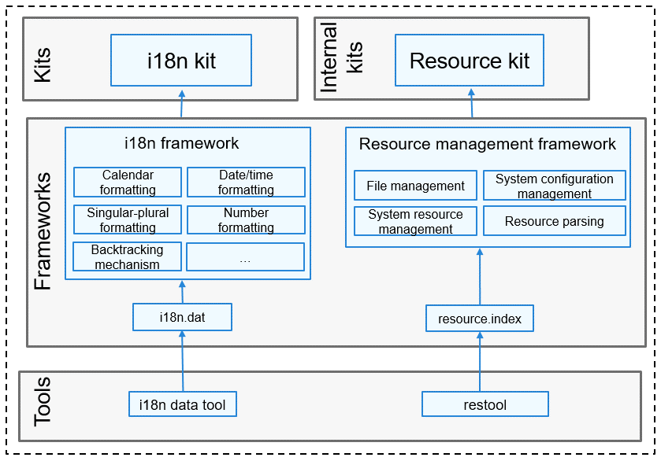

# Globalization<a name="EN-US_TOPIC_0000001054438981"></a>

-   [Introduction](#section11516137123416)
-   [Architecture](#section8958681672)
-   [Directory Structure](#section1121775732114)
-   [Constraints](#section43112258019)
-   [Repositories Involved](#section5889165803317)

## Introduction<a name="section11516137123416"></a>

If OpenHarmony devices and applications need to be used globally, they must meet the requirements of users in different regions on languages and cultures. The globalization subsystem provides the multi-language and multi-cultural capabilities for global use, including:

-   Resource management

    The subsystem loads, parses, and initializes system and application resources based on device types and system configurations, and provides APIs for obtaining resources such as character strings and images.


-   Internationalization \(i18n\)

    The subsystem provides the bottom-layer resource backtracking capabilities, with a wide array of i18n APIs for implementing functions such as date/time formatting, number formatting, and singular-plural formatting.


## Architecture<a name="section8958681672"></a>

**Figure  1**  Architecture of the globalization subsystem<a name="fig1416834516101"></a>  




-   The resource kit provides the capability of loading built-in resource files for applications and other subsystems. Currently, this capability is not yet open to applications and is used only for other subsystems to obtain framework resources of applications. 
-   The i18n kit provides i18n APIs for applications and other subsystems to meet the requirements of users in different countries or regions on languages and cultures. Only the date/time, number, and singular-plural formatting capabilities are supported currently.
-   The  **i18n.dat**  file provides cultural data specific to different languages, which ranges from date/time to number, for the i18n framework.

## Directory Structure<a name="section1121775732114"></a>

```
/base/global/
├── i18n_lite                  # Code repository for the i18n framework
│   ├──  frameworks            # Core code of the i18n framework
│   │   ├── i18n               # i18n module
│   │   │   ├── include        # Header files
│   │   │   ├── src            # Implementation code
│   │   │   └── test           # Test cases
│   ├──  interfaces            # APIs of the i18n framework 
│   │   ├── kits               # Application APIs
│   │   │   ├── i18n           # C/C++ i18n APIs
│   │   │   └── js             # C/C++ support for JavaScript APIs
├── resmgr_lite                # Code repository for the resource management framework
│   ├──  frameworks            # Core code of the resource management framework
│   │   ├── resmgr             # Core code for resource parsing
│   │   │   ├── include        # Header files
│   │   │   └── src            # Implementation code
│   ├──  interfaces            # APIs of the resource management framework 
│   │   └── innerkits          # APIs of the resource management framework for other subsystems
├── cust_lite                  # Code repository for the customization framework
│   ├── frameworks             # Core code of the customization framework
│   │   ├── cust_lite          # Customization framework
│   │   │   ├── src            # Implementation code
│   │   │   └── test           # Test code
│   ├── interfaces             # APIs of the customization framework
│   │   └── innerkits          # APIs of the customization framework for other subsystems
```

## Constraints<a name="section43112258019"></a>

None

## Repositories Involved<a name="section5889165803317"></a>

Globalization subsystem

[global\_resmgr\_lite](https://gitee.com/openharmony/global_resmgr_lite/blob/master/README.md)

[global\_i18n\_lite](https://gitee.com/openharmony/global_i18n_lite/blob/master/README.md)

[global\_cust\_lite](https://gitee.com/openharmony/global_cust_lite/blob/master/README.md)

