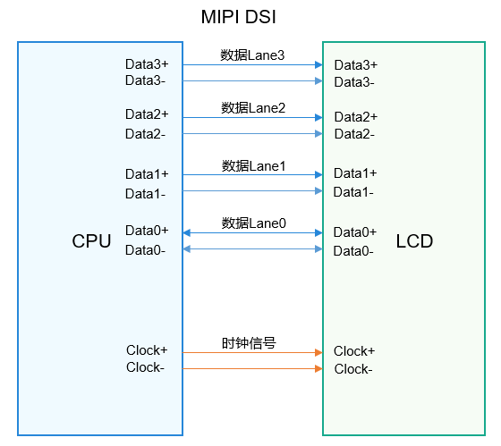

# LCD开发概述

-   [简介](#section3781515122118)
-   [接口说明](#section20280192712120)

## 简介

LCD（Liquid Crystal Display）液晶显示驱动，对LCD进行上电，并通过接口初始化LCD内部寄存器，使LCD正常工作。Display驱动模型基于HDF（ Hardware Driver Foundation）[驱动框架](HDF开发概述.md)开发，实现跨OS、跨平台，为LCD硬件提供上下电功能、发送初始化序列功能，使LCD进入正常的工作模式，显示芯片平台侧的图像数据，基于HDF驱动框架的Display驱动模型如[图1](#fig69138814229)。

**图 1**  基于HDF驱动框架的Display驱动模型  

-   **Display驱动模型介绍**

    Display驱动模型主要由平台驱动层、芯片平台适配层、LCD器件驱动层三部分组成。驱动模型基于HDF驱动框架开发，通过Platform层和OSAL层提供的接口，屏蔽内核形态的差异，使得器件驱动可以便利的迁移到不同OS及芯片平台。模型向上对接Display公共hal层，支撑HDI接口的实现，通过Display-HDI（Hardware Display Interface）对图形服务提供各类驱动能力接口。

    （1）Display平台驱动层：通过HDF提供的IOService数据通道，与公共Hal层对接，集中接收并处理各类上层调用指令；

    （2）SOC平台驱动适配层：借助此SOC适配层，实现Display驱动和SOC侧驱动解耦，主要完成芯片平台相关的参数配置，并传递平台驱动层的调用到器件驱动层；

    （3）LCD器件驱动层：在器件驱动层中，主要实现和器件自身强相关的驱动适配接口，例如发送初始化序列、上下电、背光设置等。

    基于Display驱动模型开发LCD驱动，可以借助平台提供的各种能力及接口，较大程度的降低器件驱动的开发周期和难度，提升开发效率。

## 接口说明

LCD接口通常可分为MIPI DSI接口、TTL接口和LVDS接口，常用的是MIPI DSI接口和TTL接口，下面对常用的MIPI DSI接口和TTL接口作简要介绍。

-   MIPI DSI接口

    **图 2**  MIPI DSI接口  
    

    MIPI DSI接口是MIPI（移动行业处理器接口）联盟定义的显示接口，主要用于移动终端显示屏接口，接口数据传输遵循MIPI协议，MIPI DSI接口为数据接口，传输图像数据，通常情况下MIPI DSI接口的控制信息以MIPI包形式通过MIPI DSI接口发送到对端IC，不需要额外的外设接口。

-   TTL接口

    **图 3**  TTL接口  
    

    TTL（Transistor Transistor Logic）即晶体管-晶体管逻辑，TTL电平信号由TTL器件产生，TTL器件是数字集成电路的一大门类，它采用双极型工艺制造，具有高速度、低功耗和品种多等特点。

    TTL接口是并行方式传输数据的接口，有数据信号、时钟信号和控制信号（行同步、帧同步、数据有效信号等），在控制信号控制下完成数据传输。通常TTL接口的LCD，内部寄存器读写需要额外的外设接口，比如SPI接口、I2C接口等。

