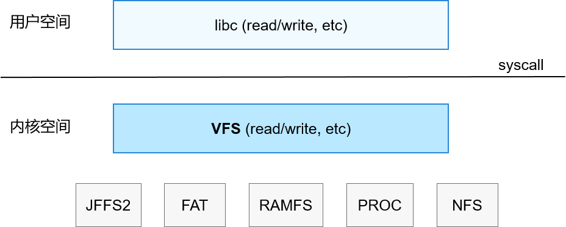
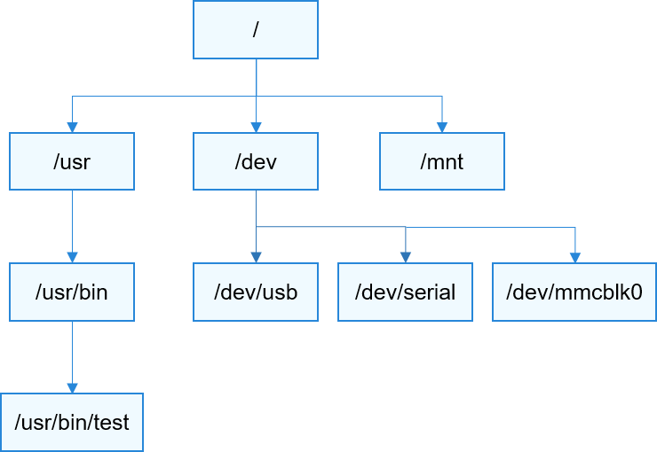

# VFS<a name="ZH-CN_TOPIC_0000001051451779"></a>

-   [概述](#section132540468341)
-   [基本概念](#section229417111227)
-   [运作机制](#section18114182834215)
-   [注意事项](#section18311145173712)
-   [开发指导](#section422619258380)
-   [编程实例](#section180311121420)
-   [结果验证](#section16772334714)

## 概述<a name="section132540468341"></a>

## 基本概念<a name="section229417111227"></a>

VFS是Virtual File System（虚拟文件系统）的缩写，它不是一个实际的文件系统，而是一个异构文件系统之上的软件粘合层，为用户提供统一的类Unix文件操作接口。

由于不同类型的文件系统接口不统一，若系统中有多个文件系统类型，访问不同的文件系统就需要使用不同的非标准接口。而通过在系统中添加VFS层，提供统一的抽象接口，屏蔽了底层异构类型的文件系统的差异，使得访问文件系统的系统调用不用关心底层的存储介质和文件系统类型，提高开发效率。VFS和各个具体文件系统的关系如下：

**图 1**  VFS和各个文件系统的关系<a name="fig633144419295"></a>  


OpenHarmony内核中，VFS框架是通过在内存中的树结构来实现的，树的每个结点都是一个inode结构体。设备注册和文件系统挂载后会根据路径在树中生成相应的结点。VFS最主要是两个功能：

-   查找节点。
-   统一调用（标准）。

## 运作机制<a name="section18114182834215"></a>

通过VFS层，可以使用标准的Unix文件操作函数（如open、read、write等）来实现对不同介质上不同文件系统的访问。

VFS框架内存中的inode树结点有三种类型：

-   虚拟结点：作为VFS框架的虚拟文件，保持树的连续性，如/usr、/usr/bin。
-   设备结点：/dev目录下，对应一个设备，如/dev/mmcblk0。
-   挂载点：挂载具体文件系统，如/vs/sd、/mnt。

**图 2**  文件系统树形结构<a name="fig1648112392612"></a>  


## 注意事项<a name="section18311145173712"></a>

-   VFS下的所有文件系统，创建的目录名和文件名最多只可以有255个字节，能支持的全路径长度最长为259字节，超过这个路径长度的文件和目录无法创建。

-   目前仅有jffs2文件系统支持完整的权限控制。

-   inode\_find\(\)函数调用后会使查找到的inode节点连接数+1，调用完成后需要调用inode\_release\(\)使连接数-1，所以一般inode\_find\(\)要和inode\_release\(\)配套使用。

-   设备分为字符设备和块设备，为了块设备上的文件系统系统数据安全，需挂载相应文件系统后通过文件系统接口操作数据。

-   los\_vfs\_init\(\)只能调用一次，多次调用将会造成文件系统异常。

-   目前OpenHarmony内核所有的文件系统中的文件名和目录名中只可以出现“-” 与“\_”两种特殊字符，使用其他特殊字符可能造成的后果不可预知，请谨慎为之。

-   OpenHarmony内核支持open\(\)+O\_DIRECTORY的方法获取目录数据信息。

-   挂载点必须为空目录，不能重复挂载至同一挂载点或挂载至其他挂载点下的目录或文件，错误挂载可能损坏设备及系统。

-   open打开一个文件时，参数O\_RDWR、O\_WRONLY、O\_RDONLY互斥，只能出现一个，若出现2个或以上作为open的参数，文件读写操作会被拒绝，并返回EACCESS错误码，禁止使用。

-   OpenHarmony内核文件系统在umount操作之前，需确保所有目录及文件全部关闭，否则umount会失败。如果强制umount，可能导致包括但不限于文件系统损坏、设备损坏等问题。

-   SD卡移除前，需确保所有目录及文件全部关闭，并进行umount操作。如果强制拔卡，可能导致包括但不限于SD数据丢失、SD卡损坏等问题。


## 开发指导<a name="section422619258380"></a>

**开发流程**

推荐驱动开发人员使用VFS框架来注册/卸载设备，即调用register\_driver\(\)、register\_blockdriver\(\)接口生成设备结点，应用层使用open\(\)、read\(\)操作设备（字符设备）文件来调用驱动。

**文件描述符**

本系统中，进程的文件描述符最多有256个（File和Socket描述符合并统计），系统文件描述符共640个，系统文件描述符规格：

-   File描述符，普通文件描述符，系统总规格为512。

-   Socket描述符，系统总规格为128。


**VFS支持的操作**

open, close, read, write, seek, ioctl, fcntl, mmap, sync, dup, dup2, truncate, opendir, closedir, readdir,  rewinddir, mount, umount, statfs, unlink, remove, mkdir, rmdir, rename, stat, utime, seek64, fallocate, fallocate64, truncate64, chmod, chown。

> **说明：** 
>-   当前只提供修改jffs2文件以及vfs设备节点属性的接口，各个系统对只读等属性有各自的处理方式。
>-   在OpenHarmony内核中属性并不冲突（可以任意修改）。
>-   在OpenHarmony内核中只读属性文件/目录不允许被删除。
>-   在OpenHarmony内核中只读属性文件/目录允许rename。
>-   只读文件不允许以O\_CREAT、O\_TRUNC，以及有含有写的权限的方式打开。
>-   在OpenHarmony内核中设置的系统文件加上隐藏属性，在Windows中只能通过命令行找到（在显示，不显示隐藏文件的属性情况下都不能看到）。

## 编程实例<a name="section180311121420"></a>

```
/* 说明：展示创建目录，和遍历目录的操作 */
#include <stdio.h>
#include <stdlib.h>
#include <dirent.h>
#include <errno.h>
#include <sys/stat.h>
#include <sys/types.h>

int main()
{
    int ret;
    char *dirname = "/test";
    char *pathname0 = "/test/test0";
    char *pathname1 = "/test/test1";
    char *pathname2 = "/test/test2";
    struct dirent **namelist;
    int num;

    ret = mkdir(dirname, 0777);
    if ((ret < 0) && (errno != EEXIST)) {
        printf("mkdir failed. path=%s, errno=%d\n", dirname, errno);
        goto EXIT;
    }

    ret = mkdir(pathname0, 0777);
    if ((ret < 0) && (errno != EEXIST)) {
        printf("mkdir failed. path=%s, errno=%d\n", pathname0, errno);
        goto EXIT0;
    }

    ret = mkdir(pathname1, 0777);
    if ((ret < 0) && (errno != EEXIST)) {
        printf("mkdir failed. path=%s, errno=%d\n", pathname1, errno);
        goto EXIT1;
    }

    ret = mkdir(pathname2, 0777);
    if ((ret < 0) && (errno != EEXIST)) {
        printf("mkdir failed. path=%s, errno=%d\n", pathname2, errno);
        goto EXIT2;
    }

    num = scandir(dirname, &namelist, NULL, alphasort);
    if (num < 0) {
        perror("scandir");
    } else {
        while (num--) {
            printf("%s\n", namelist[num]->d_name);
            free(namelist[num]);
        }
        free(namelist);
    }

    printf("fs_demo exit.\n");
    return 0;

EXIT2:
    remove(pathname2);
EXIT1:
    remove(pathname1);
EXIT0:
    remove(pathname0);
EXIT:
    remove(dirname);
    return 0;
}
```

## 结果验证<a name="section16772334714"></a>

```
OHOS # test2
test1
test0
fs_demo exit.
```

