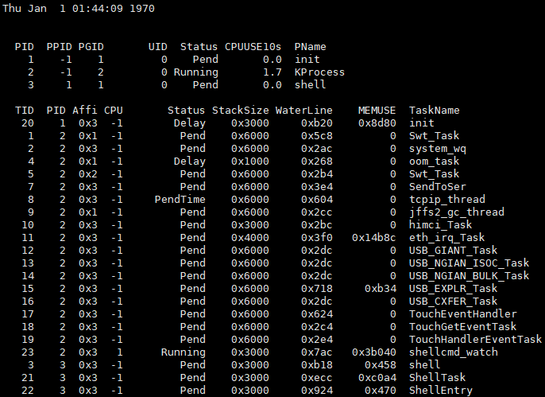

# watch

-   [命令功能](#section20643141481314)
-   [命令格式](#section1075441721316)
-   [参数说明](#section1472810220135)
-   [使用指南](#section186772414131)
-   [使用实例](#section4764192791314)
-   [输出说明](#section5791253155517)

## 命令功能

watch命令用于周期性的监视一个命令的运行结果。

## 命令格式

watch

watch \[_-c/-n/-t/--count/--interval/-no-title/--over_\] \[_command_\]

## 参数说明

**表 1**  参数说明

<table><thead align="left"><tr id="row973mcpsimp"><th class="cellrowborder" valign="top" width="19.801980198019802%" id="mcps1.2.5.1.1">
参数

</th>
<th class="cellrowborder" valign="top" width="29.222922292229224%" id="mcps1.2.5.1.2">
参数说明

</th>
<th class="cellrowborder" valign="top" width="22.26222622262226%" id="mcps1.2.5.1.3">
缺省值

</th>
<th class="cellrowborder" valign="top" width="28.712871287128717%" id="mcps1.2.5.1.4">
取值范围

</th>
</tr>
</thead>
<tbody><tr id="row982mcpsimp"><td class="cellrowborder" valign="top" width="19.801980198019802%" headers="mcps1.2.5.1.1 ">
-c / --count

</td>
<td class="cellrowborder" valign="top" width="29.222922292229224%" headers="mcps1.2.5.1.2 ">
命令执行的总次数。

</td>
<td class="cellrowborder" valign="top" width="22.26222622262226%" headers="mcps1.2.5.1.3 ">
0xFFFFFF

</td>
<td class="cellrowborder" valign="top" width="28.712871287128717%" headers="mcps1.2.5.1.4 ">
（0,0xFFFFFF]

</td>
</tr>
<tr id="row991mcpsimp"><td class="cellrowborder" valign="top" width="19.801980198019802%" headers="mcps1.2.5.1.1 ">
-n / --interval

</td>
<td class="cellrowborder" valign="top" width="29.222922292229224%" headers="mcps1.2.5.1.2 ">
命令周期性执行的时间间隔（s）。

</td>
<td class="cellrowborder" valign="top" width="22.26222622262226%" headers="mcps1.2.5.1.3 ">
1s

</td>
<td class="cellrowborder" valign="top" width="28.712871287128717%" headers="mcps1.2.5.1.4 ">
（0,0xFFFFFF]

</td>
</tr>
<tr id="row1000mcpsimp"><td class="cellrowborder" valign="top" width="19.801980198019802%" headers="mcps1.2.5.1.1 ">
-t / -no-title

</td>
<td class="cellrowborder" valign="top" width="29.222922292229224%" headers="mcps1.2.5.1.2 ">
关闭顶端的时间显示。

</td>
<td class="cellrowborder" valign="top" width="22.26222622262226%" headers="mcps1.2.5.1.3 ">
N/A

</td>
<td class="cellrowborder" valign="top" width="28.712871287128717%" headers="mcps1.2.5.1.4 ">
N/A

</td>
</tr>
<tr id="row1009mcpsimp"><td class="cellrowborder" valign="top" width="19.801980198019802%" headers="mcps1.2.5.1.1 ">
command

</td>
<td class="cellrowborder" valign="top" width="29.222922292229224%" headers="mcps1.2.5.1.2 ">
需要监测的命令。

</td>
<td class="cellrowborder" valign="top" width="22.26222622262226%" headers="mcps1.2.5.1.3 ">
N/A

</td>
<td class="cellrowborder" valign="top" width="28.712871287128717%" headers="mcps1.2.5.1.4 ">
N/A

</td>
</tr>
<tr id="row1018mcpsimp"><td class="cellrowborder" valign="top" width="19.801980198019802%" headers="mcps1.2.5.1.1 ">
--over

</td>
<td class="cellrowborder" valign="top" width="29.222922292229224%" headers="mcps1.2.5.1.2 ">
关闭当前监测指令。

</td>
<td class="cellrowborder" valign="top" width="22.26222622262226%" headers="mcps1.2.5.1.3 ">
N/A

</td>
<td class="cellrowborder" valign="top" width="28.712871287128717%" headers="mcps1.2.5.1.4 ">
N/A

</td>
</tr>
</tbody>
</table>

## 使用指南

watch运行过程中可以执行**watch --over**结束本次watch命令。

## 使用实例

输入举例：

watch  -n 2 -c 6 task

## 输出说明

**图 1**  watch task 结果  

> **说明：** 
>示例中，总共有6次task命令打印，每次间隔2秒，截图为最后一次打印详情。

