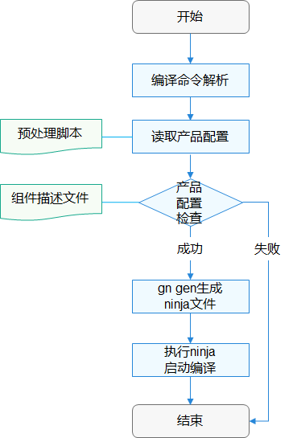

# 编译系统介绍<a name="ZH-CN_TOPIC_0000001063302771"></a>

-   [编译构建流程](#section1111311235313)
-   [编译构建适配流程](#section2159183845319)

## 编译构建流程<a name="section1111311235313"></a>

编译构建系统是一个基于gn和ninja组件化构建系统，支持按组件配置、裁剪和拼装，按需构建出定制化的产品。编译构建流程如下：

**图 1**  编译构建流程<a name="fig23781931124913"></a>  


-   编译命令解析：主要包括产品名称、编译类型（debug/release）、是否单组件编译、指定编译器等。

    > **说明：** 
    >编译类型debug选项涉及到XTS的测试用例是否参与编译；release选项会移除最后编译生成文件的符号表、调试信息等

-   读取产品配置：读取解决方案厂商的产品配置文件vendor/x\_company/x\_product.json文件，主要包括开发板、内核类型、内核版本和配置的组件。
-   gn生成ninja文件：根据产品的配置解析结果，按对应的编译工具链将所选组件加入编译，配置全局的编译选项。
-   执行ninja启动编译：组件逐个编译和链接。

gn语法和基础知识请参见官方[快速入门](https://gn.googlesource.com/gn/+/master/docs/quick_start.md)。

## 编译构建适配流程<a name="section2159183845319"></a>

首先，创建开发板目录，以芯片厂商realtek的“rtl8720“开发板为例，需创建device/realtek/rtl8720目录。编译相关的适配步骤如下：

1.  编译工具链和编译选项配置

    构建系统默认使用ohos-clang编译工具链，也支持芯片厂商按开发板自定义配置。开发板编译配置文件编译相关的变量如下：

    -   kernel\_type: 开发板使用的内核类型，例如："liteos\_a", "liteos\_m", "linux"。
    -   kernel\_version: 开发使用的内核版本，例如："4.19"。
    -   board\_cpu: 开发板CPU类型，例如："cortex-a7", "riscv32"。
    -   board\_arch: 开发芯片arch, 例如： "armv7-a", "rv32imac"。
    -   board\_toolchain: 开发板自定义的编译工具链名称，例如："gcc-arm-none-eabi"。若为空，则使用默认为ohos-clang。
    -   board\_toolchain\_prefix：编译工具链前缀，例如："gcc-arm-none-eabi"。
    -   board\_toolchain\_type：编译工具链类型，目前支持gcc和clang。例如："gcc" ，"clang"。
    -   board\_cflags：开发板配置的c文件编译选项。
    -   board\_cxx\_flags：开发板配置的cpp文件编译选项。
    -   board\_ld\_flags：开发板配置的链接选项。

        编译构建会按产品的选择的开发板，加载对应的config.gni，该文件中变量对系统组件全局可见。


    以芯片厂商realtek的“rtl8720“开发板为例，device/realtek/rtl8720/liteos\_m/config.gni如下：

    ```
    # Kernel type, e.g. "linux", "liteos_a", "liteos_m".
    kernel_type = "liteos_m"
    
    # Kernel version.
    kernel_version = ""
    
    # Board CPU type, e.g. "cortex-a7", "riscv32".
    board_cpu = "real-m300"
    
    # Board arch, e.g. "armv7-a", "rv32imac".
    board_arch = ""
    
    # Toolchain name used for system compiling.
    # E.g. gcc-arm-none-eabi, arm-linux-harmonyeabi-gcc, ohos-clang, riscv32-unknown-elf.
    # Note: The default toolchain is "ohos-clang". It's not mandatory if you use the default toochain.
    board_toolchain = "gcc-arm-none-eabi"
    
    # The toolchain path instatlled, it's not mandatory if you have added toolchian path to your ~/.bashrc.
    board_toolchain_path =
        rebase_path("//prebuilts/gcc/linux-x86/arm/gcc-arm-none-eabi/bin",
                    root_build_dir)
    
    # Compiler prefix.
    board_toolchain_prefix = "gcc-arm-none-eabi-"
    
    # Compiler type, "gcc" or "clang".
    board_toolchain_type = "gcc"
    
    # Board related common compile flags.
    board_cflags = []
    board_cxx_flags = []
    board_ld_flags = []
    ```

2.  开发板编译脚本

    新增的开发板，对应目录下需要新增BUILD.gn文件作为开发板编译的总入口。以芯片厂商realtek的rtl8720开发板为例，对应的device/realtek/rtl8720/BUILD.gn为：

    ```
    group("rlt8720") {
      ...
    }
    ```

3.  编译调试

    1. 任意目录执行hb set按提示设置源码路径和要编译的产品。

    2. 在开发板目录下执行hb build, 即可启动开发板的编译。


