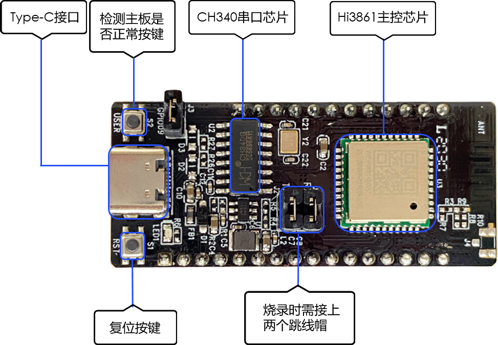
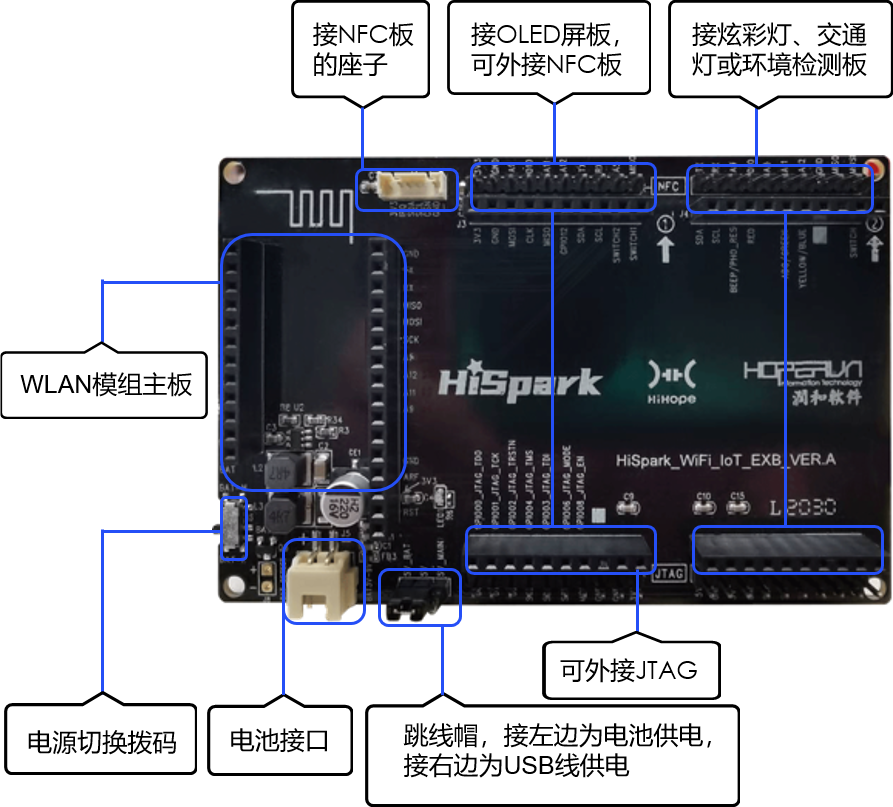

# Hi3861开发板介绍

-   [开发板简介](#section187215231809)
-   [资源和约束](#section82610215014)
-   [开发板规格](#section169054431017)
-   [关键特性](#section1317173016507)

本文档介绍Hi3861 WLAN模组的开发环境搭建、版本编译构建、烧录、源码修改、调试验证等方法。通过学习，开发者会对Hi3861 WLAN模组开发流程有初步认识，并可上手业务开发。

## 开发板简介

Hi3861 WLAN模组是一片大约2cm\*5cm大小的开发板，是一款高度集成的2.4GHz WLAN SoC芯片，集成IEEE 802.11b/g/n基带和RF（Radio Frequency）电路。支持OpenHarmony，并配套提供开放、易用的开发和调试运行环境。

**图 1**  Hi3861 WLAN模组外观图  

另外，Hi3861 WLAN模组还可以通过与Hi3861底板连接，扩充自身的外设能力，底板如下图所示。

**图 2**  Hi3861底板外观图  

-   RF电路包括功率放大器PA（Power Amplifier）、低噪声放大器LNA（Low Noise Amplifier）、RF Balun、天线开关以及电源管理等模块；支持20MHz标准带宽和5MHz/10MHz窄带宽，提供最大72.2Mbit/s物理层速率。
-   Hi3861 WLAN基带支持正交频分复用（OFDM）技术，并向下兼容直接序列扩频（DSSS）和补码键控（CCK）技术，支持IEEE 802.11 b/g/n协议的各种数据速率。
-   Hi3861芯片集成高性能32bit微处理器、硬件安全引擎以及丰富的外设接口，外设接口包括SPI（Synchronous Peripheral Interface）、UART（Universal Asynchronous Receiver & Transmitter）、I2C（The Inter Integrated Circuit）、PWM（Pulse Width Modulation）、GPIO（General Purpose Input/Output）和多路ADC（Analog to Digital Converter），同时支持高速SDIO2.0（Secure Digital Input/Output）接口，最高时钟可达50MHz；芯片内置SRAM（Static Random Access Memory）和Flash，可独立运行，并支持在Flash上运行程序。
-   Hi3861芯片适用于智能家电等物联网智能终端领域。

    **图 3**  Hi3861功能框图  
    

    

## 资源和约束

Hi3861 WLAN模组资源十分有限，整板共2MB FLASH，352KB RAM。在编写业务代码时，需注意资源使用效率。

## 开发板规格

**表 1**  Hi3861 WLAN模组规格清单

<table><thead align="left"><tr id="r54b3810e43d24e1887c1d6a41394996b"><th class="cellrowborder" valign="top" width="18.060000000000002%" id="mcps1.2.3.1.1">
规格类型

</th>
<th class="cellrowborder" valign="top" width="81.94%" id="mcps1.2.3.1.2">
规格清单

</th>
</tr>
</thead>
<tbody><tr id="r71f534ea66af4191b020408df5978f41"><td class="cellrowborder" valign="top" width="18.060000000000002%" headers="mcps1.2.3.1.1 ">
通用规格

</td>
<td class="cellrowborder" valign="top" width="81.94%" headers="mcps1.2.3.1.2 "><ul id="u2a0d06f28d454d30818ced9a0432211b"><li>1×1 2.4GHz频段（ch1～ch14）</li><li>PHY支持IEEE 802.11b/g/n</li><li>MAC支持IEEE802.11 d/e/h/i/k/v/w</li></ul>
<ul id="u8f31d142d92147789195a18b50836d2c"><li>内置PA和LNA，集成TX/RX Switch、Balun等</li><li>支持STA和AP形态，作为AP时最大支持6 个STA接入</li><li>支持WFA WPA/WPA2 personal、WPS2.0</li><li>支持与BT/BLE芯片共存的2/3/4 线PTA方案</li><li>电源电压输入范围：2.3V～3.6V</li></ul>
<ul id="ul114549122110"><li>IO电源电压支持1.8V和3.3V</li></ul>
<ul id="ue044275c53b84dd29dda674e16e72823"><li>支持RF自校准方案</li><li>低功耗：<ul id="ul0879143622219"><li>Ultra Deep Sleep模式：5μA@3.3V</li><li>DTIM1：1.5mA@3.3V</li><li>DTIM3：0.8mA@3.3V</li></ul>
</li></ul>
</td>
</tr>
<tr id="rd9b56e759af34950b6887ca1bf5bb7cf"><td class="cellrowborder" valign="top" width="18.060000000000002%" headers="mcps1.2.3.1.1 ">
PHY特性

</td>
<td class="cellrowborder" valign="top" width="81.94%" headers="mcps1.2.3.1.2 "><ul id="u6568aa052152432aa1f44372445ca634"><li>支持IEEE802.11b/g/n单天线所有的数据速率</li><li>支持最大速率：72.2Mbps@HT20 MCS7</li><li>支持标准20MHz带宽和5M/10M窄带宽</li><li>支持STBC</li><li>支持Short-GI</li></ul>
</td>
</tr>
<tr id="r3563f9df9759486794952d46c5d2d03f"><td class="cellrowborder" valign="top" width="18.060000000000002%" headers="mcps1.2.3.1.1 ">
MAC特性

</td>
<td class="cellrowborder" valign="top" width="81.94%" headers="mcps1.2.3.1.2 "><ul id="uca57d799e7814925a5bf1b891335bd79"><li>支持A-MPDU，A-MSDU</li><li>支持Blk-ACK</li><li>支持QoS，满足不同业务服务质量需求</li></ul>
</td>
</tr>
<tr id="r3e1c86e5f6cd4df0a1b30a08fb8481a2"><td class="cellrowborder" valign="top" width="18.060000000000002%" headers="mcps1.2.3.1.1 ">
CPU子系统

</td>
<td class="cellrowborder" valign="top" width="81.94%" headers="mcps1.2.3.1.2 "><ul id="u612cc2cd0cfe40229263c4f506c0c69c"><li>高性能 32bit微处理器，最大工作频率160MHz</li><li>内嵌SRAM 352KB、ROM 288KB</li><li>内嵌 2MB Flash</li></ul>
</td>
</tr>
<tr id="rae93c5236b084cd2a2c0d5c29027b40e"><td class="cellrowborder" valign="top" width="18.060000000000002%" headers="mcps1.2.3.1.1 ">
外围接口

</td>
<td class="cellrowborder" valign="top" width="81.94%" headers="mcps1.2.3.1.2 "><ul id="u7c73ebffd89e4092bd65f0d878d59b22"><li>1个SDIO接口、2个SPI接口、2个I2C接口、3个UART接口、15个GPIO接口、7路ADC输入、6路PWM、1个I2S接口（注：上述接口通过复用实现）</li><li>外部主晶体频率40M或24M</li></ul>
</td>
</tr>
<tr id="r18810701aafe42ad8d9a7d882730c210"><td class="cellrowborder" valign="top" width="18.060000000000002%" headers="mcps1.2.3.1.1 ">
其他信息

</td>
<td class="cellrowborder" valign="top" width="81.94%" headers="mcps1.2.3.1.2 "><ul id="u25f28919a3b044c5af50f9f5f5616083"><li>封装：QFN-32，5mm×5mm</li><li>工作温度：-40℃ ～ +85℃</li></ul>
</td>
</tr>
</tbody>
</table>

## OpenHarmony关键特性

OpenHarmony基于Hi3861平台提供了多种开放能力，提供的关键组件如下表所示。

**表 2**  OpenHarmony关键组件列表

<table><thead align="left"><tr id="row1368918486512"><th class="cellrowborder" valign="top" width="22.63%" id="mcps1.2.3.1.1">
组件名

</th>
<th class="cellrowborder" valign="top" width="77.37%" id="mcps1.2.3.1.2">
能力介绍

</th>
</tr>
</thead>
<tbody><tr id="row868910487517"><td class="cellrowborder" valign="top" width="22.63%" headers="mcps1.2.3.1.1 ">
WLAN服务

</td>
<td class="cellrowborder" valign="top" width="77.37%" headers="mcps1.2.3.1.2 ">
提供WLAN服务能力。包括：station和hotspot模式的连接、断开、状态查询等。

</td>
</tr>
<tr id="row568964819514"><td class="cellrowborder" valign="top" width="22.63%" headers="mcps1.2.3.1.1 ">
模组外设控制

</td>
<td class="cellrowborder" valign="top" width="77.37%" headers="mcps1.2.3.1.2 ">
提供操作外设的能力。包括：I2C、I2S、ADC、UART、SPI、SDIO、GPIO、PWM、FLASH等。

</td>
</tr>
<tr id="row143420119366"><td class="cellrowborder" valign="top" width="22.63%" headers="mcps1.2.3.1.1 ">
分布式软总线

</td>
<td class="cellrowborder" valign="top" width="77.37%" headers="mcps1.2.3.1.2 ">
在OpenHarmony分布式网络中，提供设备被发现、数据传输的能力。

</td>
</tr>
<tr id="row1383559163617"><td class="cellrowborder" valign="top" width="22.63%" headers="mcps1.2.3.1.1 ">
设备安全绑定

</td>
<td class="cellrowborder" valign="top" width="77.37%" headers="mcps1.2.3.1.2 ">
提供在设备互联场景中，数据在设备之间的安全流转的能力。

</td>
</tr>
<tr id="row54428163612"><td class="cellrowborder" valign="top" width="22.63%" headers="mcps1.2.3.1.1 ">
基础加解密

</td>
<td class="cellrowborder" valign="top" width="77.37%" headers="mcps1.2.3.1.2 ">
提供密钥管理、加解密等能力。

</td>
</tr>
<tr id="row12690548135110"><td class="cellrowborder" valign="top" width="22.63%" headers="mcps1.2.3.1.1 ">
系统服务管理

</td>
<td class="cellrowborder" valign="top" width="77.37%" headers="mcps1.2.3.1.2 ">
系统服务管理基于面向服务的架构，提供了OpenHarmony统一化的系统服务开发框架。

</td>
</tr>
<tr id="row1657310121587"><td class="cellrowborder" valign="top" width="22.63%" headers="mcps1.2.3.1.1 ">
启动引导

</td>
<td class="cellrowborder" valign="top" width="77.37%" headers="mcps1.2.3.1.2 ">
提供系统服务的启动入口标识。在系统服务管理启动时，调用boostrap标识的入口函数，并启动系统服务。

</td>
</tr>
<tr id="row15763812165616"><td class="cellrowborder" valign="top" width="22.63%" headers="mcps1.2.3.1.1 ">
系统属性

</td>
<td class="cellrowborder" valign="top" width="77.37%" headers="mcps1.2.3.1.2 ">
提供获取与设置系统属性的能力。

</td>
</tr>
<tr id="row121911343566"><td class="cellrowborder" valign="top" width="22.63%" headers="mcps1.2.3.1.1 ">
基础库

</td>
<td class="cellrowborder" valign="top" width="77.37%" headers="mcps1.2.3.1.2 ">
提供公共基础库能力。包括：文件操作、KV存储管理等。

</td>
</tr>
<tr id="row144219192579"><td class="cellrowborder" valign="top" width="22.63%" headers="mcps1.2.3.1.1 ">
DFX

</td>
<td class="cellrowborder" valign="top" width="77.37%" headers="mcps1.2.3.1.2 ">
提供DFX能力。包括：流水日志、时间打点等。

</td>
</tr>
<tr id="row16159522125710"><td class="cellrowborder" valign="top" width="22.63%" headers="mcps1.2.3.1.1 ">
XTS

</td>
<td class="cellrowborder" valign="top" width="77.37%" headers="mcps1.2.3.1.2 ">
提供OpenHarmony生态认证测试套件的集合能力。

</td>
</tr>
</tbody>
</table>

