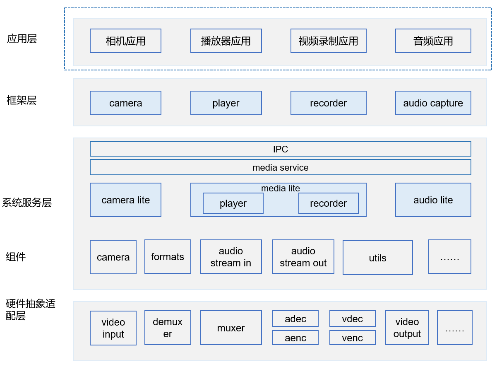

# 媒体子系统CAMERA\_SAMPLE\_APP组件<a name="ZH-CN_TOPIC_0000001080462608"></a>

-   [简介](#section11660541593)
-   [目录](#section176641621345)
-   [使用说明](#section1648194512427)
-   [约束](#section722512541395)
-   [相关仓](#section16511040154318)

## 简介<a name="section11660541593"></a>

CAMERA\_SAMPLE\_APP组件，提供媒体能力开发的相关应用，提供桌面应用和设置应用。

**图 1**  媒体子系统架构（蓝色虚线框是sample\_app）<a name="fig189881143114217"></a>  


## 目录<a name="section176641621345"></a>

```
applications/sample/camera
├── cameraApp   相机应用
├── gallery     图库应用
├── launcher    桌面应用 
├── media       拍照录像应用和音视频播放应用
└── setting     设置
```

## 使用说明<a name="section1648194512427"></a>

单仓的编译构建，在根目录下进行单仓的构建和编译

```
# 开发板选择
hb set  
# 单仓构建和编译
hb build camera_lite
```

## 约束<a name="section722512541395"></a>

C++11版本或以上

## 相关仓<a name="section16511040154318"></a>

/hmf/multimedia/camera\_lite

/hmf/multimedia/audio\_lite

/hmf/multimedia/media\_lite

/hmf/multimedia/utils\_lite

/hmf/multimedia/service\_lite

