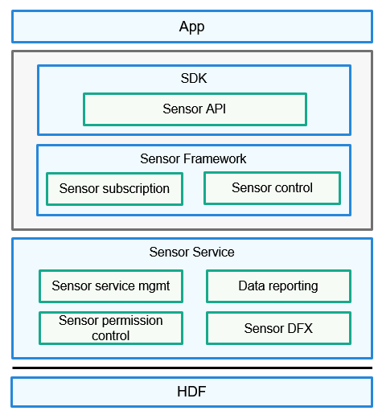

# sensor\_lite<a name="EN-US_TOPIC_0000001078194836"></a>

-   [Introduction](#section11660541593)
-   [Directory Structure](#section161941989596)
-   [Usage](#section1312121216216)
    -   [Available APIs](#section827111510217)
    -   [Usage Guidelines](#section129654513264)

-   [Repositories Involved](#section1371113476307)

## Introduction<a name="section11660541593"></a>

The pan-sensor service subsystem provides a lightweight sensor service framework, through which you can perform the following operations:

-   Query the sensor list.
-   Enable or disable a sensor.
-   Subscribe to or unsubscribe from sensor data.
-   Set the data reporting mode of a sensor.
-   Set the data sampling interval.

The following figure shows the architecture of the pan-sensor framework.

**Figure  1**  Pan-sensor service architecture<a name="fig15658513184019"></a>  


## Directory Structure<a name="section161941989596"></a>

```
/base/sensors/sensor_lite
├── frameworks      # Framework code
│   ├── include     # Header files
│   └── src         # Source code
├── interfaces      # APIs
│   └── kits        # Native APIs
├── services        # Code of services
│   ├── include     # Header files
│   └── src         # Source code
```

## Usage<a name="section1312121216216"></a>

### Available APIs<a name="section827111510217"></a>

**Table  1**  Major APIs in SensorAgent

<a name="table411220157213"></a>
<table><thead align="left"><tr id="row131101415123"><th class="cellrowborder" valign="top" width="62.339999999999996%" id="mcps1.2.3.1.1"><p id="p181106151923"><a name="p181106151923"></a><a name="p181106151923"></a>API</p>
</th>
<th class="cellrowborder" valign="top" width="37.66%" id="mcps1.2.3.1.2"><p id="p1511021515212"><a name="p1511021515212"></a><a name="p1511021515212"></a>Description</p>
</th>
</tr>
</thead>
<tbody><tr id="row711081513219"><td class="cellrowborder" valign="top" width="62.339999999999996%" headers="mcps1.2.3.1.1 "><p id="p111020153217"><a name="p111020153217"></a><a name="p111020153217"></a><strong id="b1411081511214"><a name="b1411081511214"></a><a name="b1411081511214"></a>GetAllSensors</strong>(SensorInfo **sensorInfo, int32_t *count)</p>
</td>
<td class="cellrowborder" valign="top" width="37.66%" headers="mcps1.2.3.1.2 "><p id="p71104156214"><a name="p71104156214"></a><a name="p71104156214"></a>Obtains information about all sensors in the system.</p>
</td>
</tr>
<tr id="row7111111511212"><td class="cellrowborder" valign="top" width="62.339999999999996%" headers="mcps1.2.3.1.1 "><p id="p1111091510212"><a name="p1111091510212"></a><a name="p1111091510212"></a><strong id="b1011011514211"><a name="b1011011514211"></a><a name="b1011011514211"></a>SubscribeSensor</strong>(int32_t sensorTypeId, SensorUser *user)</p>
</td>
<td class="cellrowborder" valign="top" width="37.66%" headers="mcps1.2.3.1.2 "><p id="p011014153214"><a name="p011014153214"></a><a name="p011014153214"></a>Subscribes to sensor data. The system will report the obtained sensor data to the subscriber.</p>
</td>
</tr>
<tr id="row8111121512211"><td class="cellrowborder" valign="top" width="62.339999999999996%" headers="mcps1.2.3.1.1 "><p id="p1211117151227"><a name="p1211117151227"></a><a name="p1211117151227"></a><strong id="b141111715023"><a name="b141111715023"></a><a name="b141111715023"></a>UnsubscribeSensor</strong>(int32_t sensorTypeId, SensorUser *user)</p>
</td>
<td class="cellrowborder" valign="top" width="37.66%" headers="mcps1.2.3.1.2 "><p id="p311115159211"><a name="p311115159211"></a><a name="p311115159211"></a>Unsubscribes from sensor data. The system will no longer report sensor data to the subscriber.</p>
</td>
</tr>
<tr id="row21111151822"><td class="cellrowborder" valign="top" width="62.339999999999996%" headers="mcps1.2.3.1.1 "><p id="p311110151824"><a name="p311110151824"></a><a name="p311110151824"></a><strong id="b8111201519219"><a name="b8111201519219"></a><a name="b8111201519219"></a>SetBatch</strong>(int32_t sensorTypeId, SensorUser *user, int64_t samplingInterval, int64_t reportInterval)</p>
</td>
<td class="cellrowborder" valign="top" width="37.66%" headers="mcps1.2.3.1.2 "><p id="p91111151727"><a name="p91111151727"></a><a name="p91111151727"></a>Sets the data sampling interval and data reporting interval for the specified sensor.</p>
</td>
</tr>
<tr id="row8111115520"><td class="cellrowborder" valign="top" width="62.339999999999996%" headers="mcps1.2.3.1.1 "><p id="p411113155213"><a name="p411113155213"></a><a name="p411113155213"></a><strong id="b1111181512210"><a name="b1111181512210"></a><a name="b1111181512210"></a>ActivateSensor</strong>(int32_t sensorTypeId, SensorUser *user)</p>
</td>
<td class="cellrowborder" valign="top" width="37.66%" headers="mcps1.2.3.1.2 "><p id="p13111111520217"><a name="p13111111520217"></a><a name="p13111111520217"></a>Enables the sensor that has been subscribed to. The subscriber can obtain the sensor data only after the sensor is enabled.</p>
</td>
</tr>
<tr id="row15111151518213"><td class="cellrowborder" valign="top" width="62.339999999999996%" headers="mcps1.2.3.1.1 "><p id="p11112158215"><a name="p11112158215"></a><a name="p11112158215"></a><strong id="b2011118151228"><a name="b2011118151228"></a><a name="b2011118151228"></a>DeactivateSensor</strong>(int32_t sensorTypeId, SensorUser *user)</p>
</td>
<td class="cellrowborder" valign="top" width="37.66%" headers="mcps1.2.3.1.2 "><p id="p51111215729"><a name="p51111215729"></a><a name="p51111215729"></a>Disables an enabled sensor.</p>
</td>
</tr>
<tr id="row10111171514213"><td class="cellrowborder" valign="top" width="62.339999999999996%" headers="mcps1.2.3.1.1 "><p id="p21114151528"><a name="p21114151528"></a><a name="p21114151528"></a><strong id="b1911119151727"><a name="b1911119151727"></a><a name="b1911119151727"></a>SetMode</strong>(int32_t sensorTypeId, SensorUser *user, int32_t mode)</p>
</td>
<td class="cellrowborder" valign="top" width="37.66%" headers="mcps1.2.3.1.2 "><p id="p51110150210"><a name="p51110150210"></a><a name="p51110150210"></a>Sets the data reporting mode for the specified sensor.</p>
</td>
</tr>
</tbody>
</table>

### Usage Guidelines<a name="section129654513264"></a>

This section uses the acceleration sensor as an example to describe how to use sensor APIs.

1.  Import the required header files.

```
#include "sensor_agent.h"
#include "sensor_agent_type.h"
```

1.  Create a callback.

```
void SensorDataCallbackImpl(SensorEvent *event)
{
    if(event == NULL){
        return;
    }
    float *sensorData=(float *)event->data;
}
```

1.  Obtain the list of sensors supported by the device.

```
SensorInfo *sensorInfo = (SensorInfo *)NULL;
int32_t count = 0;
int32_t ret = GetAllSensors(&sensorInfo, &count);
```

1.  Create a sensor user.

```
SensorUser sensorUser;
sensorUser.callback = SensorDataCallbackImpl; // Assign the created callback SensorDataCallbackImpl to the member variable callback.
```

1.  Enable the sensor.

```
int32_t ret = ActivateSensor(SENSOR_TYPE_ID_ACCELEROMETER, &sensorUser);
```

1.  Subscribe to sensor data.

```
int32_t ret = SubscribeSensor(SENSOR_TYPE_ID_ACCELEROMETER, &sensorUser);
```

1.  Unsubscribe from the sensor data.

```
int32_t ret = UnsubscribeSensor(SENSOR_TYPE_ID_ACCELEROMETER, &sensorUser);
```

1.  Disable the sensor.

```
int32_t ret = DeactivateSensor(SENSOR_TYPE_ID_ACCELEROMETER, &sensorUser);
```

## Repositories Involved<a name="section1371113476307"></a>

[Pan-sensor subsystem](https://gitee.com/openharmony/docs/blob/master/en/readme/pan-sensor.md)

**sensors_sensor_lite**

[sensors_miscdevice_lite](https://gitee.com/openharmony/sensors_miscdevice_lite/blob/master/README.md)

