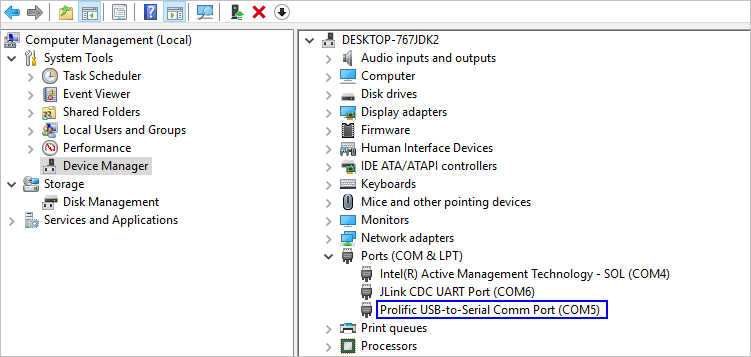
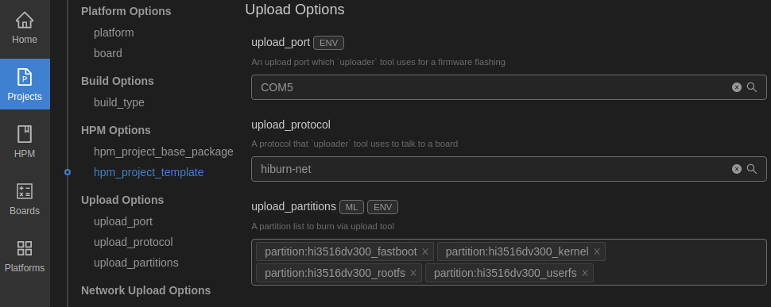
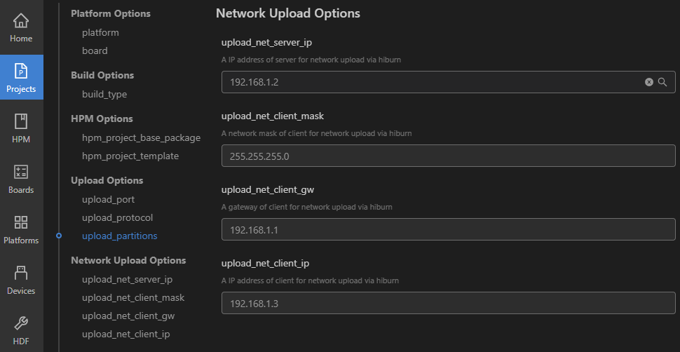
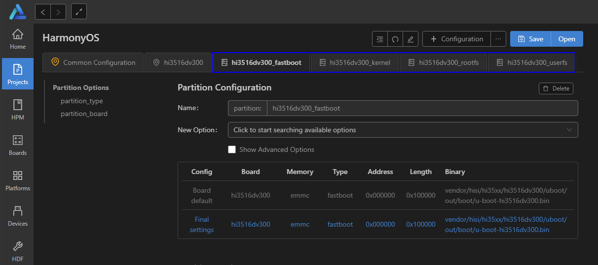
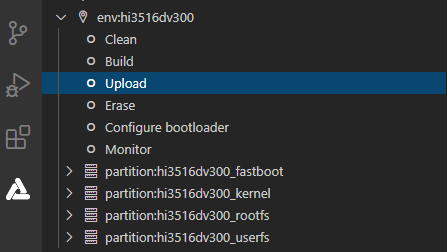

# Developing the First Example Program Running on Hi3516<a name="EN-US_TOPIC_0000001052906247"></a>

-   [Modifying a Program](#s8efc1952ebfe4d1ea717182e108c29bb)
-   [Building](#section1077671315253)
-   [Burning](#section08153912587)
-   [Running an Image](#section380511712615)
-   [Running a Program](#section5276734182615)

This section describes how to modify, compile, burn, and run the first program, and finally print  **Hello OHOS!**  on the develop board.

## Modifying a Program<a name="s8efc1952ebfe4d1ea717182e108c29bb"></a>

The code of  **helloworld.c**  in the  **applications/sample/camera/app/src**  directory is shown in the following example. You can customize the content to be printed. For example, you can change  **OHOS**  to  **World**. You can use either C or C++ to develop a program.

```
#include <stdio.h>
#include "los_sample.h"

int main(int argc, char **argv)
{
    printf("\n************************************************\n");
    printf("\n\t\tHello OHOS!\n");
    printf("\n************************************************\n\n");

    LOS_Sample(g_num);

    return 0;
}
```

## Building<a name="section1077671315253"></a>

If the Linux environment is installed using Docker, perform the compilation by referring to  [Using Docker to Prepare the Build Environment](../get-code/acquiring-tools.md). If the Linux environment is installed using a software package, go to the root directory of the source code and run the following commands for source code compilation:

```
hb set (Set the building path.)
. (Select the current path.)
Select ipcamera_hispark_taurus@hisilicon and press Enter.
hb build -f (Start building.)
```

**Figure  1**  Settings<a name="fig1211318064712"></a>  


The result files are generated in the  **out/hispark\_taurus/ipcamera\_hispark\_taurus**  directory.

> **NOTICE:** 
>The U-boot file of the Hi3516 development board can be obtained from the following path: vendor\\hisi\\hi35xx\\hi3516dv300\\uboot\\out\\boot\\u-boot-hi3516dv300.bin

## Burning<a name="section08153912587"></a>

The Hi3516 development board allows you to burn flash memory over the USB port, serial port, or network port. The following uses the network port burning as an example.

1.  Connect the PC and the target development board through the power port, serial port, and network port. In this section, the Hi3516DV300 is used as an example. For details, please refer to  [Introduction to the Hi3516 Development Board](https://device.harmonyos.com/en/docs/start/introduce/oem_camera_start_3516-0000001052670587).
2.  <a name="en-us_topic_0000001056443961_li142386399535"></a>Open Device Manager, then check and record the serial port number corresponding to the development board.

    > **NOTE:** 
    >If the serial port number is not displayed correctly, follow the steps described in  [Installing the Serial Port Driver on the Hi3516 or Hi3518 Series Development Boards](https://device.harmonyos.com/en/docs/ide/user-guides/hi3516_hi3518-drivers-0000001050743695).

    

3.  Open DevEco Device Tool and go to  **Projects**  \>  **Settings**.

    

4.  On the  **hi3516dv300**  tab page, configure the programming options.

    -   **upload\_port**: Select the serial port number obtained in step  [2](#en-us_topic_0000001056443961_li142386399535).
    -   **upload\_protocol**: Select the programming protocol  **hiburn-net**.
    -   **upload\_partitions**: Select the file to be programmed. By default, the  **fastboot**,  **kernel**,  **rootfs**, and  **userfs**  files are programmed at the same time.

    

5.  Set the IP address of the network port. You are advised to set the local TCP/IPv4 address on your PC and then set the following options:

    -   **upload\_net\_server\_ip**: Select the IP address of your PC, such as 192.168.1.2.
    -   **upload\_net\_client\_mask**: Set the subnet mask of the development board, such as 255.255.255.0. Once the  **upload\_net\_server\_ip**  field is set, this field will be automatically populated. 
    -   **upload\_net\_client\_gw**: Set the gateway of the development board, such as 192.168.1.1. Once the  **upload\_net\_server\_ip**  field is set, this field will be automatically populated. 
    -   **upload\_net\_client\_ip**: Set the IP address of the development board, such as 92.168.1.3. Once the  **upload\_net\_server\_ip**  field is set, this field will be automatically populated. 

    

6.  Switch between the  **hi3516dv300\_fastboothi3516dv300\_kernel**,  **hi3516dv300\_rootfs**, and  **hi3516dv300\_userfs**  tab pages, and modify the settings. In general cases, you can leave the fields at their default settings. To change the default settings, select the target item in the  **New Option**  field first.

    

7.  When you finish modifying, click  **Save**  in the upper right corner.

    

8.  Open the project file and go to    \>  **PROJECT TASKS**  \>  **env:hi3516dv300**  \>  **Upload**  to start programming.

    

9.  When the following message is displayed, power off the development board and then power it on.

    

10. Start programming. When the following message is displayed, it indicates that the programming is successful.

    


## Running an Image<a name="section380511712615"></a>

1.  Connect to a serial port.

    > **NOTICE:** 
    >If the connection fails, rectify the fault by referring to  [What should I do when no command output is displayed?](faq-on-hi3516.md#section14871149155911).

    **Figure  2**  Serial port connection<a name="fig056645018495"></a>  
    

    

    1.  Click  **Serial port**  to enable it.
    2.  Enter the serial port number queried in the "Burning" section \(COM11 is used in this example\) and press  **Enter**  until  **hisillicon**  is displayed.
    3.  Go to step  [2](#l5b42e79a33ea4d35982b78a22913b0b1)  if the board is started for the first time or the startup parameters need to be modified; go to step  [3](#ld26f18828aa44c36bfa36be150e60e49)  otherwise.

2.  <a name="l5b42e79a33ea4d35982b78a22913b0b1"></a>\(Mandatory when the board is started for the first time\) Modify the bootcmd and bootargs parameters of U-boot. You need to perform this step only once if the parameters need not to be modified during the operation. The board automatically starts after it is reset.

    > **NOTICE:** 
    >The default waiting time in the U-boot is 2s. You can press  **Enter**  to interrupt the waiting and run the  **reset**  command to restart the system after "hisillicon" is displayed.

    **Table  1**  Parameters of the U-boot

    <a name="table1323441103813"></a>
    <table><thead align="left"><tr id="row1423410183818"><th class="cellrowborder" valign="top" width="50%" id="mcps1.2.3.1.1"><p id="p623461163818"><a name="p623461163818"></a><a name="p623461163818"></a>Command</p>
    </th>
    <th class="cellrowborder" valign="top" width="50%" id="mcps1.2.3.1.2"><p id="p42341014388"><a name="p42341014388"></a><a name="p42341014388"></a>Description</p>
    </th>
    </tr>
    </thead>
    <tbody><tr id="row1623471113817"><td class="cellrowborder" valign="top" width="50%" headers="mcps1.2.3.1.1 "><p id="p102341719385"><a name="p102341719385"></a><a name="p102341719385"></a>setenv bootcmd "mmc read 0x0 0x80000000 0x800 0x4800; go 0x80000000";</p>
    </td>
    <td class="cellrowborder" valign="top" width="50%" headers="mcps1.2.3.1.2 "><p id="p92347120389"><a name="p92347120389"></a><a name="p92347120389"></a>Run this command to read content that has a size of 0x4800 (9 MB) and a start address of 0x800 (1 MB) to the memory address 0x80000000. The file size must be the same as that of the <strong id="b9140538191313"><a name="b9140538191313"></a><a name="b9140538191313"></a>OHOS_Image.bin</strong> file in the IDE.</p>
    </td>
    </tr>
    <tr id="row12234912381"><td class="cellrowborder" valign="top" width="50%" headers="mcps1.2.3.1.1 "><p id="p172306219392"><a name="p172306219392"></a><a name="p172306219392"></a>setenv bootargs "console=ttyAMA0,115200n8 root=emmc fstype=vfat rootaddr=10 M rootsize=15 M rw";</p>
    </td>
    <td class="cellrowborder" valign="top" width="50%" headers="mcps1.2.3.1.2 "><p id="p13489329396"><a name="p13489329396"></a><a name="p13489329396"></a>Run this command to set the output mode to serial port output, baud rate to <strong id="b1378372812210"><a name="b1378372812210"></a><a name="b1378372812210"></a>115200</strong>, data bit to <strong id="b27871628822"><a name="b27871628822"></a><a name="b27871628822"></a>8</strong>, <strong id="b678811281528"><a name="b678811281528"></a><a name="b678811281528"></a>rootfs</strong> to be mounted to the <strong id="b978813281220"><a name="b978813281220"></a><a name="b978813281220"></a>emmc</strong> component, and file system type to <strong id="b12788132814217"><a name="b12788132814217"></a><a name="b12788132814217"></a>vfat</strong>.</p>
    <p id="p12481832163913"><a name="p12481832163913"></a><a name="p12481832163913"></a><strong id="b965011165313"><a name="b965011165313"></a><a name="b965011165313"></a>rootaddr=10 M, rootsize=15 M rw</strong> indicates the start address and size of the rootfs.img file to be burnt, respectively. The file size must be the same as that of the <strong id="b69061726113015"><a name="b69061726113015"></a><a name="b69061726113015"></a>rootfs.img</strong> file in the IDE.</p>
    </td>
    </tr>
    <tr id="row18234161153820"><td class="cellrowborder" valign="top" width="50%" headers="mcps1.2.3.1.1 "><p id="p823417118386"><a name="p823417118386"></a><a name="p823417118386"></a>saveenv</p>
    </td>
    <td class="cellrowborder" valign="top" width="50%" headers="mcps1.2.3.1.2 "><p id="p32341616389"><a name="p32341616389"></a><a name="p32341616389"></a><strong id="b16238195319315"><a name="b16238195319315"></a><a name="b16238195319315"></a>saveenv</strong> means to save the current configuration.</p>
    </td>
    </tr>
    <tr id="row192345113811"><td class="cellrowborder" valign="top" width="50%" headers="mcps1.2.3.1.1 "><p id="p7235111183819"><a name="p7235111183819"></a><a name="p7235111183819"></a>reset</p>
    </td>
    <td class="cellrowborder" valign="top" width="50%" headers="mcps1.2.3.1.2 "><p id="p123781411114016"><a name="p123781411114016"></a><a name="p123781411114016"></a><strong id="b32719232420"><a name="b32719232420"></a><a name="b32719232420"></a>reset</strong> means to reset the board.</p>
    </td>
    </tr>
    </tbody>
    </table>

    > **NOTICE:** 
    >**go 0x80000000**  \(optional\) indicates that the command is fixed in the startup parameters by default and the board automatically starts after it is reset. If you want to manually start the board, press  **Enter**  in the countdown phase of the U-boot startup to interrupt the automatic startup.

3.  <a name="ld26f18828aa44c36bfa36be150e60e49"></a>Run the  **reset**  command and press  **Enter**  to restart the board. After the board is restarted,  **OHOS**  is displayed when you press  **Enter**.

    **Figure  3**  System startup<a name="fig10181006376"></a>  
    

    


## Running a Program<a name="section5276734182615"></a>

In the root directory, run the  **./bin/camera\_app**  command to operate the demo program. The compilation result is shown in the following example.

**Figure  4**  Program started successfully<a name="fig36537913815"></a>  


