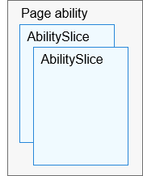
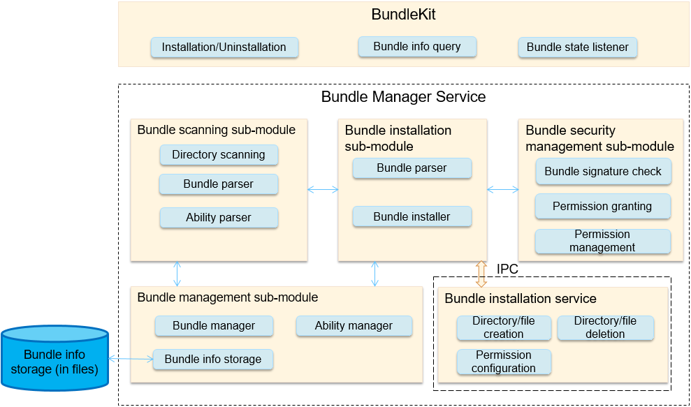

# Application Framework<a name="EN-US_TOPIC_0000001052619284"></a>

-   [Introduction](#section11660541593)
-   [Directory Structure](#section1464106163817)
-   [Constraints](#section1718733212019)
-   [Usage](#section1048719468503)
-   [Repositories Involved](#section93061357133720)

## Introduction<a name="section11660541593"></a>

The application framework of OpenHarmony consists of two modules:  **ability management framework**  and  **bundle management framework**.

**1. Ability management framework**: This framework is provided by OpenHarmony for you to develop OpenHarmony applications. The following figure shows the sub-modules in the ability management framework.

**Figure  1**  Architecture of the ability management framework<a name="fig18932193213292"></a>  


-   **AbilityKit**  is a development kit provided by the ability management framework. You can use this kit to develop applications based on the  **Ability**  component. There are two types of applications developed based on the  **Ability**  component:  **JS Ability**  developed using the JavaScript language and  **Native Ability**  developed using the C/C++ language. The  **JS application development framework**  encapsulates JavaScript UI components on the basis of the AbilityKit and is used to help you quickly develop JS Ability-based applications.
-   **Ability**  is the minimum unit for the system to schedule applications. It is a component that can implement an independent functionality. An application can contain one or more  **Ability**  instances. There are two types of templates that you can use to create an  **Ability**  instance: Page and Service.
    -   An  **Ability using the Page template**  \(Page ability for short\) provides a UI for interacting with users.
    -   An  **Ability using the Service template**  \(Service ability for short\) does not have a UI and is used for running background tasks.

-   An  **AbilitySlice**  represents a single screen and its control logic. It is specific to Page abilities. A Page ability may contain one ability slice or multiple ability slices that provide highly relevant capabilities. The following figure shows the relationship between a Page ability and its ability slices.

    **Figure  2**  Relationship between a Page ability and its ability slices<a name="fig121541746182919"></a>  
    


-   **Lifecycle**  is a general term for all states of an ability, including  **UNINITIALIZED**,  **INITIAL**,  **INACTIVE**,  **ACTIVE**, and  **BACKGROUND**. The following figure shows the lifecycle state transition of an ability.

    **Figure  3**  Lifecycle state transition of a Page ability<a name="fig4915165922910"></a>  
    

-   Description of ability lifecycle states:
    -   **UNINITIALIZED**: The ability is not initialized. This state is a temporary state. An ability changes directly to the  **INITIAL**  state upon its creation.

    -   **INITIAL**: This state refers to the initial or stopped state. The ability in this state is not running. The ability enters the  **INACTIVE**  state after it is started.

    -   **INACTIVE**: The ability is visible but does not gain focus. This state is the same as the  **ACTIVE**  state because the concept of window focus is not supported currently.

    -   **ACTIVE**: The ability is in the foreground and has focus. The ability changes from the  **ACTIVE**  state to the  **INACTIVE**  state before returning to the background.

    -   **BACKGROUND**: The ability returns to the background. After being re-activated, the ability enters the  **ACTIVE**  state. After being destroyed, the ability enters the  **INITIAL**  state.


-   **AbilityLoader**  is used to register and load  **Ability**  classes. After creating an  **Ability**  class, you should first call the registration API defined in  **AbilityLoader**  to register the  **Ability**  class name with the ability management framework so that this  **Ability**  can be instantiated when being started.
-   **AbilityManager**  enables inter-process communication \(IPC\) between the AbilityKit and the Ability Manager Service.
-   **EventHandler**  is provided by the AbilityKit to enable inter-thread communication between abilities.
-   The  **Ability Manager Service**  is a system service used to coordinate the running relationships and lifecycle states of  **Ability**  instances. It consists of the following sub-modules:
    -   The  **service startup**  sub-module starts and registers the Ability Manager Service.
    -   The  **service interface management**  sub-module manages external capabilities provided by the Ability Manager Service.
    -   The  **process management**  sub-module starts and destroys processes where  **Ability**  instances are running, and maintains the process information.
    -   The  **ability stack management**  sub-module maintains the presentation sequence of abilities in the stack.
    -   The  **lifecycle scheduling**  sub-module changes an ability to a particular state based on the current operation of the system.
    -   The  **connection management**  sub-module manages connections to Service abilities.

-   **AppSpawn**  is a system service used to create the process for running an ability. This service has high permissions. It sets permissions for  **Ability**  instances and pre-loads some common modules to accelerate application startup.

**2. Bundle management framework**: This framework is provided by OpenHarmony for you to manage application bundles \(installation packages\). The following figure shows the sub-modules in the bundle management framework.

**Figure  4**  Architecture of the bundle management framework<a name="fig1047932418305"></a>  


-   **BundleKit**  includes external APIs provided by the Bundle Manager Service, including the APIs for application installation and uninstallation, bundle information query, and bundle state change listeners.
-   The  **bundle scanning sub-module**  parses pre-installed or installed bundles on the local device and extracts information from them for the bundle management sub-module to manage and make the information persistent for storage.

-   The  **bundle installation sub-module**  installs, uninstalls, and updates a bundle.
-   The  **bundle installation service**  is an independent process used to create or delete installation directories and has high permissions.

-   The  **bundle management sub-module**  manages information related to application bundles and stores persistent bundle information.

-   The  **bundle security management sub-module**  verifies signatures, and grants and manages permissions.

## Directory Structure<a name="section1464106163817"></a>

```
/foundation
├── aafwk
│   └── aafwk_lite
│       ├── frameworks
│       │      ├── ability_lite               # Core implementation code of AbilityKit
│       │      ├── abilitymgr_lite            # Client code used for communication between the AbilityKit and Ability Manager Service
│       │      └── want_lite                  # Implementation code of the information carrier for interaction between abilities
│       ├── interfaces
│       │      ├── kits
│       │      │     ├── ability_lite        # AbilityKit APIs exposed externally
│       │      │     └── want_lite           # External APIs of the information carrier for interaction between abilities
│       │      └── innerkits
│       │             └── abilitymgr_lite     # Internal APIs provided by the Ability Manager Service for other subsystems
│       └── services
│               └── abilitymgr_lite            # Implementation code of the Ability Manager Service
└── appexecfwk
    └── appexecfwk_lite
         ├── frameworks
         │      └── bundle_lite                # Client code used for communication between the BundleKit and Bundle Manager Service
         ├── interfaces
         │      ├── kits
         │      │     └── bundle_lite         # BundleKit APIs exposed externally
         │      └── innerkits
         │             └── bundlemgr_lite      # Core implementation code of BundleKit and internal APIs provided by the Bundle Manager Service for other subsystems
         ├── services
         │      └── bundlemgr_lite             # Implementation code of the Bundle Manager Service
         └── utils
                 └── bundle_lite                # Utility code used during the implementation of the Bundle Manager Service
```

## Constraints<a name="section1718733212019"></a>

-   Language version
    -   C++ 11 or later

-   The specifications of the application framework vary depending on the System-on-a-Chip \(SoC\) and underlying OS capabilities.
    -   Cortex-M RAM and ROM
        -   RAM: greater than 20 KB \(recommended\)
        -   ROM: greater than 300 KB \(for the JS application development framework and related subsystems, such as UIKit and engine\)

    -   Cortex-A RAM and ROM
        -   RAM: greater than 2 MB \(recommended\)
        -   ROM: greater than 2 MB \(for the JS application development framework and related subsystems, such as UIKit and engine\)


## Usage<a name="section1048719468503"></a>

-   Running the Two Services in the Application Framework
    -   The application framework has two system services  **Ability Manager Service**  and  **Bundle Manager Service**. They are running in the foundation process.
    -   **Ability Manager Service**  and  **Bundle Manager Service**  are registered with  **sa\_manager**.  **sa\_manager**  runs in the foundation process and sets up a thread runtime environment for the two services. For details about how to create and use the  **Ability Manager Service**  and  **Bundle Manager Service**, see  [SA Framework](en-us_topic_0000001051589563.md).


-   The demo code of the ability developed based on the AbilityKit is stored in the  **foundation/aafwk/aafwk\_lite/frameworks/ability\_lite/example**  directory. If you need to modify the functionality, modify the code in the  **entry/src/main/cpp**  files or add a new code file, and update the configuration in  **BUILD.gn**  accordingly.
-   Add the configuration for the ability demo for compilation in the  **build/lite/config/subsystem/aafwk/BUILD.gn**  file.

    ```
    import("//build/lite/config/subsystem/lite_subsystem.gni")
    
    lite_subsystem("aafwk") {
        subsystem_components = [
            "......",
            "//foundation/aafwk/aafwk_lite/frameworks/ability_lite/example:hiability",
            "......",
        ]
    }
    ```

-   Run the following commands in the shell to build the demo. \(For more building details, see the description of the compilation and building subsystem.\) After the building is successful, the  **libhiability.so**  file is generated in  **out/ipcamera\_hi3516dv300\_liteos\_a/dev\_tools/example**.

    ```
    hb set
    hb build
    ```

-   Compile the  **config.json**  file. For details, see the  **config.json**  file in the  **foundation/aafwk/aafwk\_lite/frameworks/ability\_lite/example**  directory. The file content is as follows:

    ```
    {
        "app": {
            "bundleName": "com.xxxxxx.hiability",
            "vendor": "xxxxxx",
            "version": {
                "code": 1,
                "name": "1.0"
            },
           "apiVersion": {
              "compatible": 3,
              "target": 3
           }
        },
        "deviceConfig": {
            "default": {
                "keepAlive": false
            },
        },
        "module": {
            "deviceType": [
                "smartVision"
            ], 
            "distro": {
                "deliveryWithInstall": true, 
                "moduleName": "hiability", 
                "moduleType": "entry"
            },
            "abilities": [{
                "name": "MainAbility",
                "icon": "assets/entry/resources/base/media/icon.png",
                "label": "test app 1", 
                "launchType": "standard",
                "type": "page",
                "visible": true
            },
            {
                "name": "SecondAbility",
                "icon": "",
                "label": "test app 2", 
                "launchType": "standard",
                "type": "page",
                "visible": true
            },
            {
                "name": "ServiceAbility",
                "icon": "",
                "label": "test app 2", 
                "launchType": "standard",
                "type": "service",
                "visible": true
            }
            ]
        }
    }
    ```


-   Generate a HAP.
    -   Add resource files to the  **assets/entry/resources/base/media**  directory based on the following directory structure.

        

    -   Compress the preceding files into a ZIP package and change the file name extension to  **.hap**, for example,  **hiability.hap**.

-   Install the HAP.

    -   Place the preceding HAP file in a particular directory \(**/nfs/hap/**  in this example\).
    -   Run the following command to install the HAP. \(Taking  **hispark\_taurus**  as an example, you can obtain the bm tool from the  **out/hispark\_taurus/ipcamera\_hispark\_taurus/dev\_tools/bin directory**  after the version building.\) 

    ```
    ./bin/bm install -p /nfs/hiability.hap
    ```

-   After the installation is complete, use the aa tool to run the demo through the following command. \(Taking  **hispark\_taurus**  as an example, you can obtain the aa tool from the  **out/hispark\_taurus/ipcamera\_hispark\_taurus/dev\_tools/bin**  directory after the version building.\)

```
./bin/aa start -p com.xxxxxx.hiability -n MainAbility
```

## Repositories Involved<a name="section93061357133720"></a>

**Application framework**

[aafwk_\aafwk\_lite](https://gitee.com/openharmony/aafwk_aafwk_lite/blob/master/README.md)

[appexecfwk_\appexecfwk\_lite](https://gitee.com/openharmony/appexecfwk_appexecfwk_lite/blob/master/README.md)

