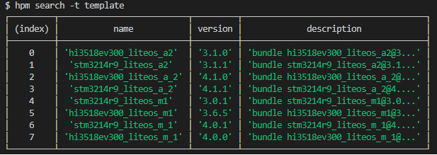

# 组件开发<a name="ZH-CN_TOPIC_0000001051690861"></a>

-   [创建组件](#section1976410130540)
-   [新建组件](#section717481119145)
-   [改造组件](#section102861955201410)
-   [从模板创建组件](#section15882846181510)
-   [编译组件](#section136732148541)
-   [定义编译脚本](#section10274147111610)
-   [执行编译](#section879301916172)
-   [定义发行版](#section413216495619)
-   [定义脚本](#section11503171219190)
-   [发行](#section4694125521912)
-   [烧录](#section1746331545413)
-   [运行调试](#section6742131615549)

## 创建OpenHarmony组件<a name="section1976410130540"></a>

创建OpenHarmony组件有如下几种方式：

-   从头开发一个全新的组件。
-   将一个现有的非组件的代码改造成组件。

-   hpm提供了一些组件模板方便快速创建组件。

## 新建组件<a name="section717481119145"></a>

通常情况下，[HPM网站](https://hpm.harmonyOS.com)上能找到您开发常用的组件，如果现有的组件不能完全满足开发，这时可以自己动手开发一个组件。

如果您愿意，可以将组件发布到HPM的仓库中供其他用户使用。假设要在D:/source目录下新建一个全新的组件my-bundle：

可以使用hpm init 创建该组件的脚手架代码，例如，进入D:/source目录，执行如下命令：

```
hpm init -t default  -d demo my-bundle
```

会在 source 目录下生成如下文件：

```
mybundle
├── bundle.json      # 组件元数据描述文件
├── example          # 测试组件功能的示例
│   └── main.c
├── include            # 组件的内部头文件
│   └── mybundle.h
├── README.md        # 组件的简要说明
└── src              # 组件的源代码
     └─ mybundle.c
```

接下来根据您的业务需要，实现组件内部的功能代码，完成代码开发后，通过git将代码（包括bundle.json文件）提交到组件代码托管仓库中（如gitee）。

## 改造组件<a name="section102861955201410"></a>

如果您已经有了代码，只是还不满足OpenHarmony的组件结构，需要改造成为hpm的组件包，只需要在当前要改造的代码目录下（例如mybundle2），执行如下命令，会提示您输入组件名称和版本。

```
hpm init
```

1.  输入名称后回车（如mybundle2）。
2.  输入版本后（如1.0.0）回车，在当前组件目录下会生成一个bundle.json文件。
3.  打开bundle.json文件再添加其他的描述，这时候他已经是一个具备可发布的组件了。

    ```
    $ hpm init
    Your bundle will be created in dirname E:\demo\mybundle2
    ? bundle name mybundel2
    ? version 1.0.0
    Init finished!
    ```


1.  打开bundle.json文件修改其他信息（如作者，代码仓库，代码目录，命令脚本，依赖组件等），如下：

    ```
    {
    "name": "mybundle2",
    "version": "1.0.0",
    "publishAs": "source",
    "dirs":{
    ".":[
    "README.md"
        ],
    "src":[
    "test.c"
        ],
    "header":[
    "header/test.h"
        ],    
    "src/common":[
    "src/common/foobar.txt"
        ]
      },
    "scripts": {
    "build": "make -${args}"
      },
    "dependencies": {
    "@ohos/cjson": "^1.0.0",
    "@ohos/": "^1.2.0"
      }
    }
    ```


## 从模板创建组件<a name="section15882846181510"></a>

hpm 除了提供了默认模板 default和simple两个简单的模板之外，其他模板均存储在服务器端。

可以使用命令hpm search -t template 从服务器端搜索模板。



根据description简要中的描述，找到适合的模板，基于模板可以快速创建一个组件的脚手架，执行如下初始化命令（指定-t -d 参数）。

```
hpm init -t {templatename} -d dir name
```

-   \{templatename\} ：指的是模板名称。
-   -d 后面的参数dir：是要创建的组件所存放的路径。
-   name：为要创建的组件名称。

## 编译组件<a name="section136732148541"></a>

完成代码开发后，需要对组件进行编译。hpm提供了命令集成的能力，您可以选择任意的适合项目的编译工具（如make，gcc，gn等等）。只需在当前项目的bundle.json文件中定义scripts脚本中的build命令，就可以通过执行hpm build执行编译。

## 定义编译脚本<a name="section10274147111610"></a>

以编译一个app目录下helloworld可执行文件为例：

```
app
├── BUILD.gn
├── include
│   └── helloworld.h
└── src
    └── helloworld.c
```

在helloworld.c同级目录下新建一个BUILD.gn

```
touch BUILD.gn
vim BUILD.gn
```

以下是BUILD.gn的样例，仅供参考

```
executable("hello_world") {
    sources = [
        "src/helloworld.c"
    ]

    include_dirs = [
        "include"
    ]
}
```

> **说明：** 
>-   “executable”是gn内置模板，可以用“gn help executable ”查看使用方法。
>-   “sources ”是源码路径，“include\_dirs ”是头文件路径。

## 执行编译<a name="section879301916172"></a>

在当前文件夹下，执行编译命令：

```
hpm build
```

在完成一系列的编译动作后，显示build succeed。检查编译的输出结果：


## 定义发行版<a name="section413216495619"></a>

发行版是将一组组件组合起来的，编译生成可以运行的OpenHarmony解决方案，里面包含了较多依赖的组件，以及以脚本形式描述如何完整编译、链接这些组件。

## 定义脚本<a name="section11503171219190"></a>

bundle.json中定义

```
{
"name": "my_dist",
"version": "1.0.0",
"publishAs": "distribution",
"scripts": {
"dist": "make -${args}"
  },
"base": {
"name": "dist-bundle",
"version": "1.0.0"
  },
"envs": {
"args": "x86"
  },
"dependencies": {
}
}
```

## 发行<a name="section4694125521912"></a>

在当前发行版根目录下，执行如下命令。

```
hpm dist
```

hpm-cli工具会自动执行编译，打包操作，将根据scripts定义的dist脚本生成镜像文件，如：

```
out
|-xxdist.img
|-xx.file
```

## 烧录<a name="section1746331545413"></a>

发行版的编译结果可以烧录到设备中运行，例如使用hiburn工具进行烧录。在发行版的bundle.json文件配置烧录参数。

```
"scripts": {
"flash": "{$DEP_HIBURN}/hiburn"
},
```

配置烧录相关的参数（参考烧录工具的说明进行配置）。

```
hpm run flash
```

## 运行调试<a name="section6742131615549"></a>

将发行版的镜像烧录到设备中后，就可以启动运行调试了，由于运行调试和具体的开发板和IDE调试工具相关，此处不再详细描述。

