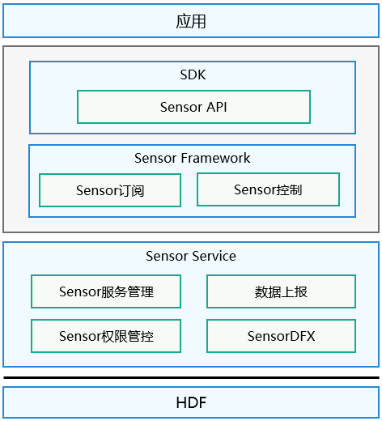

# Sensor服务子系概述

-   [简介](#section667413271505)
-   [接口说明](#section7255104114110)

## 简介

Sensor服务子系统提供了轻量级传感器服务基础框架，您可以使用该框架接口实现传感器列表查询、传感器控制、传感器订阅去订阅等功能。轻量级传感器服务框架如下图所示：

**图1**  Sensor服务框架图

-   Sensor API：提供传感器的基础API，主要包含查询传感器的列表、订阅/取消传感器数据、执行控制命令等，简化应用开发。
-   Sensor Framework：主要实现传感器的订阅管理、数据通道的创建、销毁等，实现与传感器服务层的通信。
-   Sensor Service：主要实现HDF层数据接收、解析、分发，对设备传感器的管理，数据上报管理以及传感器权限管控等。

## 接口说明

**表 1**  Sensor服务框架API接口功能介绍

<table><thead align="left"><tr id="row173964834716"><th class="cellrowborder" valign="top" width="33.33333333333333%" id="mcps1.2.4.1.1">
接口名

</th>
<th class="cellrowborder" valign="top" width="25.722572257225725%" id="mcps1.2.4.1.2">
接口说明

</th>
<th class="cellrowborder" valign="top" width="40.94409440944094%" id="mcps1.2.4.1.3">
参数要求

</th>
</tr>
</thead>
<tbody><tr id="row4397198154712"><td class="cellrowborder" valign="top" width="33.33333333333333%" headers="mcps1.2.4.1.1 ">
int32_t <strong id="b792815314396">GetAllSensors</strong>(SensorInfo **sensorInfo, int32_t *count)

</td>
<td class="cellrowborder" valign="top" width="25.722572257225725%" headers="mcps1.2.4.1.2 ">
<strong id="b59221831174918">作用</strong>：获取系统中所有传感器的信息。

<strong id="b2922183114917">返回值</strong>：0表示成功，其他返回值表示失败。

</td>
<td class="cellrowborder" valign="top" width="40.94409440944094%" headers="mcps1.2.4.1.3 ">
<strong id="b633817407478">sensorInfo</strong>(NOT NULL)：输出系统中所有传感器的信息；

<strong id="b8845650154711">count</strong>(NOT NULL)：输出系统中所有传感器的数量。

</td>
</tr>
<tr id="row1839716854716"><td class="cellrowborder" valign="top" width="33.33333333333333%" headers="mcps1.2.4.1.1 ">
int32_t <strong id="b17835184513919">SubscribeSensor</strong>(int32_t sensorTypeId, SensorUser *user)

</td>
<td class="cellrowborder" valign="top" width="25.722572257225725%" headers="mcps1.2.4.1.2 ">
<strong id="b2922133194911">作用</strong>：订阅传感器数据，系统会将获取到的传感器数据上报给订阅者。

<strong id="b49221631154911">返回值</strong>： 0为成功，其他返回值表示失败。

</td>
<td class="cellrowborder" valign="top" width="40.94409440944094%" headers="mcps1.2.4.1.3 ">
<strong id="b383183812561">sensorTypeId</strong>：唯一标识一个传感器类型;

<strong id="b15825101814564">user</strong>(NOT NULL)：传感器的用户，用于从传感器获取数据，一般一个用户只属于一个传感器。

</td>
</tr>
<tr id="row6397138134713"><td class="cellrowborder" valign="top" width="33.33333333333333%" headers="mcps1.2.4.1.1 ">
int32_t <strong id="b338673044313">UnsubscribeSensor</strong>(int32_t sensorTypeId, SensorUser *user)

</td>
<td class="cellrowborder" valign="top" width="25.722572257225725%" headers="mcps1.2.4.1.2 ">
<strong id="b592313144920">作用</strong>：去订阅传感器数据，系统将取消传感器数据上报给订阅者。

<strong id="b3923113134918">返回值</strong>：0为成功，其他返回值表示失败。

</td>
<td class="cellrowborder" valign="top" width="40.94409440944094%" headers="mcps1.2.4.1.3 ">
<strong id="b48981147570">sensorTypeId</strong>：唯一标识一个传感器类型;

<strong id="b5898194105710">user</strong>(NOT NULL)：传感器的用户，用于从传感器获取数据，一般一个用户只属于一个传感器。

</td>
</tr>
<tr id="row43981283476"><td class="cellrowborder" valign="top" width="33.33333333333333%" headers="mcps1.2.4.1.1 ">
int32_t <strong id="b16691194511438">SetBatch</strong>(int32_t sensorTypeId, SensorUser *user, int64_t samplingInterval, int64_t reportInterval)

</td>
<td class="cellrowborder" valign="top" width="25.722572257225725%" headers="mcps1.2.4.1.2 ">
<strong id="b1292416313494">作用</strong>：设置传感器的数据采样间隔和数据上报间隔

<strong id="b16924123134910">返回值</strong>：0为成功，其他返回值表示失败。

</td>
<td class="cellrowborder" valign="top" width="40.94409440944094%" headers="mcps1.2.4.1.3 ">
<strong id="b20906161712597">sensorTypeId</strong>：唯一标识一个传感器类型;

<strong id="b2736849195911">user</strong>(NOT NULL)：传感器的用户，用于从传感器获取数据，一般一个用户只属于一个传感器;

<strong id="b1866310191589">samplingInterval</strong>：传感器数据采样间隔，单位纳秒;

<strong id="b851892113817">reportInterval</strong>：传感器数据上报间隔，单位纳秒。

</td>
</tr>
<tr id="row439813812472"><td class="cellrowborder" valign="top" width="33.33333333333333%" headers="mcps1.2.4.1.1 ">
int32_t <strong id="b12311455154316">ActivateSensor</strong>(int32_t sensorTypeId, SensorUser *user)

</td>
<td class="cellrowborder" valign="top" width="25.722572257225725%" headers="mcps1.2.4.1.2 ">
<strong id="b129251231104917">作用</strong>：使能一个传感器订阅用户。

<strong id="b592515316496">返回值</strong>：0为成功，其他返回值表示失败。

</td>
<td class="cellrowborder" valign="top" width="40.94409440944094%" headers="mcps1.2.4.1.3 ">
<strong id="b556385111910">sensorTypeId</strong>：唯一标识一个传感器类型；

<strong id="b187561853496">user</strong>(NOT NULL)：传感器的用户，用于从传感器获取数据，一般一个用户只属于一个传感器。

</td>
</tr>
<tr id="row123998813470"><td class="cellrowborder" valign="top" width="33.33333333333333%" headers="mcps1.2.4.1.1 ">
int32_t <strong id="b1612146204413">DeactivateSensor</strong>(int32_t sensorTypeId, SensorUser *user)

</td>
<td class="cellrowborder" valign="top" width="25.722572257225725%" headers="mcps1.2.4.1.2 ">
<strong id="b10925163114496">作用</strong>：去使能一个传感器订阅用户

<strong id="b17926331124911">返回值</strong>：0为成功，其他返回值表示失败。

</td>
<td class="cellrowborder" valign="top" width="40.94409440944094%" headers="mcps1.2.4.1.3 ">
<strong id="b4896161619112">sensorTypeId</strong>：唯一标识一个传感器类型；

<strong id="b1629389111">user</strong>(NOT NULL)：传感器的用户，用于从传感器获取数据，一般一个用户只属于一个传感器。

</td>
</tr>
<tr id="row939914814478"><td class="cellrowborder" valign="top" width="33.33333333333333%" headers="mcps1.2.4.1.1 ">
int32_t <strong id="b1999420216444">SetMode</strong>(int32_t sensorTypeId, SensorUser *user, int32_t mode)

</td>
<td class="cellrowborder" valign="top" width="25.722572257225725%" headers="mcps1.2.4.1.2 ">
<strong id="b1926113164920">作用</strong>：设置传感器的工作模式

<strong id="b1492733110494">返回值</strong>：0为成功，其他返回值表示失败。

</td>
<td class="cellrowborder" valign="top" width="40.94409440944094%" headers="mcps1.2.4.1.3 ">
<strong id="b142625231515">sensorTypeId</strong>：唯一标识一个传感器类型；

<strong id="b05739545156">user</strong>(NOT NULL)：传感器的用户，用于从传感器获取数据，一般一个用户只属于一个传感器；

<strong id="b3914356101520">mode</strong>：传感器的数据上报模式。

</td>
</tr>
</tbody>
</table>

