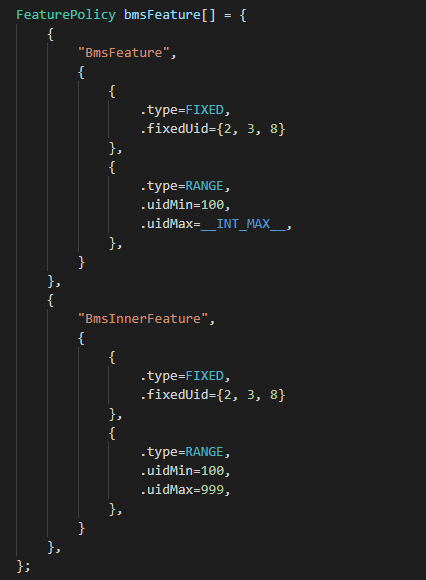
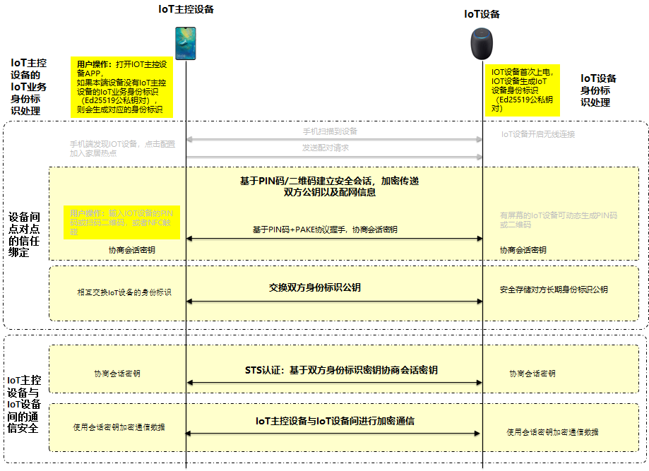

# 安全子系统<a name="ZH-CN_TOPIC_0000001051982984"></a>

-   [简介](#section6309125817418)
-   [目录](#section5614117756)
-   [约束](#section14134111467)
-   [安全启动](#section10750510104718)
-   [应用权限管理](#section20822104317111)
-   [IPC通信鉴权](#section156859591110)
-   [HUKS](#section9819115764715)
-   [HiChain](#section19390142934814)
-   [应用完整性校验](#section15468226154919)
-   [涉及仓](#section1665013282177)

## 简介<a name="section6309125817418"></a>

提供样例给开发者展示如何去使用已有的安全机制来提升系统的安全能力，包括安全启动、应用权限管理、IPC通信鉴权、HUKS、HiChain、应用签名验签。

## 目录<a name="section5614117756"></a>

```
base/security
├── appverify
│   └── interfaces
│       └── innerkits
│           └── appverify_lite  # 应用签名
├── deviceauth
│   ├── frameworks
│   │   └── deviceauth_lite  # 设备授权实现
│   └── interfaces
│       └── innerkits
│           └── deviceauth_lite # 设备授权接口
├── huks
│   ├── frameworks
│   │   ├── crypto_lite  # 加解密实现
│   │   └── huks_lite  # 秘钥管理实现
│   └── interfaces
│       └── innerkits
│           └── huks_lite  # 秘钥管理接口
└── permission
    ├── interfaces
    │   ├── innerkits
    │   │   └── permission_lite  # 权限管理对内接口
    │   └── kits
    │       └── permission_lite  # 权限管理对外接口
    └── services
        └── permission_lite  # 权限管理服务
```

## 约束<a name="section14134111467"></a>

开发语言是C语言，上述安全能力主要是在Cortex-A或同等处理能力设备上使用，在Cortex-M或同等处理能力设备上只有HUKS\(Huawei Universal KeyStore Service，华为通用密钥存储管理服务\)和hichain（身份认证平台技术）。

## 安全启动<a name="section10750510104718"></a>

x509镜像包生成：参考编译构建子系统编译方式，执行编译生成需要的二进制镜像，包括内核镜像kernel.bin\(liteos/OHOS\_Image\)、rootfs.img，以3516dv300为例，生成镜像位于out\\ipcamera\_hi3516dv300\_liteos\_a目录，将这些二进制和安全uboot相应私钥（位于vendor\\hisi\\hi35xx\\hi3516dv300\\uboot\\secureboot\_release）拷贝至secureboot\_ohos目录（位于vendor\\hisi\\hi35xx\\hi3516dv300\\uboot），进入该目录下的x509\_creater执行./creater.sh，根据提示生成x509证书，然后返回secureboot\_ohos目录执行./sec\_os.sh最终生成x509镜像包。

## 应用权限管理<a name="section20822104317111"></a>

应用权限是软件用来访问系统资源和使用系统能力的一种通行方式，存在涉及个人隐私相关功能和数据的场景，例如：访问个人设备的硬件特性，如摄像头、麦克风，以及读写媒体文件等。操作系统通过应用权限管理来保护这些数据以及能力。

权限定义字段说明：

**表 1**  权限定义字段

<a name="table1073153511418"></a>
<table><thead align="left"><tr id="row11107193541417"><th class="cellrowborder" valign="top" width="22.220000000000002%" id="mcps1.2.4.1.1"><p id="p6107535141420"><a name="p6107535141420"></a><a name="p6107535141420"></a>字段</p>
</th>
<th class="cellrowborder" valign="top" width="35.099999999999994%" id="mcps1.2.4.1.2"><p id="p111080352143"><a name="p111080352143"></a><a name="p111080352143"></a>取值</p>
</th>
<th class="cellrowborder" valign="top" width="42.68%" id="mcps1.2.4.1.3"><p id="p161080358141"><a name="p161080358141"></a><a name="p161080358141"></a>意义</p>
</th>
</tr>
</thead>
<tbody><tr id="row151081735111418"><td class="cellrowborder" valign="top" width="22.220000000000002%" headers="mcps1.2.4.1.1 "><p id="p1108193521417"><a name="p1108193521417"></a><a name="p1108193521417"></a>name</p>
</td>
<td class="cellrowborder" valign="top" width="35.099999999999994%" headers="mcps1.2.4.1.2 "><p id="p131081435151413"><a name="p131081435151413"></a><a name="p131081435151413"></a>字符串</p>
</td>
<td class="cellrowborder" valign="top" width="42.68%" headers="mcps1.2.4.1.3 "><p id="p0108235141411"><a name="p0108235141411"></a><a name="p0108235141411"></a>权限名。</p>
</td>
</tr>
<tr id="row19108143516148"><td class="cellrowborder" valign="top" width="22.220000000000002%" headers="mcps1.2.4.1.1 "><p id="p51081355145"><a name="p51081355145"></a><a name="p51081355145"></a>reason</p>
</td>
<td class="cellrowborder" valign="top" width="35.099999999999994%" headers="mcps1.2.4.1.2 "><p id="p01082358147"><a name="p01082358147"></a><a name="p01082358147"></a>多语言字符串id</p>
</td>
<td class="cellrowborder" valign="top" width="42.68%" headers="mcps1.2.4.1.3 "><p id="p191081235171414"><a name="p191081235171414"></a><a name="p191081235171414"></a>应用申请此权限的目的。</p>
</td>
</tr>
<tr id="row13108123516145"><td class="cellrowborder" valign="top" width="22.220000000000002%" headers="mcps1.2.4.1.1 "><p id="p18109835101415"><a name="p18109835101415"></a><a name="p18109835101415"></a>used-scene{</p>
<p id="p910913358146"><a name="p910913358146"></a><a name="p910913358146"></a>ability，</p>
<p id="p11109235181420"><a name="p11109235181420"></a><a name="p11109235181420"></a>when</p>
<p id="p16109193531417"><a name="p16109193531417"></a><a name="p16109193531417"></a>}</p>
</td>
<td class="cellrowborder" valign="top" width="35.099999999999994%" headers="mcps1.2.4.1.2 "><p id="p4109123511420"><a name="p4109123511420"></a><a name="p4109123511420"></a>ability:组件类名字符串</p>
<p id="p19109133531410"><a name="p19109133531410"></a><a name="p19109133531410"></a>when:inuse, always</p>
</td>
<td class="cellrowborder" valign="top" width="42.68%" headers="mcps1.2.4.1.3 "><p id="p31091835151413"><a name="p31091835151413"></a><a name="p31091835151413"></a>调用受此权限管控的接口的场景。</p>
<p id="p93361156407"><a name="p93361156407"></a><a name="p93361156407"></a>声明在哪些组件和场景（前台/后台）下调用受管控的接口。</p>
</td>
</tr>
</tbody>
</table>

## IPC通信鉴权<a name="section156859591110"></a>

-   在Samgr中注册的系统服务如果通过进程间通信的方式暴露接口给其他进程访问，需要配置相应的访问控制策略。若不进行相关配置，访问会被拒绝。
-   配置方式：在头文件base/security/services/iam\_lite/ipc\_auth/include/policy\_preset.h中配置访问策略。

    1. 定义各个Feature的策略

    2. 将Feature的策略加到全局策略中


Eg.  比如当前需要为BMS服务配置访问策略，BMS在Samgr中注册的service为bundlems，注册的Feature为BmsFeature。

一、首先定义Feature的策略，可配置多个Feature，每个Feature可以配置多个访问策略，策略的声明方式参考图1

**图 1**  Feature策略示例<a name="fig715515221920"></a>  




访问策略有三种类型：

**图 2**  访问策略结构体<a name="fig1848524515915"></a>  


1.   type为RANGE类型：允许某个特定范围UID的进程访问，需要指定uidMin和uidMax

2.   type为FIXED类型：允许指定的几个UID的进程访问，需要指定fixedUid，最多配置8个

3.   type为BUNDLENAME类型：只允许特定的应用访问，需要指定bundleName（包名）

二、将定义的Feature的策略加配到全局策略中，需要配置feature数量，注册参考图3

**图 3**  feature策略注册<a name="fig1181753551014"></a>  


UID分配规则

1. Init进程：0

2. appspawn进程：1

3. Shell进程：2

4. 其他内置系统服务UID <= 99

5. 系统应用（如设置、桌面、相机）：100 \~ 999

6. 预置厂商应用：1000 \~ 9999

7. 普通三方应用：10000 \~ INT\_MAX

## HUKS<a name="section9819115764715"></a>

在分布式场景下，不同终端设备的硬件能力和运行系统环境都不尽相同。这些设备在分布式场景下均需要建立信任关系，最典型的应用即是HiChain可信互联，那么就需要这样一个统一的密钥管理服务来做到接口一致，密钥数据格式一致，同时提供业界标准的加解密算法实现。HUKS基于此来提供统一的密钥管理、加解密等能力。

HUKS模块整体分为北向接口，南向适配层，以及核心的功能模块：

1.  HUKS 北向接口：提供统一的对外API，用C语言实现，保持所有设备一致，主要包括密钥生成API、加解密API等；
2.  HUKS Core Module：依赖HAL层，提供核心功能，如加解密、签名验签、密钥存储等；
3.  HUKS HAL层：屏蔽底层硬件和OS的差异，定义HUKS需要的统一底层API，主要包括平台算法库、IO和LOG等。

## HiChain<a name="section19390142934814"></a>

**设备互联安全**

为了实现用户数据在设备互联场景下在各个设备之间的安全流转，需要保证设备之间相互正确可信，即设备和设备之间建立信任关系，并能够在验证信任关系后，搭建安全的连接通道，实现用户数据的安全传输。设备之间的信任关系在本文档中涉及IoT主控设备和IoT设备之间建立的可信关系。



-   **IoT设备互联安全**


设备互联支持基于系统的IoT设备（如AI音箱、智能家居、智能穿戴等设备）与IoT主控设备（手机、平板等）间建立点对点的信任关系，并在具备信任关系的设备间，搭建安全的连接通道，实现用户数据端到端加密传输。

-   **IoT主控设备的IoT业务身份标识**


IoT主控设备为不同的IoT设备管理业务生成不同的身份标识，形成不同IoT管理业务间的隔离，该标识用于IoT主控设备与IoT设备之间的认证以及通信。IoT业务身份标识为椭圆曲线公私钥对（Ed25519公私钥对）；

-   **IoT设备身份标识**


IoT设备会生成各自的设备身份标识，用来与IoT主控设备通信。该身份标识同样为椭圆曲线公私钥对（Ed25519公私钥对）；IoT设备私钥不出IoT设备，设备每次恢复出厂设置，会重置这个公私钥对。

上述身份标识可用于IoT主控设备与IoT设备间的安全通信：当IoT主控设备与IoT设备通过信任绑定流程交换业务身份标识或设备标识后，可以进行密钥协商并建立安全通信通道。

-   **设备间点对点的信任绑定**


IoT主控设备和IoT设备建立点对点信任关系的过程，实际上是相互交换IoT设备的身份标识的过程。

在点对点建立信任关系的过程中，用户需要在IoT主控设备上，输入IoT设备上提供的PIN码：对于有屏幕的设备，该PIN码动态生成；对于没有屏幕的设备，该PIN码由设备生产厂家预置；PIN码的展示形式，可以是一个用户可读的数字，也可以是一个二维码。随后，IoT主控设备和IoT设备间使用PAKE协议完成认证和会话密钥协商过程，并在此基础上，通过协商出的会话密钥加密传输通道用于交换双方设备的身份标识公钥。

**IoT主控设备与IoT设备间的通信安全**

当建立过信任关系的IoT主控设备与IoT设备间进行通信时，双方在完成上述信任关系绑定后，基于本地存储的对端身份公钥相互进行认证；在每次通信时基于STS协议完成双向身份认证以及会话密钥协商，之后设备使用此会话密钥加密双方设备间的传输通道。

## 应用完整性校验<a name="section15468226154919"></a>

OpenHarmony允许应用安装。为了确保应用的完整性和来源可靠，需要对安装的应用进行签名和验签。

应用开发阶段：开发者完成开发并生成安装包后，需要开发者对安装包进行签名，以证明安装包发布到设备的过程中没有被篡改。OpenHarmony的应用完整性校验模块提供了签名工具、签名证书生成规范，以及签名所需的公钥证书等完整的机制，支撑开发者对应用安装包签名。为了方便开源社区开发者，版本中预置了公钥证书和对应的私钥，为开源社区提供离线签名和校验能力；在商用版本中应替换此公钥证书和对应的私钥。

应用安装阶段：OpenHarmony程序框架子系统负责应用的安装。在接收到应用安装包之后，应用程序框架子系统需要解析安装包的签名数据，然后使用应用完整性校验模块的API对签名进行验证，只有校验成功之后才允许安装此应用.  应用完整性校验模块在校验安装包签名数据时，会使用系统预置的公钥证书进行验签。

## 涉及仓<a name="section1665013282177"></a>

security\_permission

security\_appverify

security\_deviceauth

security\_huks

