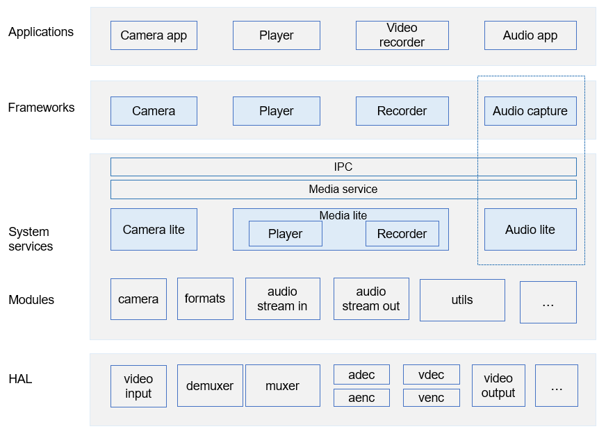

# AUDIO\_LITE<a name="EN-US_TOPIC_0000001080430608"></a>

- [AUDIO\_LITE<a name="EN-US_TOPIC_0000001080430608"></a>](#audio_lite)
  - [Introduction<a name="section11660541593"></a>](#introduction)
  - [Directory Structure<a name="section178251437756"></a>](#directory-structure)
  - [Usage<a name="section1648194512427"></a>](#usage)
  - [Constraints<a name="section722512541395"></a>](#constraints)
  - [Repositories Involved<a name="section1371113476307"></a>](#repositories-involved)

## Introduction<a name="section11660541593"></a>

This repository provides the audio capability.

**Figure  1**  Position of this repository \(in the dotted blue box\) in the multimedia subsystem<a name="fig584652218594"></a>  


## Directory Structure<a name="section178251437756"></a>

```
foundation/multimedia/audio_lite
├── frameworks         # Framework code
└── interfaces         # APIs
    └── kits           # External APIs
```

## Usage<a name="section1648194512427"></a>

Build a single repository in the root directory.

```
# Select the development board.
hb set  
# Build this repository.
hb build audio_manager_lite 
```

## Constraints<a name="section722512541395"></a>

-   C++ 11 or later

## Repositories Involved<a name="section1371113476307"></a>

/hmf/multimedia/camera\_lite

/hmf/multimedia/audio\_lite

/hmf/multimedia/media\_lite

/hmf/multimedia/utils\_lite

/hmf/multimedia/service\_lite

