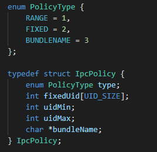

# permission\_lite

-   [Application Permission Management](#section20822104317111)
-   [IPC Authentication](#section156859591110)

## Application Permission Management

Application permissions are used to control access to system resources and features related to personal privacy, for example, accessing hardware features of personal devices such as cameras and microphones, and reading and writing media files. The OS protects such data and features through application permission management.

The following table describes fields in a permission.

<table><thead align="left"><tr id="row11107193541417"><th class="cellrowborder" valign="top" width="22.220000000000002%" id="mcps1.1.4.1.1">
Field

</th>
<th class="cellrowborder" valign="top" width="35.099999999999994%" id="mcps1.1.4.1.2">
Value

</th>
<th class="cellrowborder" valign="top" width="42.68%" id="mcps1.1.4.1.3">
Description

</th>
</tr>
</thead>
<tbody><tr id="row151081735111418"><td class="cellrowborder" valign="top" width="22.220000000000002%" headers="mcps1.1.4.1.1 ">
name

</td>
<td class="cellrowborder" valign="top" width="35.099999999999994%" headers="mcps1.1.4.1.2 ">
String

</td>
<td class="cellrowborder" valign="top" width="42.68%" headers="mcps1.1.4.1.3 ">
Permission name

</td>
</tr>
<tr id="row19108143516148"><td class="cellrowborder" valign="top" width="22.220000000000002%" headers="mcps1.1.4.1.1 ">
reason

</td>
<td class="cellrowborder" valign="top" width="35.099999999999994%" headers="mcps1.1.4.1.2 ">
Multi-language string ID

</td>
<td class="cellrowborder" valign="top" width="42.68%" headers="mcps1.1.4.1.3 ">
Purpose of requesting the permission

</td>
</tr>
<tr id="row13108123516145"><td class="cellrowborder" valign="top" width="22.220000000000002%" headers="mcps1.1.4.1.1 ">
used-scene{

ability,

when

}

</td>
<td class="cellrowborder" valign="top" width="35.099999999999994%" headers="mcps1.1.4.1.2 ">
<strong id="b2227185715217">ability</strong>: string of the component class name

when:inuse, always

</td>
<td class="cellrowborder" valign="top" width="42.68%" headers="mcps1.1.4.1.3 ">
Scene where the APIs controlled by this permission are called.

This field declares what components can call the APIs controlled by this permission in the specified scene (foreground/background).

</td>
</tr>
</tbody>
</table>

## IPC Authentication

-   If system services registered with Samgr provide APIs for other processes to access the services through IPC, access control policies must be configured; otherwise, access to the system services will be denied.
-   You can configure access control policies in  **base/security/permission/services/permission\_lite/ipc\_auth/include/policy\_preset.h**.

    1. Define the policies for each feature.

    2. Add the feature policies to the global policy.

Eg.  For example, to configure an access policy for the BMS service, whose service registered with Samgr is  **bundlems**  and whose registered feature is  **BmsFeature**, perform the following operations:

1. Define feature policies. You can configure multiple features and configure multiple access policies for each feature.

**Figure  1**  Example feature policy  

There are three types of access policies:

**Figure  2**  Access policy structure  

1.    **RANGE**: Processes with UIDs in a specified range can access the BMS service.  **uidMin**  and  **uidMax**  must be specified.

2.    **FIXED**: Processes with specified UIDs can access the BMS service.  **fixedUid**  must be specified, and a maximum of eight UIDs are allowed.

3.    **BUNDLENAME**: A specified application can access the BMS service.  **bundleName**  must be specified.

2. Add the defined feature policies to the global policy. You need to configure the number of features.

**Figure  3**  Registering a feature policy  

UID allocation rules:

1. Init process: 0

2. appspawn process: 1

3. Shell process: 2

4. Other built-in system services: less than or equal to 99

5. System applications \(such as settings, home screen, and camera\): 100–999

6. Preset applications: 1000–9999

7. Common third-party applications: 10000 to  **INT\_MAX**

