# 基于Neptune开发板的键盘蓝牙模块DIY指南

## **项目简介**

这个项目适合：

- 有线usb键盘升级蓝牙键盘，改造后键盘有线/蓝牙模式只能二选一。

- 支持BLE 4.2协议，可向下兼容旧BLE版本，如: BLE 4.0。

- 支持HID协议（Human Interface Device），理论上支持键盘、鼠标、控制杆、游戏手柄等USB设备。

  

V0.3版本特性：

- 支持HarmonyOS一碰连
- 实现5台设备之间自由切换
- 支持5种OS（HarmonyOS、Windows、Linux、Android、初步支持IOS）
- 增加低功耗特性
- 支持HUAWEI DevEco Device Tool一站式编译、烧录
- 修复键盘连击BUG（[I3R87V](https://gitee.com/openharmony-sig/vendor_oh_fun/issues/I3R87V)、[I3R8VX](https://gitee.com/openharmony-sig/vendor_oh_fun/issues/I3R8VX)、[I3VG44](https://gitee.com/openharmony-sig/vendor_oh_fun/issues/I3VG44)、[I3Y38B](https://gitee.com/openharmony-sig/vendor_oh_fun/issues/I3Y38B)）

 **注：由于Windows设备和Mac设备的键盘结构不同的缘故，需要注意如下：**
**1)	IOS和Mac设备的中英文请使用CapsLock切换。**
**2)	NumLock按键关闭不了IOS和Mac的数字键盘。**

历史版本：

V0.1版本特性：

- 基于OpenHarmony V1.0版本
- USB键盘升级蓝牙键盘
- 支持一个设备、4种OS（HarmonyOS、Windows、 Linux、 安卓）

V0.2版本特性：

- 新增设备切换功能，实现2台设备之间自由切换

- 加入锂电池方案，实现真无线键盘

- OpenHarmony升级至V1.1.0 LTS版本

- 代码开源

- 新增Tera Term开源烧录工具

  

软件准备：

- [串口驱动官网链接](http://www.wch.cn/downloads/CH341SER_EXE.html)

-  [Visual Studio Code下载地址](https://code.visualstudio.com/docs/?dv=linux64_deb)

- [HUAWEI DevEco Device Tool下载地址](https://device.harmonyos.com/cn/ide#download)

  

硬件准备([购买链接](https://item.taobao.com/item.htm?spm=a2oq0.12575281.0.0.50111debJVmGMn&ft=t&id=643138793871))：

- 润和Neptune开发板
- CH9350 HID转UART板（以下简称CH9350板）
- 杜邦线4根
- 支持写数据的NFC标签一个
- Type-C数据线一根（需自备，注意需要有数据线功能，而不能仅仅有充电功能，否则会造成无法正常安装驱动及正常通讯，推荐使用手机自备充电线而非专门的三合一充电线）

 

## **一、** 快速上手

拿到开发板后，简单连接，上手即玩。

### 1、注册

打开网址：https://gitee.com/ ，点击注册，如图：

发送验证码：

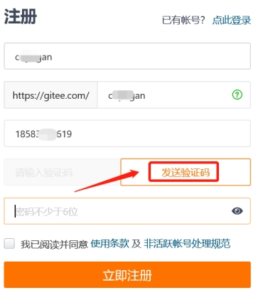

 

填写验证码和密码后，点击“立即注册”，如图：

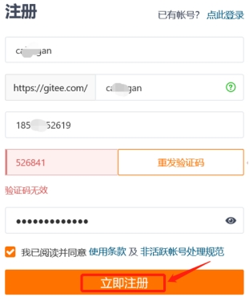

 

注册成功，如图：

 

### 2、点赞

打开该链接：

https://gitee.com/openharmony-sig/vendor_oh_fun/tree/master/hihope_neptune-oh_hid

给码云上的代码点赞，如图：

 

### 3、安装硬件

如下图所示，连接以下硬件：

- 润和Neptune开发板（单板）
- CH9350 板（单板）
- USB有线键盘
- 5v的USB电源(建议电脑USB口，以便执行后续烧写动作)

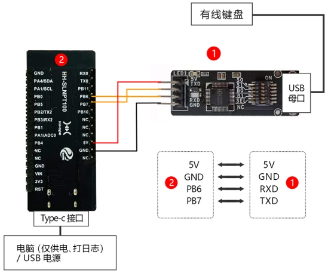

另外，上图开发板①的S0拨码开关往右拨码到L0处，如图：

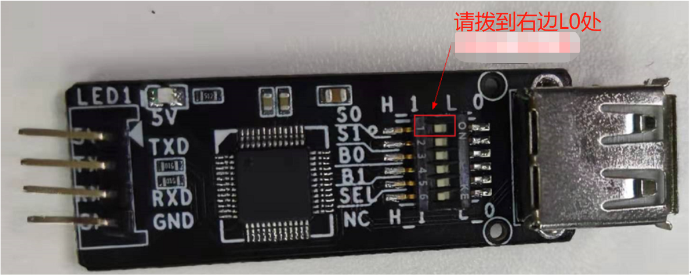

正确连接，上电后，如下两个灯常亮，按键盘任意键，号灯闪烁，如图所示：

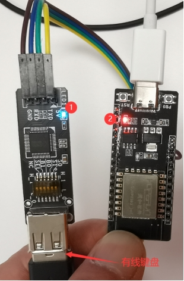

### 4、连接/切换蓝牙设备

#### 4.1、添加蓝牙设备

##### 4.1.1 碰一碰连接蓝牙设备

碰一碰连接蓝牙设备是针对安装了HarmonyOS 2.0.0 Release及以上版本的手机而提供的一项功能。该操作与4.1.2 手动添加蓝牙设备二选一，推荐使用碰一碰方式。另外，需事先准备支持写数据的NFC标签一个。

其操作详细步骤如下：

###### 4.1.1.1 写入NFC数据

- 写入到NFC的数据样例结构，如下:

  D20C1A6170702F68776F6E65686F702001004800**39393533**0081060005200685919106**286DCD824FEF**

  其中：

  a)   39393533表示9953的ascill码，9953是该应用的productid；

  b)   286DCD824FEF表示neptune硬件编码（mac地址）；

- 获取mac地址:

  a)   安装“BLE调试助手”（ 该工具用来获取目标ble设备的mac地址）

  打开华为“应用市场”,如图：
  
  
  
  

搜索、下载：”BLE调试助手”，如图：

安装完毕后，如图：

​                                                        

b)   打开该工具，找到蓝牙键盘，获取蓝牙键盘的mac地址，如图：

​                                                      

将上图BLE调试助手获取的mac地址：**286DCD7C0E67**替换样例的mac地址：286DCD824FEF，组装后的字符串为：

D20C1A6170702F68776F6E65686F702001004800393935330081060005200685919106**286DCD7C0E67**

c)   使用Airlink 工具写入NFC

1)   下载NFC写入工具airlink-tool，[下载链接](https://developer.huawei.com/consumer/cn/doc/development/smarthome-Library/download-0000001050287714)，下载、解压后，如图：

​                                       

2)   安装airlink-tool，打开windows设备的cmd命令行工具（请保证windows设备安装了adb工具），执行如下命令，即可完成安装：

**adb –r –d hilinkcert-tool-1.0.0.3.apk**

如图：

​                                                       

安装完毕后，如图：

​                                                 

3)   打开该工具后，点击add, 如图：

​                                                    

4)   输入邀请码：“b4zd8bz3”，然后，点击ok, 如图：

​                                                         

5)   点击NFC，如图：

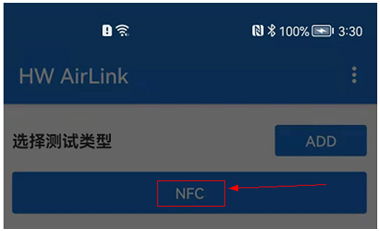

​                                                     

6)   选择NFC WRITE，如图：

​                                                         

7)   置入缓存区

- 输入要写的字符串（4.1.1.1步骤b所获取的字符串），

- 选择: ”byte code”，

- 点击：“置入缓存区”，如图：

  

​                                                           

8)   写入NFC贴纸

将运行该FA应用的手机NFC传感器（一般在手机背部）靠近指定的NFC卡片（**注意：请尽量关闭网络，然后选用空白NFC卡片写入**），如图：

​                                                                 

写入成功，如图：

​                                                                

###### 4.1.1.2 碰一碰连蓝牙

a)   打开手机的WIFI/无线、蓝牙和NFC功能，如图：

​                                                      

b)   碰一碰配蓝牙

- 蓝牙键盘长按alt + 1 (第二个设备长按alt + 2, 依次类推)大于三秒

- 将手机NFC传感器贴向NFC卡片

   如图：
   
   

​                                                          

此时，就可以出现碰一碰加载应用界面（确保网络打开、信号良好），如图：

​                                                          

随后，会出现”蓝牙键盘助手“服务页面，点击”连接“，如图：

**注：“蓝牙键盘助手”已作为服务上架，不用安装，HarmonyOS手机碰一碰NFC标签就会出现。**

c)   弹出的如下对话框时，选择：配对，如图：

​                                                         

配对，链接成功后，如图：

​                                                         

打开“已配对设备”，可显示”已连接“，表明该设备配对、连接成功，如图：

​                                                         

d)   打开HarmonyOS手机文本编辑器，键盘输入测试通过，按键盘Num Lock、 Caps Lock和Scroll Lock指示灯正确，如图：

​                                                  

##### 4.1.2 手动添加蓝牙设备

以Android手机添加第一个设备为例：

添加快捷键：" Alt + 数字键"

**注意：**

- **先按Alt，后按数字键（非小键盘数字键）。**
- **假如添加设备失败，请执行章节："4.3、删除蓝牙设备"，以清除蓝牙键盘的配对信息，然后重新执行添加蓝牙设备步骤。**

1) 长按键盘按键"Alt + 1"（大于三秒）（注：添加第二设备时按"Alt + 2"，依此类推）

2) 从屏幕顶部下拉出配置快捷菜单。

3) 长按蓝牙图标，打开蓝牙搜索。

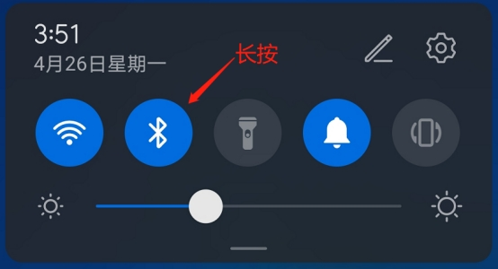

 

4) 查找设备“OpenHarmony_HID-***”并单击，如图：

已配对、连接后，如图：

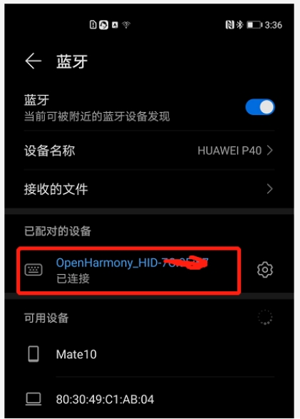

 

5) 打开安卓手机文本编辑器，键盘输入测试通过，按键盘Num Lock、 Caps Lock和Scroll Lock指示灯正确，如图：

 

#### 4.2、切换蓝牙设备

切换快捷键："Alt + 数字键"

**注意：**

- **先按Alt，后按数字键（非小键盘数字键）**。
- **切换设备后，用鼠标获取输入框焦点后，才能输入**。
- **若无法输入，请按一下"Alt"后再输入。**

1）短按蓝牙键盘上的"Alt + 1"（小于1秒），切换到第1个设备。

2）同样短按蓝牙键盘上的"Alt + 2"（小于1秒），切换到第2个设备，依次类推。

#### 4.3、删除已配对的蓝牙设备

a)   删除快捷键："Alt + 0"（短按小于1秒）（注：每按一次，删除一个设备，建议多按几次（不超过5次））

b)   按一下开发板的RST键（复位键），使设置生效。

## **二、** 固件更新升级

快速上手之后，如果需要升级固件，请按照本章流程操作。

### **1、** 下载

1) 下载最新固件

打开该链接:

https://gitee.com/openharmony-sig/vendor_oh_fun/tree/master/hihope_neptune-oh_hid

点击下载ZIP，如图：

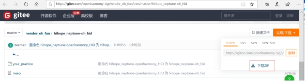

2) 解压

请解压“openharmony-sig-vendor_oh_fun-master.zip”，完成解压后如图：

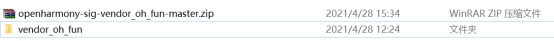

### **2、** 安装USB串口(CH340)驱动

1) 将Neptune开发板通过Type_C 电源线连接到电脑的usb接口，如图：

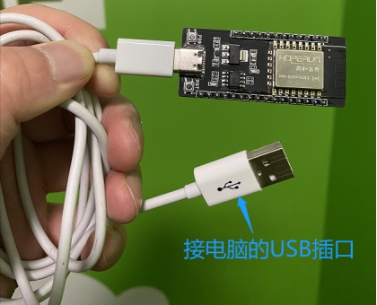

 

2) 在网上下载串口驱动

串口驱动路径：http://www.wch.cn/downloads/CH341SER_EXE.html

3) 进入浏览器的下载目录，双击：CH341SER.EXE，如图：

 

4) 出现驱动安装(X64)界面后，点“安装”，如图下图所示。

**注：若提示“安装失败”，请点击“卸载“，再点击“安装”。**

5) 若驱动安装成功,则如下图所示：

 

6) 搜索“设备管理器 -> 端口 -> USB-SERIAL CH340(COM*)"，需要记住COM*，每台设备的不一样，如图：

**注：注意：假如端口没显示，请拔掉usb口再插上或更换usb线。**

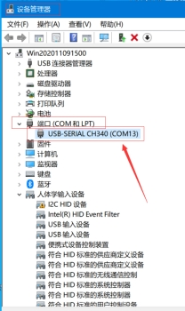

### **3、** 固件烧录

目前固件烧录可以使用基于Windows或Linux环境运行的IDE烧录。下面以基于VMware虚拟机运行的Linux（Ubuntu）环境下使用IDE方式烧录（DevEco Device Tool烧录工具）为例说明，具体烧录流程如下。

1)   确定Neptune开发板是否通过串口连接到虚拟机

- 将Neptune开发板通过串口连接到电脑的USB口。如图：

  

​                                                                            

- 打开VMware,依次选择：

①  连接到虚拟机、

② Ubuntu64位、

③ 确定

如图：

- 打开VMware，依次点开：

①  虚拟机

②  可移动设备

③  QinHeng USB Serial

查看是否显示“④在状态栏中显示”，如图：

上图表明：Neptune开发板通过串口成功连接虚拟机。

2)   打开基于虚拟机运行的Ubuntu，点击左下角，显示所有应用程序，如图：

 

3)   搜索框输入：Visual Studio Code，找到后，打开Visual Studio Code，如图：

**（注意：请确保您已经在Ubuntu安装最新版本的Visual Studio Code 和DevEco Device Tool，对应下载链接和安装方法如下：**

[Visual Studio Code下载地址](https://code.visualstudio.com/docs/?dv=linux64_deb)

[DevEco Device Tool下载地址](https://device.harmonyos.com/cn/ide#download)

[Visual Studio Code和DevEco Device Tool的安装方法](https://device.harmonyos.com/cn/docs/ide/user-guides/install_ubuntu-0000001072959308)**）**

​                       

4)   打开Extentions，如图：

​                                                   

5)   打开DevEco Device Tool（步骤②），如图：

​                                                  

6)   打开DevEco，如图：

​                                               

7)   打开Home，如图：

​                                                

8)   新建工程，New DevEco Project, 如图：

​                  

9)   输入新建工程信息：

- 工程名称：Name（自定义）

- 开发板型号：Board（选w800）

- Bundle(选@hihope/neptune_iot)，如图：

  

​                         

10) 设置被烧录固件位置

- 点击Partiton Configuration(步骤①） 

- 点击文件夹图标(步骤②）

  如图：
  
  

- 找到固件所在文件夹位置（可以自定义路径，请提前把目标固件拷贝到该位置），如图：

  

​                         

- 选择目标固件“OpenHarmony_HID_V0.3.img”（步骤①）

- 点击按钮：“Open “OpenHarmony_HID_V0.3.img””（步骤②）

  如图：
  
  

​                                     

- 点击Save保存，如图：

  

​                    

11) 设置烧录端口

- 点击w800, 如图：

  

​                  

- upload_port：烧录端口，选择默认值“/dev/ttyUSB0”（没有的话，可以输入“/dev/ttyUSB0”），如图：

  

​                      

12) 填写烧录协议

- upload_protocol，选择：“xmodem”，如图：

  

​                        

13) 设置upload_partitions

- upload_partitions: 选择”partition:w800_app“, 如图：

  

​                

14) 保存配置

点击：Save，如图：

​              

15) 打开工程，

点击Open，如图：

​         

16) 查看已经打开的工程

点击左上角的图标：Explorer，如图：

​                                                

17) 移除不相干的项目，防止编译异常，如图：

​                                               

18) 烧录固件

- 点击DevEco，如图：

  

​                                   

点击Upload，如图：

​                                    

- 根据提示“Please reset the board”，单击开发板的RST按键，如图：

  

正在烧录，如图：

- 烧录成功，如图：

  

## **三、** 添加锂电

本节将介绍如何为蓝牙键盘添加电池

- 增加锂电池可以省去杂乱的线，做到真无线键盘，相信玩过该项目的小伙伴都有此DIY的想法。
- 这需要用到电烙铁等焊接工具，整个操作过程大约需要十分钟。
- 市面上单个锂电池的输出电压都是3.7V，而我们的Neptune(w800)开发板需要5V的电压输入才能正常工作，另外考虑到锂电池需要充电，所以我们需要升压电路和充电电路一体的模块，这样可以减少一块板，也减少成本。

### **1、** 准备材料

- 充放电板				x1		（某宝搜索：锂电池充放电一体模块）
- 电池						x1		（某宝搜索：3.7V锂电池）
- 杜邦线					x2
- Neptune开发板	x1

电烙铁，锡线，松香等焊接工具自行准备

**注意：锂电池安全性较差，强烈推荐选择带保护板的优质锂电池，同时操作过程中注意防短路及高温。**

### **2、** 焊接步骤

事物连接图，如下所示（**注意：电源正负极不要接错**）

1) 电烙铁加热到(300~350)度，在电池输入口和输出口的位置先上少量的锡（烙铁静置时，在烙铁头处上少量的锡，防止干烧氧化后不好上锡）。

2) 电池两根电源线去掉(2~3)mm，红色为正极，黑色为负极，分别焊在充放电板的电池输入口的正负极上。

3) 用两根杜邦线，去掉两头的连接口，再去掉(2~3)mm的绝缘皮，两根线的一端焊接在充放电板的输出口位置，另一边焊接在开发板的5V和GND的两根pin上。

当然，有**type-c**数据线的伙伴们可以简单粗暴，将type-c口的一端焊接在充放板输出口位置（剪开的type-c线红色为正极，黑色为负极），焊好后可以直接插到开发板上，如图。

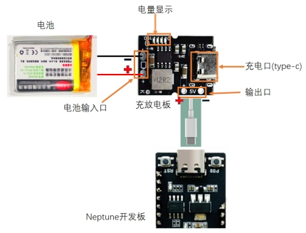

​      

 