# 基于润和Neptune开发板的键盘蓝牙模块DIY指南

## **项目简介**

这个项目适合：

-  有线usb键盘升级蓝牙键盘，改造后键盘有线/蓝牙模式只能二选一。
- 支持BLE 4.2协议，可向下兼容旧BLE版本，如: BLE 4.0。
- 支持HID协议（Human Interface Device），理论上支持键盘、鼠标、控制杆、游戏手柄等USB设备。

V0.1版本特性：

- 基于OpenHarmony V1.0版本
- USB键盘升级蓝牙键盘
- 支持一个设备、4种OS（鸿蒙、Windows、 Linux、 安卓）

 

ToDo List:

- V0.2版本

1. 支持锂电
2. 支持2个设备自由切换，4种OS（鸿蒙、Windows、Linux、安卓）
3. OpenHarmony升级至V1.1.0 LTS版本

- V0.3版本

1. 支持5个设备自由切换
2. 支持5种OS（鸿蒙、Windows、Linux、安卓、IOS）

- V0.5版本

1. 支持鸿蒙OS一碰连

软件准备(官网下载链接)：

- 串口驱动：http://www.wch.cn/downloads/CH341SER_EXE.html

硬件准备([购买链接](https://item.taobao.com/item.htm?spm=a2oq0.12575281.0.0.50111debJVmGMn&ft=t&id=643138793871))：

-  润和Neptune开发板
-  CH9350 HID转UART板（以下简称CH9350板）
-  杜邦线4根
-  Type-C数据线一根（需自备，注意需要有数据线功能，而不能仅仅有充电功能，否则会造成无法正常安装驱动及正常通讯，推荐使用手机自备充电线而非专门的三合一充电线）

 

## 一、 快速上手

拿到开发板后，简单连接，上手即玩。

### 1、   注册

1. 打开网址：https://gitee.com/ ，点击注册，如图：

​                               

发送验证码：

​										 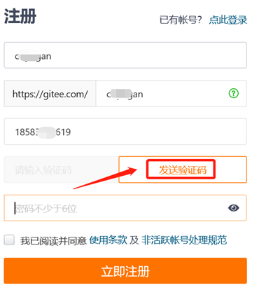

 

填写验证码和密码后，点击“立即注册”，如图：

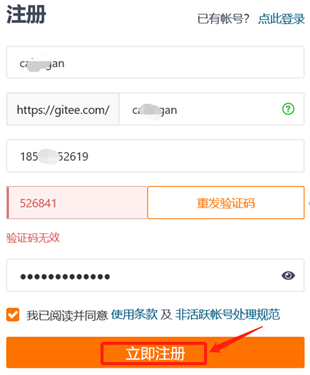

注册成功，如图：

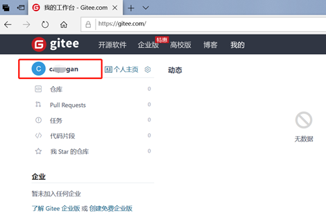													

2. 点赞

打开该链接：

https://gitee.com/openharmony-sig/vendor_oh_fun/tree/master/hihope_neptune-oh_hid

给码云上代码点赞，如图：

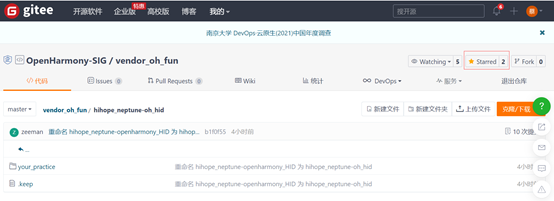

### 2、    安装硬件

如下图所示，连接以下硬件：

- 润和Neptune开发板（单板**②**）
- CH9350 板（单板**①**）
- USB有线键盘
- 5v的USB电源(建议电脑USB口，以便执行后续烧写动作)

​				 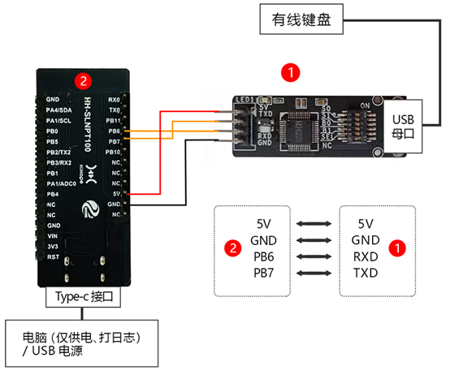

正确连接，上电后，如下两个灯常亮，按键盘任意键，**①**号灯闪烁，如图所示：

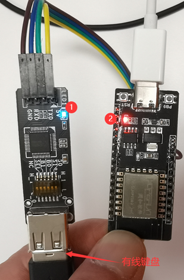

## 3、    连接蓝牙键盘

以Android手机为例：

1. 从屏幕顶部下拉出配置快捷菜单。

2. 长按蓝牙图标，打开蓝牙搜索。  										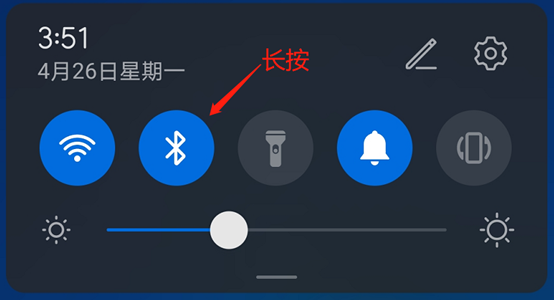

3. 查找设备“OpenHarmony_HID-***”并单击，如图：

   ​                    			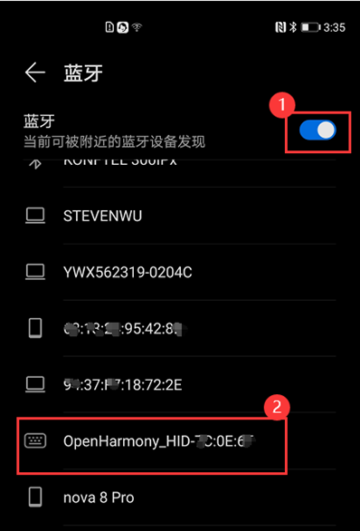

已配对、连接后，如图：

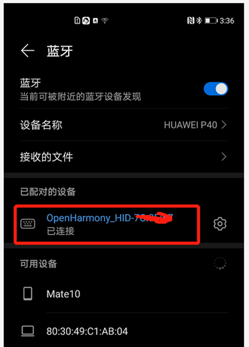

4. 打开安卓手机文本编辑器，键盘输入测试通过，按键盘Num Lock、 Caps Lock和Scroll Lock指示灯正确，如图：

    			 ​									    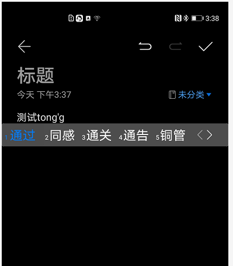

## 二、       固件更新升级

快速上手之后，如果需要升级固件，请按照本章流程操作。

 

### 1.2 下载

1. 下载

打开该链接:

https://gitee.com/openharmony-sig/vendor_oh_fun/tree/master/hihope_neptune-oh_hid

点击下载ZIP，如图：

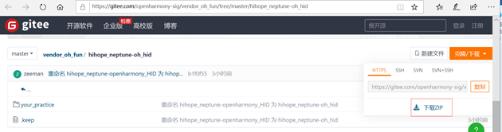

2. 解压

请解压“openharmony-sig-vendor_oh_fun-master.zip”，完成解压后如图：

​	                					  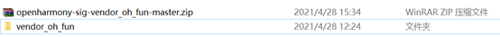

### 1.3 安装USB串口(CH340)驱动

1、  将Neptune开发板通过Type_C 电源线连接到电脑的usb接口，如图：

​											 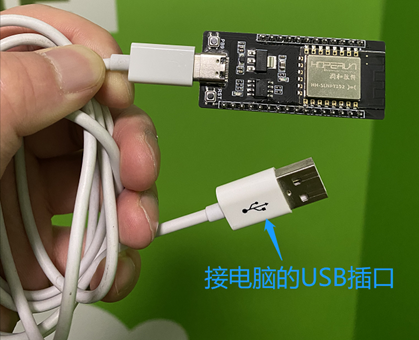

 

2、 在网上下载串口驱动

串口驱动路径：http://www.wch.cn/downloads/CH341SER_EXE.html

3、 进入浏览器的下载目录，双击：CH341SER.EXE，如图：

​						 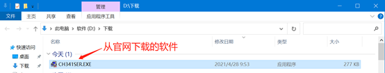

4、 出现驱动安装(X64)界面后，点“安装”，如图下图所示。

**注意，若提示“安装失败”，请点击“卸载”，再点击“安装”。**

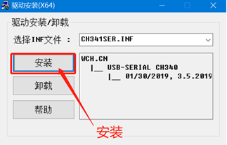

5、 若驱动安装成功,则如下图所示：

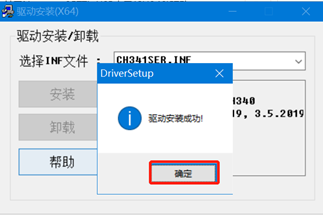

6、  搜索“设备管理器 -> 端口 -> USB-SERIAL CH340(COM*)”，需要记住COM*，每台设备的不一样，如图：

**注意：假如端口没显示，请拔掉usb口再插上或更换usb线。**

​																	   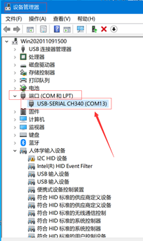

### 1.4 烧写OpenHarmony固件

1. 使用“**SecureCRT**”工具烧写固件**，**双击：“**SecureCRTPortable.exe**”，如下图所示： 

   ​													 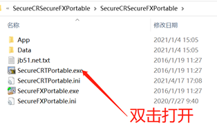

2. 第一次打开，可能会弹出如下窗口，请选择“使用兼容性设置安装”，如图：

   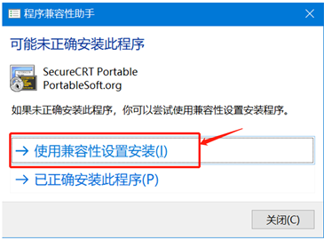

3. 根据提示，安装完毕后，打开SecreCRT，如图：

     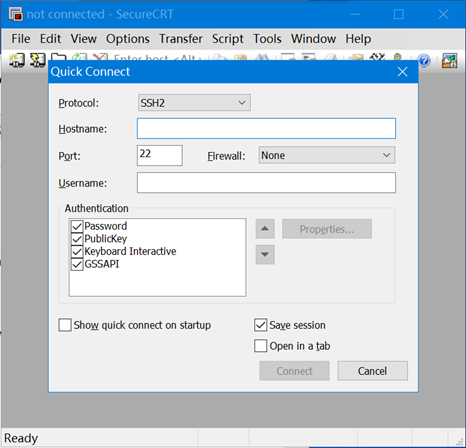

4. Protocal选择Serial，Flow Control**不要勾选**， 确保左侧设备管理器的USB-SERIAL和右侧SecureCRT的Port保持一致。另外，Baud rate选115200，配置好了，点击Connect，如图：

      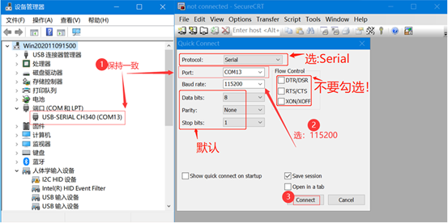

若连接成功，如下图所示：

​                    									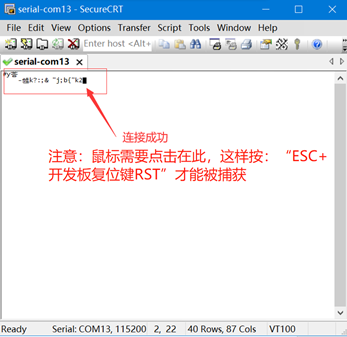

5. 鼠标点击SecureCRT窗口，后续“ESC + 开发板复位键RST”才能被捕获。

6. 先按住PC的“ESC”键不放。

7. 单击Neptune开发板的复位(RST)键。

   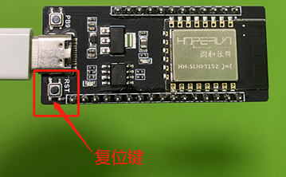

8. 当如下图所示 “cccccccccc”时,表示进入烧录状态，可松开PC键盘的“ESC”键。

     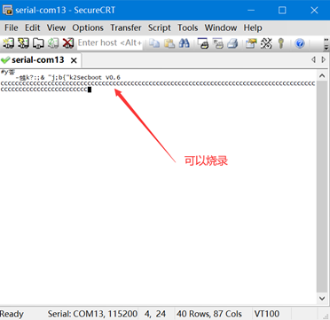

9. 选择 “**Transfer** -> **Send Xmoderm”**，进入烧录界面，如图：

     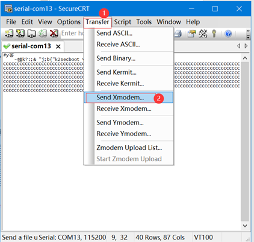

10. 选择“\04_固件\OpenHarmony_HID_V0.1.img**”**，点击“Send”，如图：

     							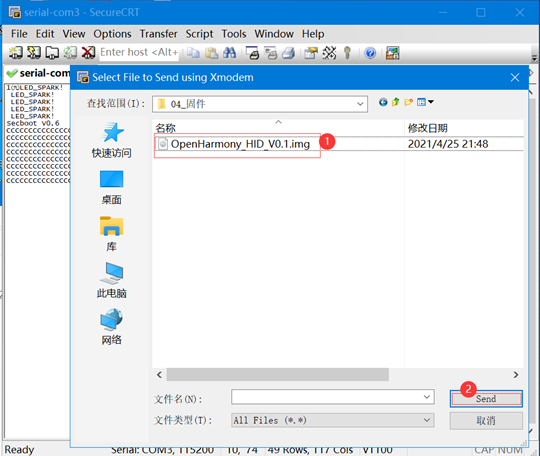

烧录过程中，如下图所示，会显示烧录进度。

**注意：过程中不要随便点击该该页面以免过程中断。**

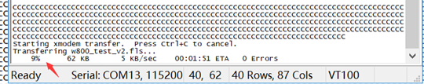

烧录完成后，如图所示，表示烧录成功：

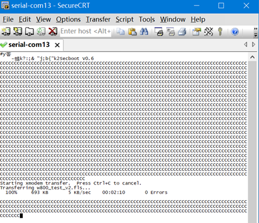

11. 单击Neptune开发板的复位（RST）键，退出烧录模式：

    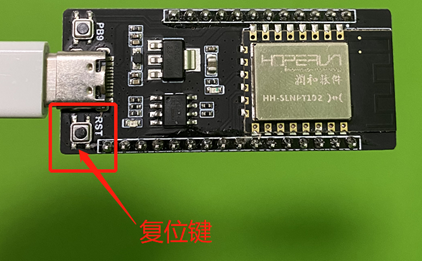