# 基于Neptune开发板的键盘蓝牙模块DIY指南

## **项目简介**

这个项目适合：

- 有线usb键盘升级蓝牙键盘，改造后键盘有线/蓝牙模式只能二选一。
- 支持BLE 4.2协议，可向下兼容旧BLE版本，如: BLE 4.0。
- 支持HID协议（Human Interface Device），理论上支持键盘、鼠标、控制杆、游戏手柄等USB设备。

 

V0.2版本特性：

- 新增设备切换功能，实现2台设备之间自由切换
- 加入锂电池方案，实现真无线键盘
- OpenHarmony升级至V1.1.0 LTS版本
- 代码开源
- 新增Tera Term开源烧录工具

 

历史版本：

V0.1版本特性：

- 基于OpenHarmony V1.0版本
- USB键盘升级蓝牙键盘
- 支持一个设备、4种OS（HarmonyOS、Windows、 Linux、 安卓）

 

ToDo List:

- V0.3版本

1. 支持5个设备自由切换
2. 支持5种OS（HarmonyOS、Windows、Linux、安卓、IOS）

- V0.5版本

1.  支持HarmonyOS一碰连

软件准备：

- [串口驱动官网链接](http://www.wch.cn/downloads/CH341SER_EXE.html)
- Tera Term烧录工具路径：”vendor_oh_fun\hihope_neptune-oh_hid\05_烧录工具\teraterm-4.104.exe“

硬件准备([购买链接](https://item.taobao.com/item.htm?spm=a2oq0.12575281.0.0.50111debJVmGMn&ft=t&id=643138793871))：

- 润和Neptune开发板
- CH9350 HID转UART板（以下简称CH9350板）
- 杜邦线4根
- Type-C数据线一根（需自备，注意需要有数据线功能，而不能仅仅有充电功能，否则会造成无法正常安装驱动及正常通讯，推荐使用手机自备充电线而非专门的三合一充电线）

 

## **一、** 快速上手

拿到开发板后，简单连接，上手即玩。

### 1、注册

打开网址：https://gitee.com/ ，点击注册，如图：

发送验证码：

 

填写验证码和密码后，点击“立即注册”，如图：

 

注册成功，如图：

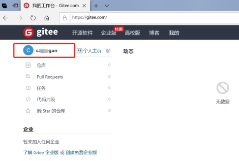

 

### 2、点赞

打开该链接：

https://gitee.com/openharmony-sig/vendor_oh_fun/tree/master/hihope_neptune-oh_hid

给码云上的代码点赞，如图：

 

### 3、安装硬件

如下图所示，连接以下硬件：

- 润和Neptune开发板（单板）
- CH9350 板（单板）
- USB有线键盘
- 5v的USB电源(建议电脑USB口，以便执行后续烧写动作)

正确连接，上电后，如下两个灯常亮，按键盘任意键，号灯闪烁，如图所示：

### 4、连接/切换蓝牙设备

#### 4.1、添加蓝牙设备

以Android手机添加第一个设备为例：

添加快捷键：" Alt + 数字键"

**注意：**

- **先按Alt，后按数字键（非小键盘数字键）。**
- **假如添加设备失败，请执行章节："4.3、删除蓝牙设备"，以清除蓝牙键盘的配对信息，然后重新执行添加蓝牙设备步骤。**

1) 长按键盘按键"Alt + 1"（大于三秒）（注：添加第二设备时按"Alt + 2"，依此类推）

2) 从屏幕顶部下拉出配置快捷菜单。

3) 长按蓝牙图标，打开蓝牙搜索。

 

4) 查找设备“OpenHarmony_HID-***”并单击，如图：

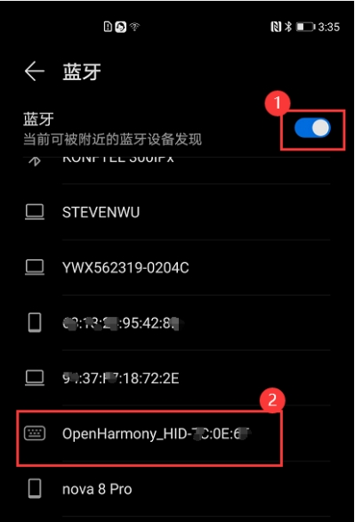

已配对、连接后，如图：

 

5) 打开安卓手机文本编辑器，键盘输入测试通过，按键盘Num Lock、 Caps Lock和Scroll Lock指示灯正确，如图：

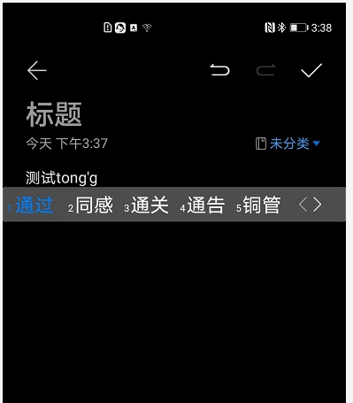

 

#### 4.2、切换蓝牙设备

切换快捷键："Alt + 数字键"

**注意：**

- **先按Alt，后按数字键（非小键盘数字键）**。
- **切换设备后，用鼠标获取输入框焦点后，才能输入**。
- **若无法输入，请按一下"Alt"后再输入。**

1）短按蓝牙键盘上的"Alt + 1"（小于1秒），切换到第1个设备。

2）同样短按蓝牙键盘上的"Alt + 2"（小于1秒），切换到第2个设备，依次类推。

#### 4.3、删除蓝牙设备

删除快捷键："Alt + 0"（短按小于1秒）（注：每按一次，删除一个设备，建议多按几次（不超过5次），然后，按一下复位键才能生效；此操作将删除已配对的蓝牙设备）。

## **二、** 固件更新升级

快速上手之后，如果需要升级固件，请按照本章流程操作。

### **1、** 下载

1) 下载最新固件

打开该链接:

https://gitee.com/openharmony-sig/vendor_oh_fun/tree/master/hihope_neptune-oh_hid

点击下载ZIP，如图：

2) 解压

请解压“openharmony-sig-vendor_oh_fun-master.zip”，完成解压后如图：

### **2、** 安装USB串口(CH340)驱动

1) 将Neptune开发板通过Type_C 电源线连接到电脑的usb接口，如图：

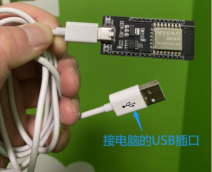

 

2) 在网上下载串口驱动

串口驱动路径：http://www.wch.cn/downloads/CH341SER_EXE.html

3) 进入浏览器的下载目录，双击：CH341SER.EXE，如图：

 

4) 出现驱动安装(X64)界面后，点“安装”，如图下图所示。

**注：若提示“安装失败”，请点击“卸载“，再点击“安装”。**

5) 若驱动安装成功,则如下图所示：

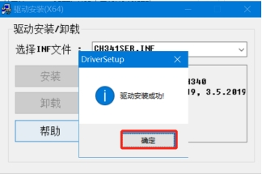

 

6) 搜索“设备管理器 -> 端口 -> USB-SERIAL CH340(COM*)"，需要记住COM*，每台设备的不一样，如图：

**注：注意：假如端口没显示，请拔掉usb口再插上或更换usb线。**

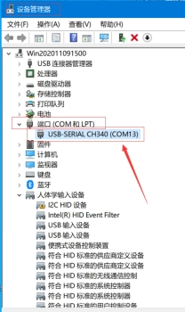

### **3、** 安装Tera Trem固件烧录工具

1) 打开文件夹”05_烧写工具/”，双击”teraterm-4.104.exe“开始安装，如图：

2) 双击后，选择“I accept the agreement”，然后点击Next，如图：

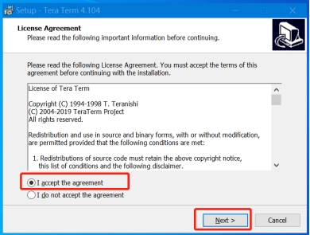

 

3) 设置安装路径，然后点击Next，如图：

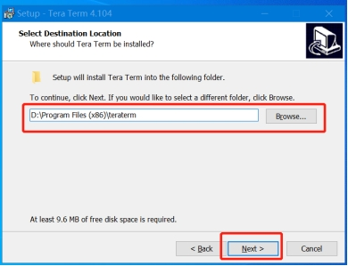

 

4) 默认设置，然后Next，如图：

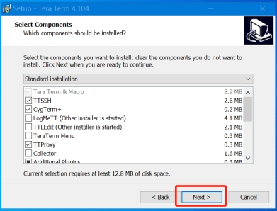

 

5) 选择简体中文，然后“Next” ，如图：

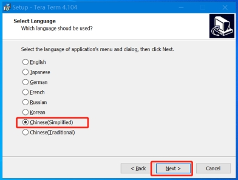

 

6) 默认配置，然后Next，如图：

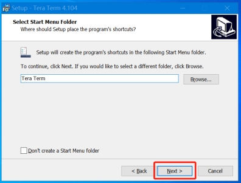

 

7) 配置默认，然后Next，如图：

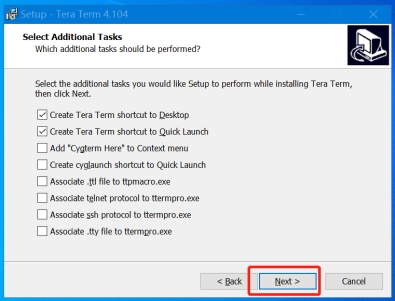

 

8) 选择Install，如图：

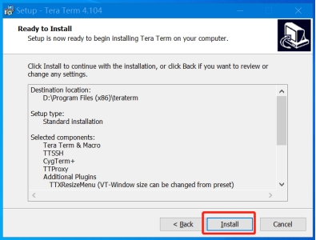

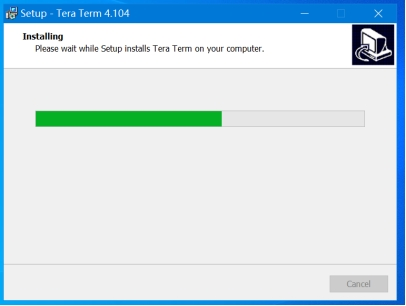

 

9) 安装完后，点击“Finish”，如图：

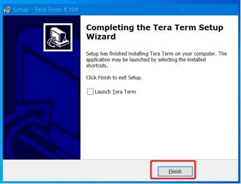

 

### **4、** 固件烧录

1) 打开设备管理器和Tera Term烧录工具，确保左侧设备管理器的USB-SERIAL和右侧Tera Team的端口保持一致，然后，选确认，如图：

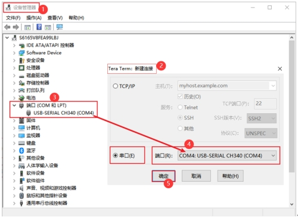

 

2) 打开Tera Trem 的“设置”和”串口”, 如图：

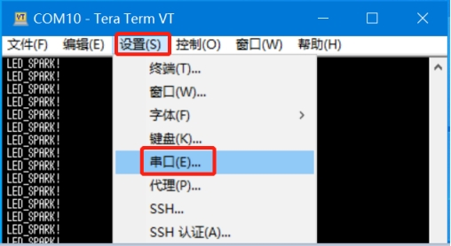

 

3) 设置端口号和波特率（115200），然后“确定”，如图：

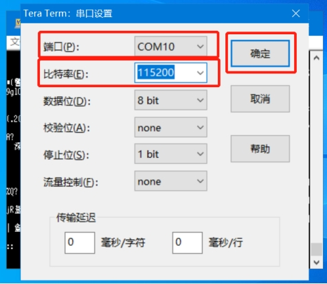

 

4) 按住PC键盘的Esc键。**（注意：非蓝牙键盘的ESC键，是PC键盘的ESC键）**

5) 单击Neptune开发板的复位(RST)键。

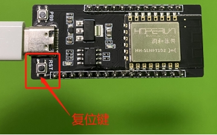

 

6) 当如下图所示 “cccccccccc”时,表示进入烧录状态，可松开PC键盘的“ESC”键。

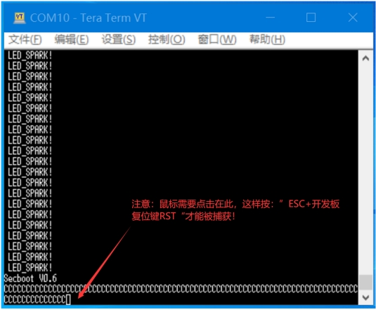

 

7) 选择“**传输** **->** **Xmoderm -> 发送(S)”**，进入烧录界面，如图

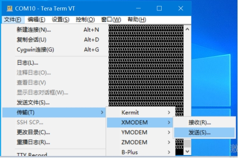

 

8) 选择固件，然后打开，如图：

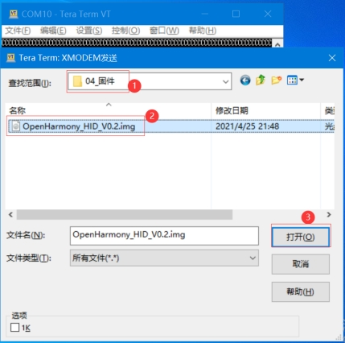

烧烧录过程中，如下图所示，会显示烧录进度。

**注意：过程中不要随便点击该该页面以免过程中断。**

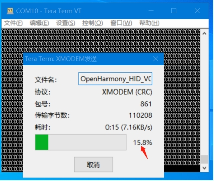

烧录完成后，如图所示，表示烧录成功：

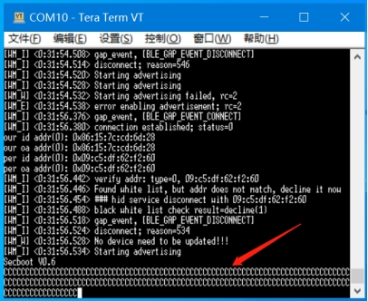

 

9) 单击Neptune开发板的复位（RST）键，退出烧录模式：

 

## **三、** 添加锂电

本节将介绍如何为蓝牙键盘添加电池

- 增加锂电池可以省去杂乱的线，做到真无线键盘，相信玩过该项目的小伙伴都有此DIY的想法。
- 这需要用到电烙铁等焊接工具，整个操作过程大约需要十分钟。
- 市面上单个锂电池的输出电压都是3.7V，而我们的Neptune(w800)开发板需要5V的电压输入才能正常工作，另外考虑到锂电池需要充电，所以我们需要升压电路和充电电路一体的模块，这样可以减少一块板，也减少成本。

### **1、** 准备材料

- 充放电板				x1		（某宝搜索：锂电池充放电一体模块）
- 电池						x1		（某宝搜索：3.7V锂电池）
- 杜邦线					x2
- Neptune开发板	x1

电烙铁，锡线，松香等焊接工具自行准备

**注意：锂电池安全性较差，强烈推荐选择带保护板的优质锂电池，同时操作过程中注意防短路及高温。**

### **2、** 焊接步骤

事物连接图，如下所示（**注意：电源正负极不要接错**）

1) 电烙铁加热到(300~350)度，在电池输入口和输出口的位置先上少量的锡（烙铁静置时，在烙铁头处上少量的锡，防止干烧氧化后不好上锡）。

2) 电池两根电源线去掉(2~3)mm，红色为正极，黑色为负极，分别焊在充放电板的电池输入口的正负极上。

3) 用两根杜邦线，去掉两头的连接口，再去掉(2~3)mm的绝缘皮，两根线的一端焊接在充放电板的输出口位置，另一边焊接在开发板的5V和GND的两根pin上。

当然，有**type-c**数据线的伙伴们可以简单粗暴，将type-c口的一端焊接在充放板输出口位置（剪开的type-c线红色为正极，黑色为负极），焊好后可以直接插到开发板上，如图。

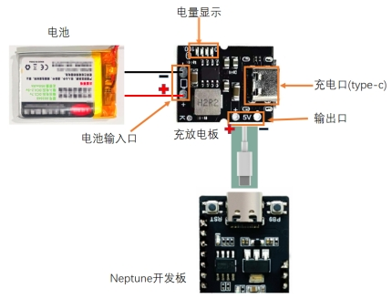

​      

 