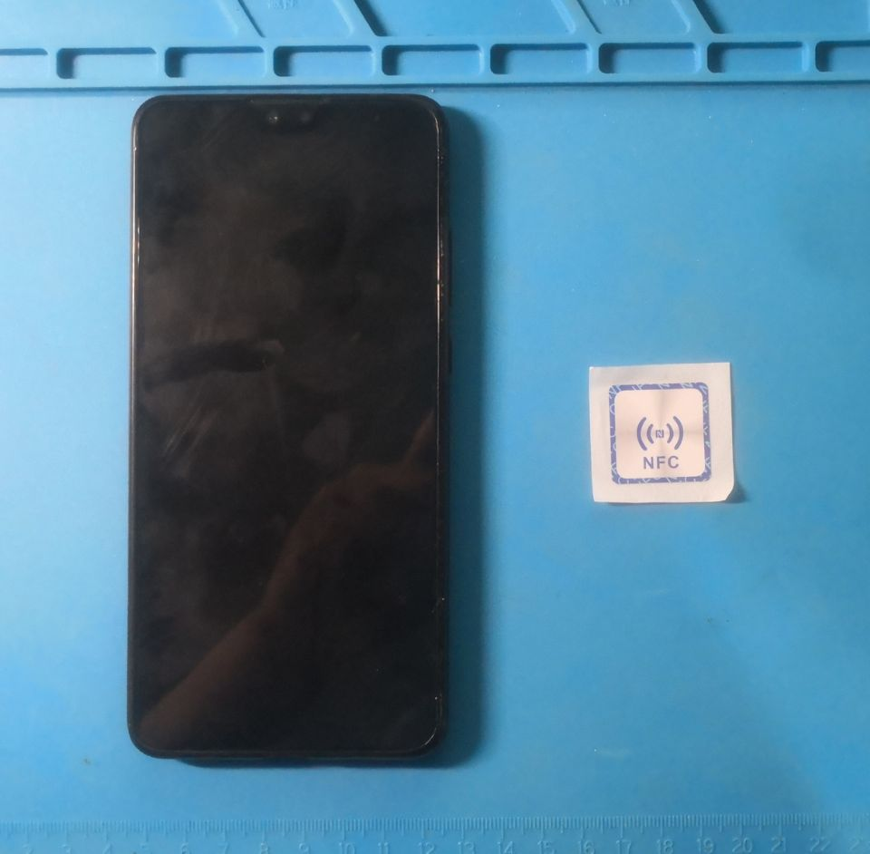
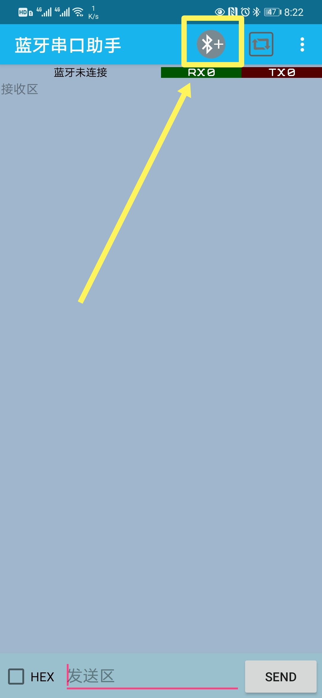
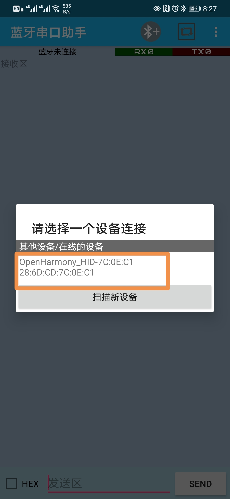
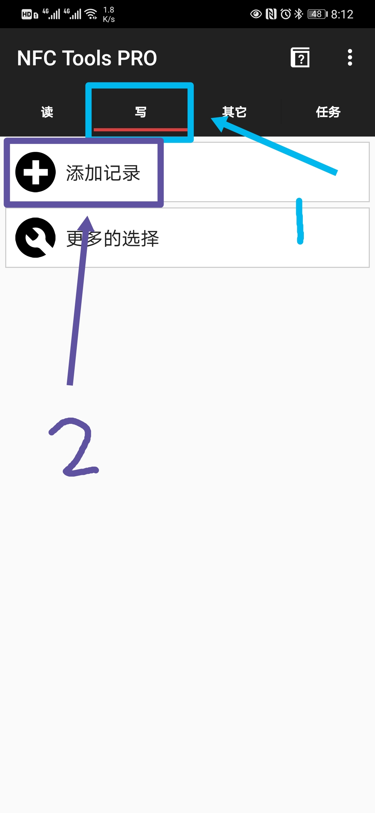
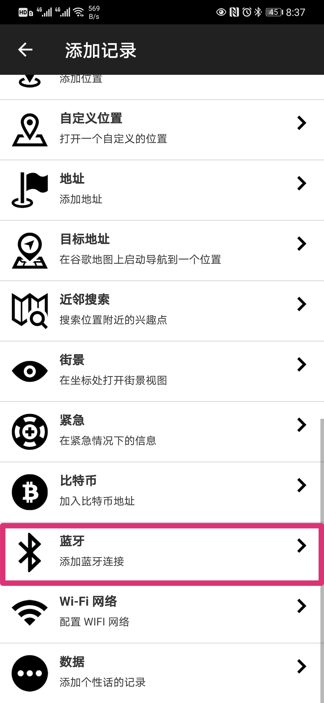
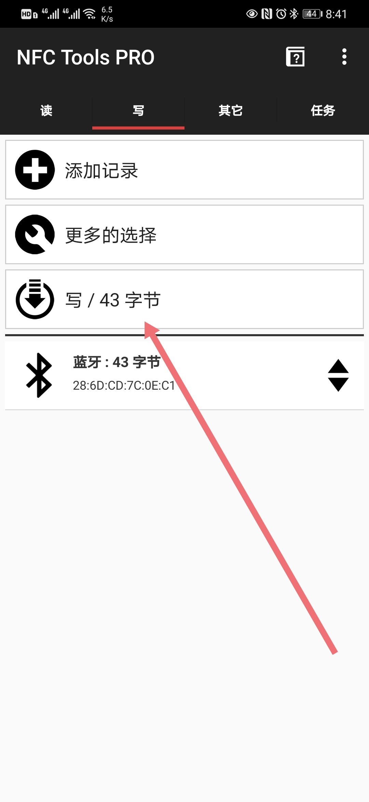
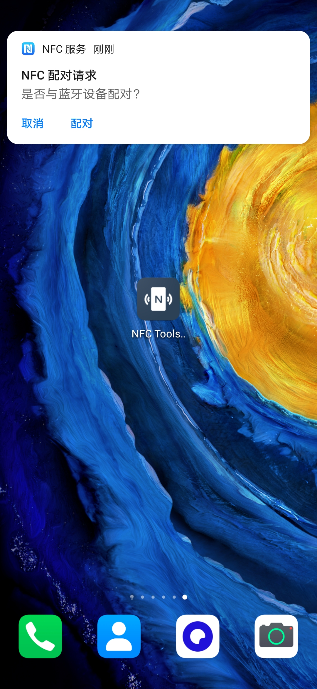
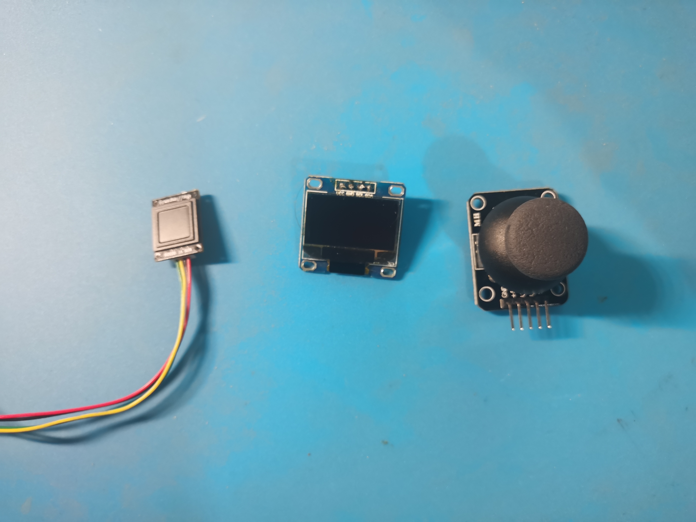

# OpenHarmony之USB键盘（LAPOP力拓）改造
前端时间正好赶上HarmonyOS的BEAT测试，可惜我没获得OTA资格，现在正好看到了这个项目就先体验下单片机上的HarmonyOS。
## 硬件购买
在淘宝上购买了套件后收到了两块板子，一块是Neptune开发板另一块是CH9350 HID转UART板。

这个项目的原理是通过Neptune开发板读取键盘信号再将信号通过蓝牙发送出去。由于Neptune开发板无法直接读取键盘输出的USB信号，需要通过CH9350 HID转UART板转换为Neptune开发板可以识别的串口信号。
## 硬件环境搭建
正好家中还有一块旧键盘正好给它升升级，根据官方教程进行接线，这个过程很简单只需要给开发板供电之后接上键盘即可。

***
## 额外功能
对于这块单片机来说这点功能还没到达性能的极限，我们还可以添加其他的功能。
### 一碰传
要实现一碰传需要以下材料
* NFC贴纸
* 带有NFC功能的手机

APP
* 蓝牙串口助手
* NFC Tools PRO
一碰传需要向NFC贴纸中写入Neptune开发板的蓝牙的MAC地址，为了获得蓝牙地址我们需要蓝牙串口助手。

打开蓝牙串口助手点击上方的蓝牙图标并选择扫描新设备，这时可以搜到一个新设备，记录下设备名称下的15位的数字、字母、冒号的组合，这就是我们所需的蓝牙地址。**（注意图上的是我的蓝牙地址每个模块的地址都是不同的）**

打开NFC Tools PRO，点击写，之后选择添加记录。

打开后滑动到最下方，点开蓝牙。

输入之前的蓝牙地址后点击OK。这时会返回到之前的界面不同的是多了一个写的选项，按下写之后将NFC标签放到手机的NFC读写区域，一会NFC标签就写好了。

之后退出APP将贴纸放到手机NFC读写区域后出现NFC配对请求就成功了。

快去试试把。
### 指纹识别
要实现指纹识别需要以下材料
* 指纹模块
* IIC协议的12864 OLED模块（非必须）
* 摇杆模块（非必须）

**未完待续**
