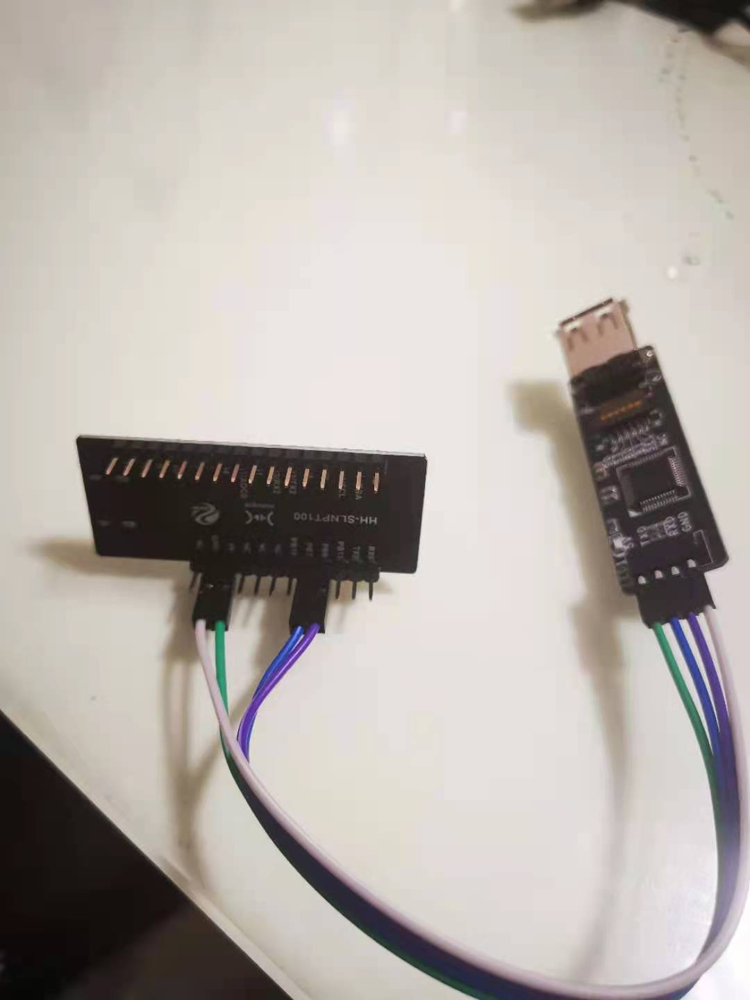
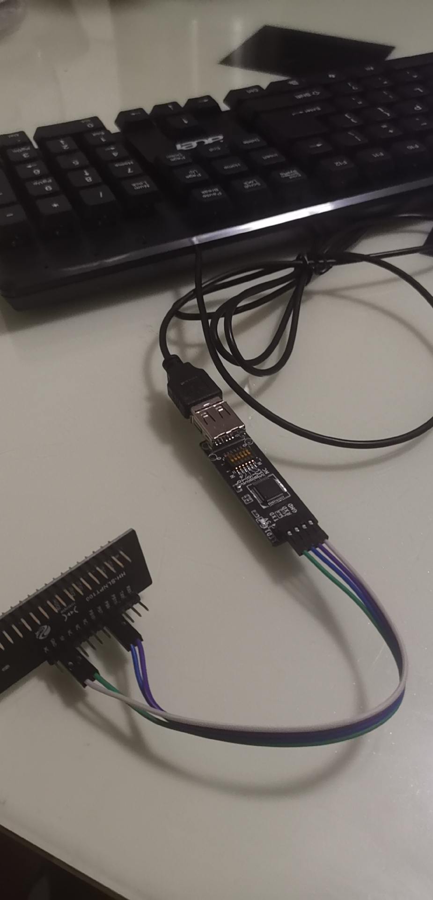
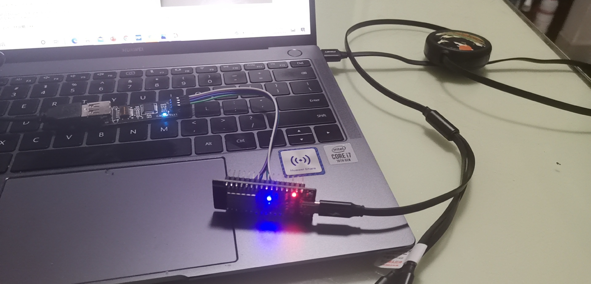
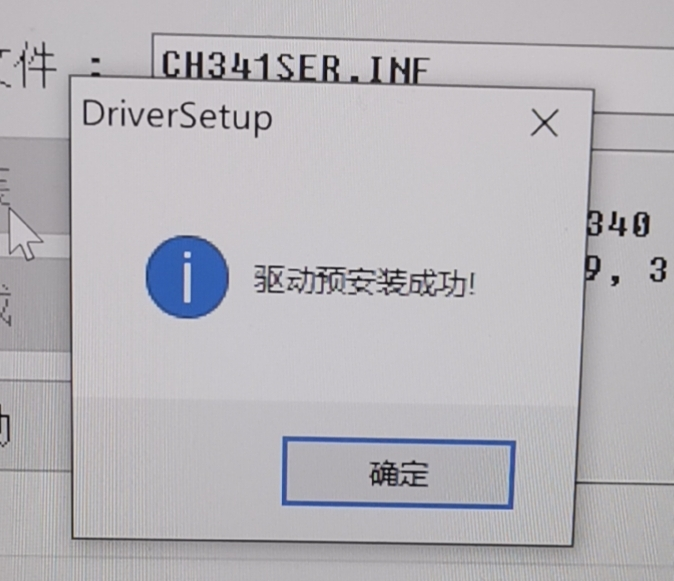
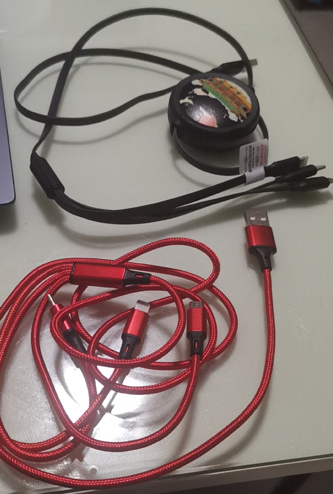
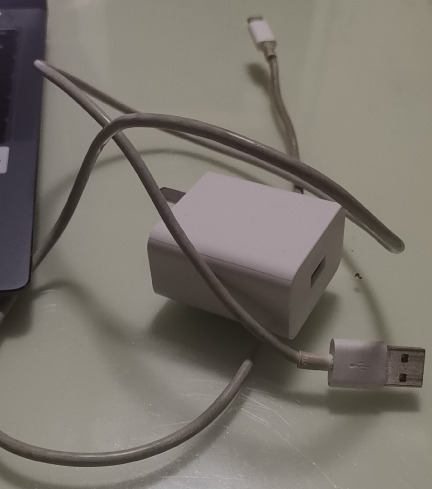
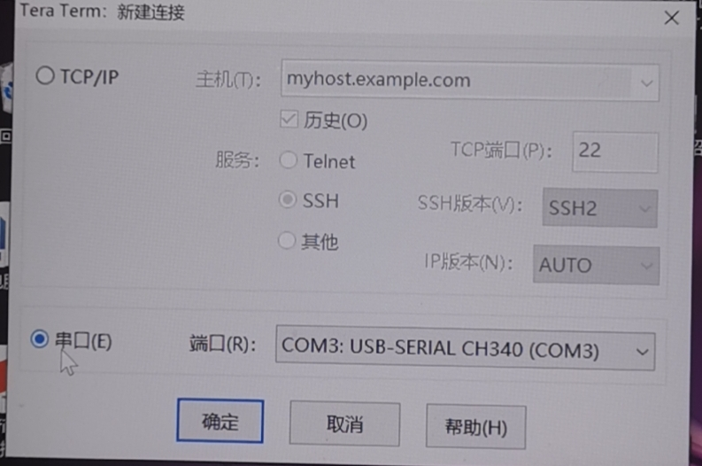
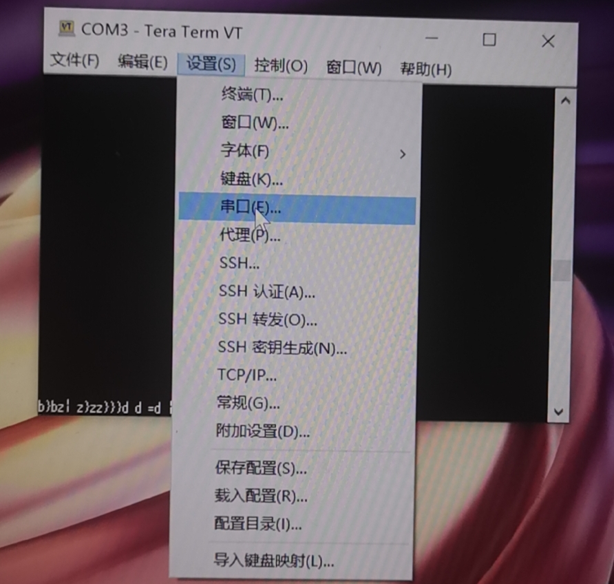
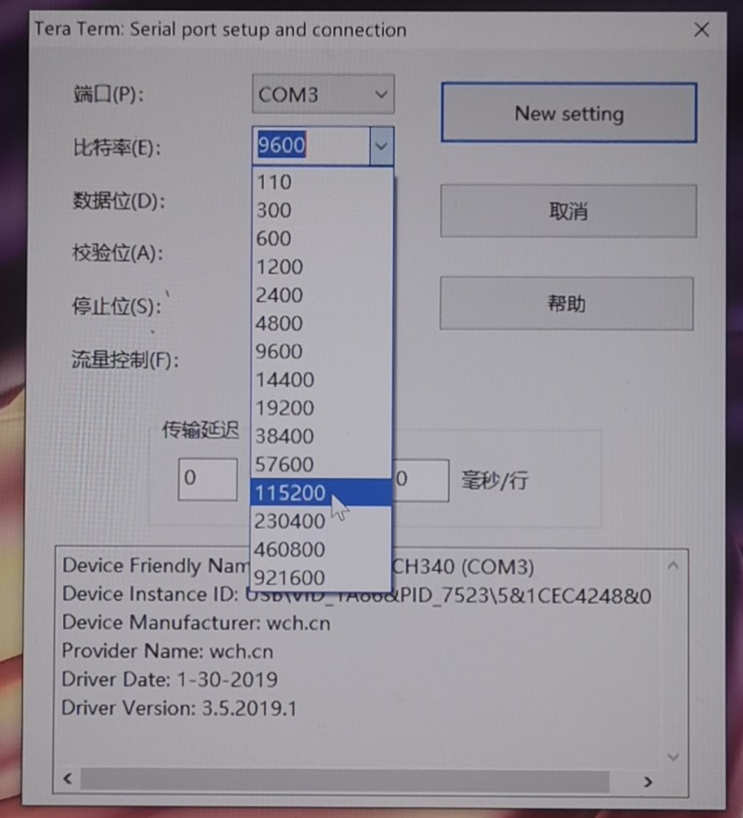
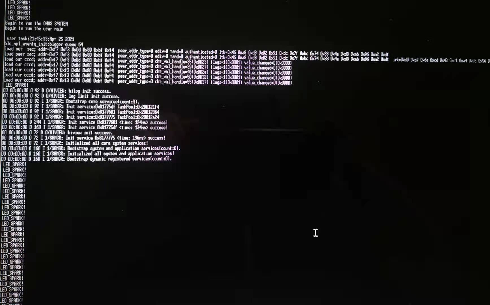

# OpenHarmony Fun体验之Acer USB键盘蓝牙改造<a name="ZH-CN_TOPIC_0000001053069234">

这个体验的动机来源于网上看到改造的视频，对OpenHarmony一直充满好奇，看到这个体验就急急忙忙买来体验。

## 获取实验器材
1.  首先在淘宝下单开发板套装"润和Neptune(W800)开发板鸿蒙OpenHarmony蓝牙BLE键盘鼠标HID", 链接:[https://m.tb.cn/h.4IiYpbY?sm=8ce79c  润和Neptune(W800)开发板鸿蒙OpenHarmony蓝牙BLE键盘鼠标HID](url)，下单第二天就发货，还不错，不完全令人满意的是在这个包邮的时代还被收了6块快递费。
2.  收到开发板才发现自己其实没有USB键盘，那就再买个，19.9的一个acer键盘免邮到家。

## 硬件环境搭建，验证功能
1.  连接实验板，按指导操作，非常简单 
2.  连接键盘 
3.  连接电脑供电，指示灯正常 
4.  手机蓝牙连接键盘正常，输入正常

## 升级测试

### 1. 升级测试第一步就遇到问题，**串口驱动安装不正常** 

1.  串口驱动安装异常，提示为 "驱动**预安装**成功" 而不是应该出现的 “驱动安装成功”，“设备管理器”中也不显示端口。 
2.  更换两个USB线都不成功。
3.  更换我手机充电器的USB线成功安装驱动，“设备管理器" 中出现端口。
4.  发现规律就是三合一充电线普遍不行，网上查找信息，可能是此类线缆普遍只支持充电，而不支持信号传输，是降成本偷工减料或是其他原因就不知道了，以后哪天拆一个线看看。

### 2. 升级测试第二个问题，**哪里去安装SecureCRT** 
1.  按指导去相应网站获取SecureCRT工具，发现该工具似乎不是免费工具，网上搜索，有一些破解版，但怕有风险，不原因安装；
2.  查看安装说明，发现其实就是用Xmodem协议安装，和很多年前硬件的串口升级其实是一回事，当时用的是叫“超级终端”的软件；继续度娘，得知“Tera Term”开源软件支持Xmodem，去其网站下载[https://zh.osdn.net/projects/ttssh2/releases/72009](url)后顺利安装
3.  Tera Term的配置过程也比较简单，主要是配置串口波特率等，详细过程如图：
     
     
     
4.  按指导升级完成，显示如下

##  等待下一步新玩法 
