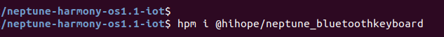
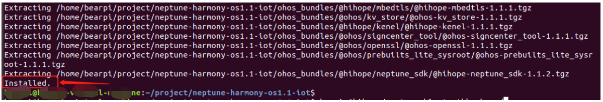
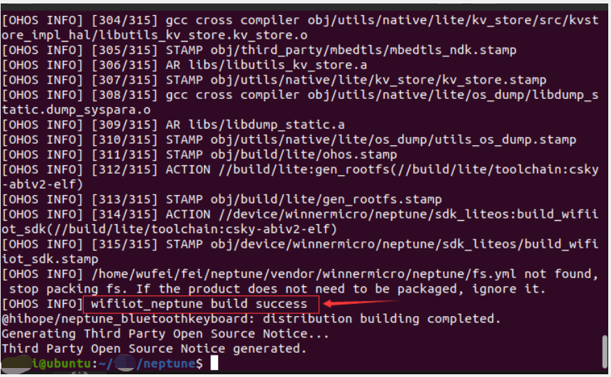
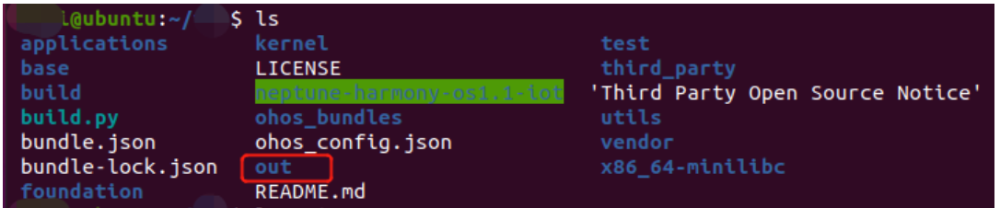
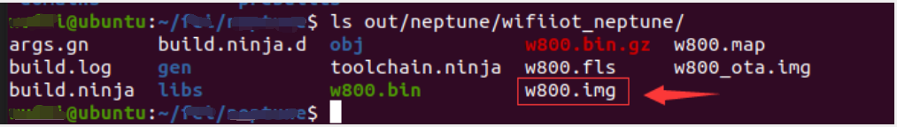

##  																				源码构建指南

###  1、hpm环境搭建

HPM（harmony package manager）即Harmony包管理器，它是华为Harmony推出的组件包管理器，可以方便地从官网获取所需组件，根据需要只下载当前项目用到的组件，使得工程文件更加精简。

[Ubuntu搭建hpm开发环境的指导链接](https://device.harmonyos.com/cn/docs/ide/user-guides/install_ubuntu-0000001072959308)

**注意：假如某些步骤执行失败，请重启ubuntu再试试**。

### 2、hpm拉取源码

[HiHope-Neptune开发板介绍链接](https://hpm.harmonyos.com/#/cn/distribution/@hihope%2Fneptune_iot)

首先，hpm开发环境搭建完毕后，在Ubuntu首先输入：

```
hpm init -t dist 
```

实现目录初始化，如图：


然后，输入：

```
hpm i @hihope/neptune_bluetoothkeyboard
```

下载对应组件及依赖包，如图：



执行完毕，显示“Installed”，表示成功下载, 如图：



最后，执行编译命令

```
hpm dist
```

如图：


执行完毕，显示：“Build success!”，表示编译成功，如图：



编译生成的img文件，位于out目录，如图：



打开“out/neptune/wifiiot_neptune/"文件夹，可找到“w800.img”文件，其就是生成的固件，如图：



**说明**
1、更多的hpm命令请参照: [hpm常见命令](https://device.harmonyos.com/cn/docs/develop/bundles/oem_bundle_standard_manage-0000001050171890)

